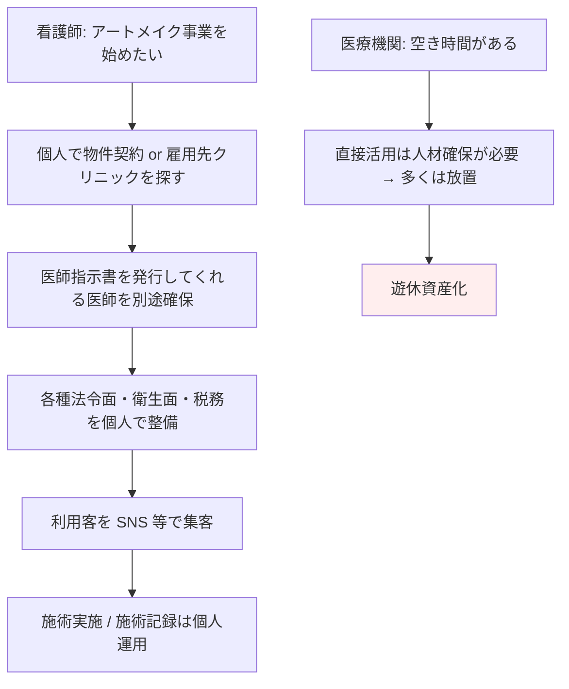
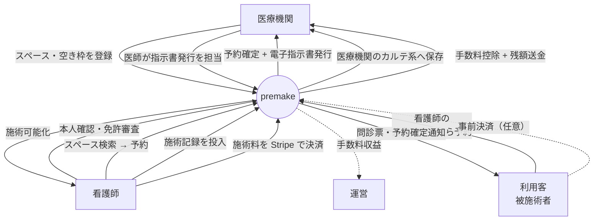
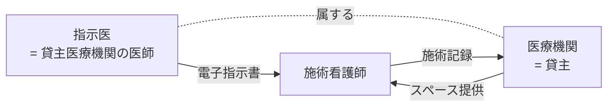

# 業務理解 — premake

> 病院内の空きスペース・空き病室を、アートメイク施術を行う看護師がスポット利用できるようにする予約マッチングプラットフォーム。Web 先行・手数料モデル・将来モバイル対応。

---

## 1. ビジネス背景

### 1.1 現状の課題

| # | 課題 | 影響を受ける人 | 頻度 | 深刻度 |
|---|------|--------------|------|--------|
| 1 | 病院・クリニックの **診察室や病室が時間帯によって遊休資産化** している | 医療機関（経営） | 日常的 | 中（収益機会損失） |
| 2 | アートメイクを行う看護師が、**清潔・適法・安全な施術場所** を確保しづらい。サロン形式での施術には法令面のグレーが残る | 施術看護師 | 高頻度 | 高（営業継続リスク） |
| 3 | 看護師が個人で医師指示書を取得・運用する負担が大きく、**法令面の建付けが属人化** している | 施術看護師・利用客 | 高頻度 | 高（医師法・保助看法リスク） |
| 4 | 自由診療としてのアートメイクを医療機関が直接運営するには、**スタッフ確保・運営オペレーション** のハードルが高い | 医療機関 | 検討段階 | 中（事業機会の取りこぼし） |

### 1.2 現在の対処方法

- 看護師: 個人サロン or 提携クリニックでの非常勤雇用形態。場所と医師指示の両方を自前で確保。
- 医療機関: 一部は院内でアートメイク部門を立ち上げているが、専属看護師の採用が必要。多くは未着手。
- 利用客: 個別に施術者・施設を探して予約。価格・品質・衛生のばらつきが大きい。

---

## 2. プロジェクト目的

### 2.1 ゴール（優先順位付き）

| 優先度 | ゴール | 成功指標（KPI） |
|--------|--------|-----------------|
| P0 | 看護師がアプリ経由で **適法に・安全に** スペースを予約・施術できる状態を作る | β期間中の予約成立件数 / 適法性違反インシデント件数 = 0 |
| P0 | 医療機関の遊休スペースを **手数料モデルで収益化** する仕組みを稼働させる | 施設あたり月間稼働時間 / GMV / プラットフォーム手数料収益 |
| P0 | 全ステークホルダー（運営・医療機関・看護師）に「使いやすく意味のある」UX を提供する | NPS（看護師 / 医療機関）≥ +30、解約率 ≤ 月 5% |
| P1 | デザイン・ブランド品質で、**試作品ではなく完成プロダクト** として市場投入する | デザインシステム導入率 100%、Lighthouse スコア ≥ 90 |
| P1 | 将来の iOS/Android 展開を見据えた **API ファースト** 設計にする | Web/Mobile 共通 API 比率 ≥ 90% |

### 2.2 リリース計画

- **目標**: 2〜3ヶ月でパブリックβ（DEC-07）
- **初期規模**: 20 施設 × 100 看護師（クローズドβ）
- **開発体制**: AI エージェント活用によるスプリント的短期集中開発（DEC-06）
- **予算感**: [仮決定] 開発コストはかけて OK（User スタンス）。法令対応 > 利益 > 速度の順
- **本リリース後**: LP・公開導線を同一コードベースで増設（DEC-10）→ オープン化（時期未定）

---

## 3. スコープ

### 3.1 In Scope（MVP / β）

#### 機能カテゴリ（DEC-09 で全カテゴリ P0 確定）

| ID | カテゴリ | 内容 | 状態 |
|----|---------|------|------|
| A | 認証・本人確認 | サインアップ、ログイン、看護師免許アップロード、運営による手動審査画面 | P0 |
| B | 施設・スペース管理 | 医療機関登録、スペース登録、空き枠カレンダー、写真・設備情報、料金設定 | P0 |
| C | 検索・予約 | スペース検索（地域・日時・設備）、詳細閲覧、予約申込、確定、キャンセル | P0 |
| D | 医師指示・施術記録 | 電子指示書の発行・電子署名、施術記録（同意書・施術内容・写真）保存 | P0（A 案により必須） |
| E | 決済（Stripe） | カード登録、施術料の決済、手数料按分、返金、Stripe Connect で施設へ送金 | P0 |
| F | メッセージ・通知 | 看護師⇄施設のチャット、メール通知 | P0（UI 上「β」表記） |
| G | レビュー・評価 | 看護師→施設、施設→看護師の相互評価 | P0（UI 上「β」表記） |
| H | 運営管理画面 | ユーザー審査、取引監視、手数料モニタ、CSV 出力 | P0 |
| I | 公開導線（最小） | 利用規約 / プライバシーポリシー / 特商法表記のみ | P0（最小） |
| J | ダッシュボード | 看護師：予約一覧 / 売上 ／ 施設：稼働率 / 収益 ／ 運営：KPI | P0 |
| K | 顧客予約ページ（簡易） | 看護師ごとの公開ブッキングページ。看護師が確保したスペース＋枠から、利用客（アートメイク被施術者）が予約・問診票記入・任意で事前決済。看護師がリンクを共有 | P0（簡易版） |

### 3.2 Out of Scope（β段階では含まない）

- iOS / Android ネイティブアプリ（DEC-04）
- LP・マーケティングサイト本格版（DEC-10。MVP リリース後に同一コードベースで増設）
- アートメイク以外の施術領域（脱毛・点滴等）への横展開
- 利用客（エンドカスタマー）がプラットフォーム横断で **看護師を検索して予約する C2C マーケットプレイス的機能**（β段階では K カテゴリの「看護師ごとの公開ブッキングページ」を看護師がリンクで共有する形に限定）
- 自前の決済システム（DEC-03。Stripe を採用）
- 自動本人確認（OCR / eKYC）。β期間は **運営による手動審査** で対応
- 多言語対応（日本語のみ）

### 3.3 将来拡張構想

- iOS / Android ネイティブアプリ
- 利用客が直接予約・決済できる C2C 拡張
- 看護師の保険・賠償責任のプラットフォーム提供
- 医師指示書の AI 自動チェック・テンプレート提案
- 他自由診療領域（脱毛・点滴・美容医療全般）への展開
- 海外展開（医療制度差異あり）

---

## 4. 業務フロー

### 4.1 As-Is（現状）

### 4.2 To-Be（プラットフォーム導入後）

#### 中核トリプル関係（A 案）

> **Why**: スペース貸主の医療機関に所属する医師が指示を出すことで、急変時の対応も含めて法令面を盤石にする（DEC-08）。看護師から見れば「予約 = 場所 + 指示医 + 施術可能化」がワンセットで提供される。

---

## 5. 外部連携

| 連携先 | 連携方法 | 目的 | 必須 / 任意 | 備考 |
|--------|---------|------|-------------|------|
| Stripe（Stripe Connect） | API | 決済・手数料按分・送金 | 必須 | DEC-03 |
| メール送信サービス（Resend / SendGrid 等） | API | 通知・パスワードリセット | 必須 | Phase 3 で確定 |
| クラウドストレージ（S3 / R2 等） | API | 看護師免許画像・施術写真・電子指示書 PDF | 必須 | Phase 3 で確定 |
| 認証基盤（Clerk / Supabase Auth / 自前） | API | サインアップ・MFA | 必須 | Phase 3 で確定 |
| 監視・ログ（Sentry / Better Stack 等） | SDK | エラー監視・パフォーマンス | 必須 | Phase 3 で確定 |
| カレンダー連携（Google Calendar / iCal） | iCal フィード | 看護師・施設のスケジュール同期 | 任意 | β後 |
| 電子カルテ連携 | API | 施術記録を医療機関の電子カルテへ流す | 任意 | β後検討 |
| 自社コーポレートサイト | 静的リンクのみ | products ページから本サービスへ誘導 | 任意 | DEC-10 |

---

## 6. ステークホルダー整理

| Stakeholder | 役割 | 優先 KPI |
|------------|------|---------|
| 運営（自社） | プラットフォーム提供、本人確認審査、手数料収益受領 | GMV / 手数料収益 / 違反インシデント 0 |
| 医療機関（医師含む） | スペース提供、医師指示書発行、施術記録保管 | 稼働率 / スペース収益 |
| 施術看護師 | プラットフォームを利用してスペース予約 → 施術 | 予約成立率 / 施術売上 / 利便性 NPS |
| 利用客（被施術者） | 看護師から共有された予約ページから施術枠を予約・問診票記入・任意で事前決済 | 予約完了率 / 施術満足度 |

> **DEC-06 補足**: 全ステークホルダーの UX を最優先とする。利益はその次。

---

## 7. 用語

業務固有用語は `00_共通/用語集_glossary.md` を参照。

---

バージョン: 1.0 / 作成日: 2026-05-10 / Phase 1 / 状態: ヒアリング済み・User 確認待ち
