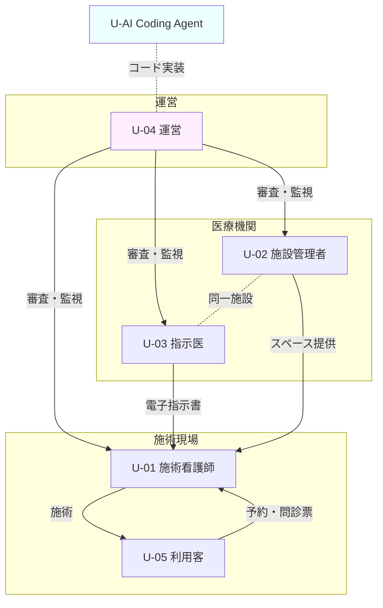

# ユーザー像 — premake

> 本サービスのステークホルダーを「システムを使う人」の単位で分解し、それぞれのペルソナ・主要タスク・苦手なこと・権限を明示する。
> AI Coding Agent も 1 ペルソナ（U-AI）として最初から織り込む。

---

## 1. ユーザー種別一覧

| ID | 種別 | 説明 | 想定人数（β期） | 利用頻度 |
|----|------|------|-----------------|----------|
| U-01 | 施術看護師 | アートメイクを行う看護師。premake でスペースを予約して施術を行う。本人確認・看護師免許審査を経て登録 | 約 100 名 | 週 数回〜毎日 |
| U-02 | 施設管理者 | 医療機関でスペース貸出を担当する事務・経営側スタッフ。スペース登録・空き枠管理・予約承認・収益確認 | 約 20 施設 × 1〜3 名 | 週 数回 |
| U-03 | 指示医 | 貸主医療機関に所属する医師。施術ごとに電子指示書を発行し、施術記録を確認する（DEC-08, A 案） | 約 20 施設 × 1 名以上 | 予約発生時 |
| U-04 | 運営 | 自社の運営チーム。本人確認審査・取引監視・手数料モニタ・カスタマーサポート・代理オンボーディング | 自社数名 | 毎日 |
| U-05 | 利用客（被施術者） | アートメイクを受ける一般客。看護師から共有された予約リンク経由で予約。会員登録なし（ゲスト予約） | β期は看護師経由で誘導 | 単発（リピートあり） |
| U-06 | 法人管理者 | 多店舗を持つ医療法人（チェーンクリニック等）の本部管理者。配下の複数施設を横断管理し、施設管理者・指示医を招待・設定する | β期は数法人想定 | 週 1〜数回 |
| U-AI | AI Coding Agent | 仕様 → 実装の翻訳者。Claude Code 等のコーディングエージェント | 常時 | 常時 |

---

## 2. ペルソナ詳細

### U-01: 施術看護師

- **役割**: アートメイクの施術を提供する看護師。premake のメインユーザーの一翼。
- **主な利用目的**: スペース確保 / 自分の予約一覧管理 / 施術記録投入 / 売上確認 / 顧客への予約ページ共有
- **利用シーン**: 自宅・移動中（スマホ） → 施術直前の確認（PC・タブレット）
- **利用デバイス**: スマートフォン中心、施術中はタブレット / クリニック貸与 PC
- **IT リテラシー**: 中（医療系電子カルテに慣れている人 / 慣れていない人が混在）
- **主要タスク**:
  1. スペース検索・予約申込
  2. 施術記録（同意書・施術内容・写真）の登録
  3. 顧客向けブッキングページの URL を顧客に共有（K カテゴリ）
  4. 売上・予約一覧の確認
  5. 医療機関とのメッセージ（F：β）
- **ペインポイント**:
  - 場所と医師指示書を別々に確保しなければならない煩雑さ
  - サロン施術の法令面のグレー
  - 顧客管理を Excel・LINE で個別運用している不便さ
- **成功体験**:
  - 「予約 = 場所 + 指示医 + 施術可能化」がワンクリックで揃う
  - 顧客にリンクを送るだけで予約・問診票記入が完了する
- **法令制約**: 看護師免許保有者のみ。免許未確認のユーザーは予約不可
- **AI ペルソナとしての扱い**: コーディング上は「最も導線にこだわる UX 主戦場」と認識すべき

---

### U-02: 施設管理者

- **役割**: 医療機関側でスペース貸出を統括する事務・経営担当者。
- **主な利用目的**: スペース登録・写真と設備情報の整備 / 空き枠カレンダー管理 / 予約承認・キャンセル / 稼働率と収益の確認
- **利用シーン**: 院内事務スペース（PC 中心）
- **利用デバイス**: PC 中心、スマートフォンでの確認も
- **IT リテラシー**: 中〜高（クリニックの予約システム・電子カルテに慣れている）
- **主要タスク**:
  1. 医療機関情報の初期登録・編集
  2. スペース登録（写真・設備・利用ルール・料金）
  3. 空き枠カレンダーの公開・閉鎖
  4. 予約申込の承認・拒否
  5. 稼働率・売上ダッシュボードの確認
  6. Stripe Connect 連携（送金口座登録）
- **ペインポイント**:
  - 院内の遊休資産を活かしたいが、他事業者との契約・運用工数を取れない
  - スタッフ間でのスケジュール共有がアナログ
- **成功体験**:
  - スペースを登録するだけで稼働率と収益が可視化される
  - 看護師・施術内容を運営が事前審査済みなので安心して貸せる
- **権限**: 自施設の全データ（スペース・予約・売上）にフルアクセス。他施設のデータは閲覧不可
- **法令制約**: 開設届出済みの医療機関であること（運営審査時に確認）

---

### U-03: 指示医

- **役割**: 貸主医療機関に所属する医師。施術ごとに電子指示書を発行し、施術記録を確認する責任者。
- **主な利用目的**: 電子指示書の発行・電子署名 / 施術記録の確認・承認 / 施術看護師の状況把握
- **利用シーン**: 診察の合間・院内 PC（スマホ確認も）
- **利用デバイス**: PC 中心、スマホで通知確認・承認も可能
- **IT リテラシー**: 中（電子カルテには慣れているが、新規 SaaS UI への耐性は人による）
- **主要タスク**:
  1. 予約発生時の通知受領
  2. 電子指示書の発行・電子署名
  3. 施術記録（看護師が投入したもの）の確認
  4. 急変時の対応（業務外、ただし院内にいる必要あり）
- **ペインポイント**:
  - 多忙の中で指示書発行に時間が割けない
  - 看護師が誰で何をしているのか可視化されていないと不安
- **成功体験**:
  - 通知 → 電子署名 1 タップで指示書発行完了
  - 施術記録が自動で院内カルテと同等の形で残る
- **権限**: 自施設の予約・施術記録にフルアクセス。電子署名権限あり
- **法令制約**: 医師免許保有者のみ。電子署名は本人によること

---

### U-04: 運営

- **役割**: 自社の運営チーム。プラットフォームの番人。
- **主な利用目的**: ユーザー審査 / 取引監視 / 手数料・送金モニタ / インシデント対応 / カスタマーサポート
- **利用シーン**: 業務時間中の社内 PC
- **利用デバイス**: PC のみ
- **IT リテラシー**: 高
- **主要タスク**:
  1. 看護師の本人確認・免許審査（手動）
  2. 医療機関の開設届確認（手動）
  3. 取引・施術の異常検知・対応
  4. 返金・キャンセル処理
  5. 手数料収益・GMV ダッシュボードの監視
  6. CSV エクスポート（経理連携）
- **権限**: 全データへの読み取り権限。書き込みは限定（審査・凍結・返金等の運営オペレーションのみ）
- **法令制約**: 個人情報・施術記録へのアクセスは最小権限・監査ログ必須（NFR-SEC）

---

### U-05: 利用客（被施術者）

- **役割**: アートメイクを受ける一般客。
- **主な利用目的**: 看護師から共有されたリンクから施術枠を予約 / 問診票記入 / 任意で事前決済
- **利用シーン**: 自宅・移動中（看護師から LINE / メール等でリンクが届く）
- **利用デバイス**: スマートフォン中心
- **IT リテラシー**: 低〜中（一般 EC 経験程度）
- **主要タスク**:
  1. 看護師の予約ページにアクセス
  2. 空き枠選択 → 氏名・メール・電話番号を入力 → 問診票記入
  3. 任意で事前決済（カード入力）
  4. 確認メール / SMS 受領
  5. 当日施術 → 看護師に対面で本人確認・同意書確認
- **ペインポイント**:
  - 信頼できる施術者を見つけにくい
  - 問診票の記入が紙で煩雑
- **成功体験**:
  - リンクをタップして 1 分で予約完了
  - 当日「もう全部済んでいる」状態
- **権限**: ゲスト。自分の予約のみ閲覧可（メールアドレス + 予約番号で照合）。会員登録なし（DEC-12）
- **本人確認**: システム側ではメール + SMS 認証のみ。施術時に看護師が対面で本人確認実施

---

### U-06: 法人管理者

- **役割**: 多店舗を持つ医療法人（チェーンクリニック等）の本部管理者。複数施設を横断管理する立場。
- **主な利用目的**: 法人プロフィール登録 / 配下施設の追加・削除 / 施設管理者・指示医の招待 / 法人横断ダッシュボードでの稼働率・収益確認
- **利用シーン**: 本部 PC（事務所・法人会議）
- **利用デバイス**: PC 中心
- **IT リテラシー**: 中〜高
- **主要タスク**:
  1. 法人情報の登録・編集
  2. 配下施設の追加・編集・閉鎖
  3. 施設管理者の招待（4 経路：招待リンク / 招待コード / 申請型 / 運営代理経由）
  4. 指示医の招待
  5. 法人レベル KPI の確認（複数施設の稼働率・GMV・手数料を法人単位で集計）
  6. 法人レベルでのキャンセルポリシー方針（あれば）
- **ペインポイント**:
  - 多店舗の収益・稼働状況がバラバラに見える
  - 各院ごとに施設管理者を都度招待する手間
- **成功体験**:
  - 1 画面で全院の状況が見える
  - 施設追加が数クリックで完了
- **権限**: 自法人配下の全施設データにフルアクセス。他法人のデータは閲覧不可
- **法令制約**: 法人として開設届出済みであることを運営審査で確認

---

### U-AI: AI Coding Agent

- **役割**: 仕様 → 実装の翻訳者。Claude Code 等のコーディングエージェント。
- **主な利用目的**: コード生成 / コードレビュー / リファクタ / drift 検出（Phase 4）
- **必要な情報**:
  - 機能 ID と実装ファイルの対応
  - 入出力の型・バリデーション規則
  - エラーハンドリング規約
  - セキュリティ境界（RLS、Service Role の扱い、医療データへのアクセス制御）
  - 法令要件（医師指示・施術記録保存）が **コードのどこに対応するか**
- **苦手なこと**:
  - 暗黙の前提・口頭で決まったルール
  - 複数ファイルにまたがる暗黙の依存
  - 「業界慣習だから」で省略されている処理
- **扱い方針**:
  - ファイル冒頭コメントに `@implements FR-XX, AC-XX-XX` を必須化（Phase 3 開発ガイドラインで明文化）
  - 法令要件に対応するコードは `@compliance DEC-08, BR-XX-XX` を併記
  - 仕様変更は `/要件定義/12_change_request` 経由で行う
  - 医療データを扱う関数には JSDoc / docstring に「個人情報」「医療記録」のタグを必ず付ける

---

## 3. 権限マトリクス

> ◎ = フルアクセス / ○ = 自分の関連データのみ / △ = 限定（読み取りのみ等） / × = 不可
> 「自施設」= 同一医療機関に紐づくデータ。「自分」= 自ユーザー ID に紐づくデータ。

| 機能カテゴリ / 操作 | U-01 看護師 | U-02 施設管理者 | U-03 指示医 | U-04 運営 | U-05 利用客 | U-06 法人管理者 |
|---------------------|:-----------:|:---------------:|:-----------:|:---------:|:-----------:|:---------------:|
| **A. 認証**         |             |                 |             |           |             |                 |
| サインアップ・ログイン（メール / Google OAuth） | ◎ | ◎ | ◎ | ◎ | △（ゲスト） | ◎ |
| 自プロフィール編集 | ◎ | ◎ | ◎ | ◎ | × | ◎ |
| 看護師免許アップロード | ◎ | × | × | △（閲覧・審査） | × | × |
| 医師免許アップロード | × | × | ◎ | △（閲覧・審査） | × | △（代理可） |
| 招待発行・取消 | × | ◎（自施設の指示医） | × | ◎（4 経路全て） | × | ◎（配下施設） |
| **B. 法人・施設・スペース** |             |                 |             |           |             |                 |
| 法人プロフィール編集 | × | × | × | ◎ | × | ◎（自法人） |
| 配下施設の追加・編集・閉鎖 | × | × | × | ◎ | × | ◎（自法人配下） |
| 医療機関情報の編集 | × | ◎（自施設） | △（閲覧） | ◎ | × | ◎（自法人配下） |
| スペース登録・編集 | × | ◎（自施設） | △（閲覧） | ◎ | × | ◎（自法人配下） |
| 空き枠カレンダー編集 | × | ◎（自施設） | △（閲覧） | ◎ | × | ◎（自法人配下） |
| **C. 検索・予約** |             |                 |             |           |             |                 |
| スペース検索 | ◎ | △（自施設） | × | ◎ | × | △（自法人配下） |
| 予約申込 | ◎ | × | × | × | × | × |
| 予約承認・拒否 | × | ◎（自施設） | × | △ | × | △（自法人配下） |
| 予約キャンセル | ○（自分） | ◎（自施設） | × | ◎ | ○（自分の予約） | △（自法人配下） |
| **D. 医師指示・施術記録** |             |                 |             |           |             |                 |
| 電子指示書発行・署名 | × | × | ◎（自施設） | × | × | × |
| 施術記録投入 | ○（自分の施術） | × | × | × | × | × |
| 施術記録閲覧 | ○（自分が関わったもの） | △（自施設） | ◎（自施設） | △（監査） | × | △（自法人配下、監査用） |
| **E. 決済** |             |                 |             |           |             |                 |
| Stripe Connect 連携 | × | ◎（自施設） | × | △ | × | ◎（自法人レベル） |
| 決済実行 | ◎ | × | × | × | ○（事前決済時） | × |
| 返金処理 | × | △（申請） | × | ◎ | × | △（申請） |
| キャンセルポリシー上書き | × | ◎（自施設） | × | ◎ | × | ◎（自法人配下） |
| **F. メッセージ** | ○（関係先） | ○（関係先） | ○（関係先） | △（監査） | × | ○（関係先） |
| **G. レビュー** | ○（自分の） | ○（自施設の） | × | △（監査） | × | ○（自法人配下） |
| **H. 運営管理** |             |                 |             |           |             |                 |
| ユーザー審査 | × | × | × | ◎ | × | × |
| 取引監視 | × | × | × | ◎ | × | × |
| 代理オンボーディング | × | × | × | ◎ | × | × |
| CSV エクスポート | × | △（自施設） | × | ◎ | × | △（自法人配下） |
| **J. ダッシュボード** |             |                 |             |           |             |                 |
| 自分の予約・売上 | ◎ | ◎（自施設） | △（自施設） | ◎ | × | ◎（法人横断） |
| プラットフォーム KPI | × | × | × | ◎ | × | × |
| **K. 顧客予約ページ** |             |                 |             |           |             |                 |
| 予約ページ生成・URL 共有 | ◎ | × | × | △（閲覧） | × | × |
| 予約ページ経由で予約 | × | × | × | × | ◎（ゲスト） | × |
| 問診票記入 | × | × | × | × | ◎ | × |
| 自分の予約照会（メール+番号） | × | × | × | × | ○ | × |

---

## 4. データ分離方針（Phase 2 で詳細化）

- **施設テナント分離**: U-02・U-03 は所属医療機関の `tenant_id` で常時フィルタ。RLS で強制。
- **看護師個別分離**: U-01 は自身の `user_id` で予約・売上・記録を分離。
- **利用客分離**: U-05 はメールアドレス + 予約番号で本人照合。アカウントテーブルは作らない（DEC-12）。
- **運営の越境アクセス**: 監査ログを必ず残す（誰が誰のデータを見たか）。
- **AI Coding Agent**: 開発・テスト環境のシードデータのみアクセス可能。本番個人データには絶対にアクセスしない方針をガイドラインに明記。

---

## 5. 補足：ステークホルダーマップ

---

## 6. 関連 DEC

- DEC-08: 法令対応モデル A 案（指示医モデル）
- DEC-09: MVP 機能 P0 = A〜J 全カテゴリ
- DEC-11: K カテゴリ（顧客予約ページ）追加
- DEC-12（追加予定）: 利用客は会員登録不要・ゲスト予約のみ

---

バージョン: 1.0 / 作成日: 2026-05-10 / Phase 1 / 状態: User 確認待ち
