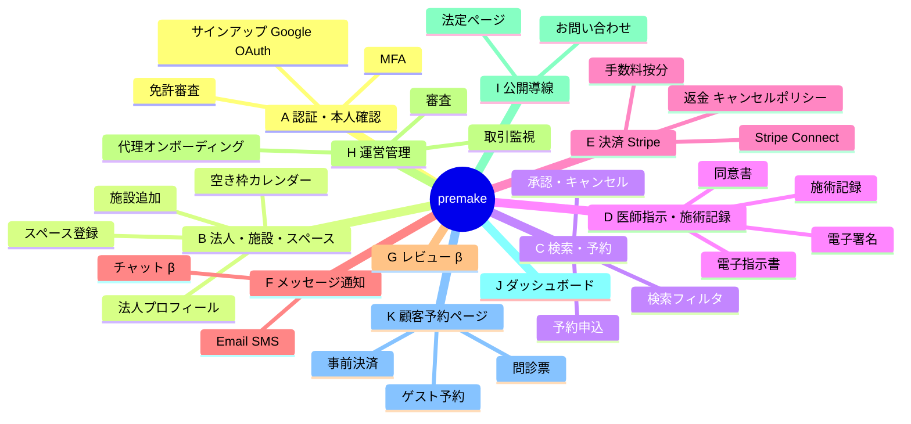
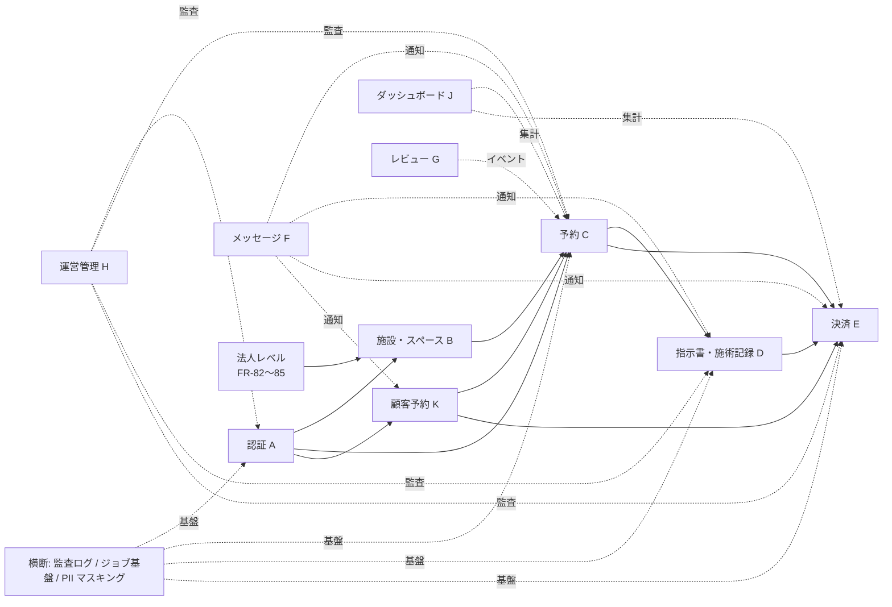

# スコープ・機能一覧 — premake

> 機能 ID は `FR-XX` 形式。優先度: **P0** (MVP β必須) / **P1** (β中の余裕枠) / **P2** (将来) / **P3** (構想)。
> 各機能の詳細は `features/FR-XX_{slug}.md` を参照。

---

## 1. 機能概要マップ

---

## 2. カテゴリ別 機能一覧

### A. 認証・本人確認

| 機能ID | 機能名 | 優先度 | 対象ユーザー | 詳細ファイル |
|--------|--------|--------|--------------|--------------|
| FR-01 | 看護師サインアップ（メール+パスワード） | P0 | U-01 | features/FR-01_nurse-signup.md |
| FR-02 | 施設管理者招待型サインアップ（4経路） | P0 | U-02 | features/FR-02_facility-admin-invite-signup.md |
| FR-03 | 指示医招待型サインアップ（4経路） | P0 | U-03 | features/FR-03_doctor-invite-signup.md |
| FR-04 | ログイン | P0 | 全認証ユーザー | features/FR-04_login.md |
| FR-05 | パスワードリセット | P0 | 全認証ユーザー | features/FR-05_password-reset.md |
| FR-06 | メールアドレス確認 | P0 | 全認証ユーザー | features/FR-06_email-verification.md |
| FR-07 | MFA（TOTP / SMS） | P0 | 全認証ユーザー | features/FR-07_mfa.md |
| FR-08 | 看護師免許アップロード・審査 | P0 | U-01 / U-04 | features/FR-08_nurse-license-review.md |
| FR-09 | 医療機関開設届審査 | P0 | U-02 / U-04 | features/FR-09_facility-license-review.md |
| FR-10 | 医師免許アップロード・審査 | P0 | U-03 / U-04 | features/FR-10_doctor-license-review.md |
| FR-11 | アカウント凍結・復活 | P0 | U-04 | features/FR-11_account-suspend.md |
| FR-12 | ログアウト・セッション管理 | P0 | 全認証ユーザー | features/FR-12_logout.md |
| FR-81 | Google OAuth サインアップ・ログイン | P0 | U-01 / U-02 / U-03 / U-04 / U-06 | features/FR-81_google-oauth.md |

### B. 法人・施設・スペース管理

| 機能ID | 機能名 | 優先度 | 対象ユーザー | 詳細ファイル |
|--------|--------|--------|--------------|--------------|
| FR-13 | 医療機関プロフィール登録・編集 | P0 | U-02 | features/FR-13_facility-profile.md |
| FR-14 | スペース登録 | P0 | U-02 | features/FR-14_space-create.md |
| FR-15 | スペース料金設定 | P0 | U-02 | features/FR-15_space-pricing.md |
| FR-16 | 空き枠カレンダー編集 | P0 | U-02 | features/FR-16_space-availability.md |
| FR-17 | スペース公開・非公開切替 | P0 | U-02 | features/FR-17_space-publish.md |
| FR-18 | 施設の指示医割当 | P0 | U-02 | features/FR-18_facility-doctor-assign.md |
| FR-82 | 法人プロフィール登録・編集 | P0 | U-06 | features/FR-82_org-profile.md |
| FR-83 | 配下施設の追加・編集・閉鎖 | P0 | U-06 | features/FR-83_org-facility-management.md |
| FR-84 | 施設管理者・指示医の招待（法人から） | P0 | U-06 | features/FR-84_org-admin-invite.md |

### C. 検索・予約（看護師→施設）

| 機能ID | 機能名 | 優先度 | 対象ユーザー | 詳細ファイル |
|--------|--------|--------|--------------|--------------|
| FR-19 | スペース検索（地域・日時・設備フィルタ） | P0 | U-01 | features/FR-19_space-search.md |
| FR-20 | スペース詳細閲覧 | P0 | U-01 | features/FR-20_space-detail.md |
| FR-21 | 予約申込 | P0 | U-01 | features/FR-21_booking-request.md |
| FR-22 | 予約承認・拒否 | P0 | U-02 | features/FR-22_booking-approval.md |
| FR-23 | 予約変更 | P0 | U-01 / U-02 | features/FR-23_booking-modify.md |
| FR-24 | 予約キャンセル | P0 | U-01 / U-02 / U-04 | features/FR-24_booking-cancel.md |
| FR-25 | 予約一覧（看護師） | P0 | U-01 | features/FR-25_nurse-booking-list.md |
| FR-26 | 予約一覧（施設） | P0 | U-02 | features/FR-26_facility-booking-list.md |
| FR-27 | 予約詳細 | P0 | 関係者全員 | features/FR-27_booking-detail.md |
| FR-88 | 予約セッション管理（カウンセリング+施術） | P0 | U-01 / U-02 / U-05 | features/FR-88_booking-sessions.md |

### D. 医師指示・施術記録

| 機能ID | 機能名 | 優先度 | 対象ユーザー | 詳細ファイル |
|--------|--------|--------|--------------|--------------|
| FR-28 | 予約発生時の指示医通知 | P0 | U-03 | features/FR-28_doctor-notification.md |
| FR-29 | 電子指示書発行・電子署名 | P0 | U-03 | features/FR-29_prescription-issue.md |
| FR-30 | 電子指示書 PDF 生成・保管 | P0 | システム | features/FR-30_prescription-pdf.md |
| FR-31 | 同意書テンプレート編集 | P0 | U-02 / U-01 | features/FR-31_consent-template.md |
| FR-32 | 利用客の同意書記入 | P0 | U-05 | features/FR-32_consent-fill.md |
| FR-33 | 施術記録投入 | P0 | U-01 | features/FR-33_treatment-record.md |
| FR-34 | 施術記録の確認・承認（指示医） | P0 | U-03 | features/FR-34_treatment-record-approval.md |
| FR-35 | 施術記録の検索・閲覧 | P0 | 権限内ユーザー | features/FR-35_treatment-record-search.md |

### E. 決済（Stripe Connect）

| 機能ID | 機能名 | 優先度 | 対象ユーザー | 詳細ファイル |
|--------|--------|--------|--------------|--------------|
| FR-36 | 看護師のカード登録（スペース利用料用） | P0 | U-01 | features/FR-36_nurse-card-register.md |
| FR-37 | 施設の Stripe Connect アカウント連携 | P0 | U-02 / U-06 | features/FR-37_facility-stripe-connect.md |
| FR-38 | スペース利用料の決済（按分） | P0 | システム | features/FR-38_space-fee-payment.md |
| FR-39 | 利用客の事前決済（任意） | P0 | U-05 | features/FR-39_customer-prepayment.md |
| FR-40 | 返金処理 | P0 | U-04 | features/FR-40_refund.md |
| FR-41 | キャンセルポリシー適用・自動返金（共通） | P0 | システム | features/FR-41_cancel-policy.md |
| FR-42 | Stripe Webhook 受信・整合性確認 | P0 | システム | features/FR-42_stripe-webhook.md |
| FR-43 | 手数料明細表示 | P0 | U-01 / U-02 / U-06 | features/FR-43_fee-statement.md |
| FR-44 | 入金スケジュール表示 | P0 | U-02 / U-06 | features/FR-44_payout-schedule.md |
| FR-86 | 施設別キャンセルポリシー上書き | P1 | U-02 / U-06 | features/FR-86_facility-cancel-policy-override.md |

### F. メッセージ・通知（β表記だが本実装）

| 機能ID | 機能名 | 優先度 | 対象ユーザー | 詳細ファイル |
|--------|--------|--------|--------------|--------------|
| FR-45 | 看護師⇄施設のチャット | P0(β) | U-01 / U-02 | features/FR-45_chat.md |
| FR-46 | メール通知（全イベント） | P0 | 全ユーザー | features/FR-46_email-notification.md |
| FR-47 | SMS 通知（重要イベント・利用客向け） | P0 | U-05 / 認証ユーザー | features/FR-47_sms-notification.md |
| FR-48 | 通知設定 | P0 | 全認証ユーザー | features/FR-48_notification-settings.md |

### G. レビュー・評価（β表記だが本実装）

| 機能ID | 機能名 | 優先度 | 対象ユーザー | 詳細ファイル |
|--------|--------|--------|--------------|--------------|
| FR-49 | 看護師→施設のレビュー | P0(β) | U-01 | features/FR-49_nurse-to-facility-review.md |
| FR-50 | 施設→看護師のレビュー | P0(β) | U-02 | features/FR-50_facility-to-nurse-review.md |
| FR-51 | レビュー一覧表示 | P0(β) | 関係者 | features/FR-51_review-list.md |
| FR-52 | レビューの公開設定・通報・モデレーション | P0(β) | 全ユーザー / U-04 | features/FR-52_review-moderation.md |

### H. 運営管理画面

| 機能ID | 機能名 | 優先度 | 対象ユーザー | 詳細ファイル |
|--------|--------|--------|--------------|--------------|
| FR-53 | ユーザー一覧・検索 | P0 | U-04 | features/FR-53_ops-user-list.md |
| FR-54 | ユーザー審査ワークフロー | P0 | U-04 | features/FR-54_ops-user-review.md |
| FR-55 | 取引一覧・監視 | P0 | U-04 | features/FR-55_ops-transaction-monitor.md |
| FR-56 | 違反検知・対応 | P0 | U-04 | features/FR-56_ops-violation-action.md |
| FR-57 | 返金処理画面 | P0 | U-04 | features/FR-57_ops-refund.md |
| FR-58 | CSV エクスポート | P0 | U-04 | features/FR-58_ops-csv-export.md |
| FR-59 | 監査ログ閲覧 | P0 | U-04 | features/FR-59_ops-audit-log.md |
| FR-87 | 運営代理オンボーディング | P0 | U-04 | features/FR-87_ops-managed-onboarding.md |
| FR-60 | お知らせ配信 | P1 | U-04 | features/FR-60_ops-announcement.md |

### I. 公開導線（最小）

| 機能ID | 機能名 | 優先度 | 対象ユーザー | 詳細ファイル |
|--------|--------|--------|--------------|--------------|
| FR-61 | 利用規約ページ | P0 | 全員 | features/FR-61_terms-of-service.md |
| FR-62 | プライバシーポリシーページ | P0 | 全員 | features/FR-62_privacy-policy.md |
| FR-63 | 特商法表記ページ | P0 | 全員 | features/FR-63_commerce-disclosure.md |
| FR-64 | お問い合わせフォーム | P0 | 全員 | features/FR-64_contact-form.md |

### J. ダッシュボード

| 機能ID | 機能名 | 優先度 | 対象ユーザー | 詳細ファイル |
|--------|--------|--------|--------------|--------------|
| FR-65 | 看護師ダッシュボード | P0 | U-01 | features/FR-65_nurse-dashboard.md |
| FR-66 | 施設ダッシュボード | P0 | U-02 | features/FR-66_facility-dashboard.md |
| FR-67 | 指示医ダッシュボード | P0 | U-03 | features/FR-67_doctor-dashboard.md |
| FR-68 | 運営 KPI ダッシュボード | P0 | U-04 | features/FR-68_ops-dashboard.md |
| FR-85 | 法人レベルダッシュボード | P0 | U-06 | features/FR-85_org-dashboard.md |

### K. 顧客予約ページ

| 機能ID | 機能名 | 優先度 | 対象ユーザー | 詳細ファイル |
|--------|--------|--------|--------------|--------------|
| FR-69 | 看護師の公開ブッキングページ生成 | P0 | U-01 | features/FR-69_nurse-public-booking-page.md |
| FR-70 | 利用客のゲスト予約 | P0 | U-05 | features/FR-70_customer-guest-booking.md |
| FR-71 | 問診票テンプレート編集 | P0 | U-01 | features/FR-71_questionnaire-template.md |
| FR-72 | 問診票記入 | P0 | U-05 | features/FR-72_questionnaire-fill.md |
| FR-73 | 確認メール / SMS 通知 | P0 | U-05 | features/FR-73_customer-confirmation.md |
| FR-74 | 予約照会（メール+番号） | P0 | U-05 | features/FR-74_customer-booking-lookup.md |
| FR-75 | 予約変更・キャンセル（利用客） | P0 | U-05 | features/FR-75_customer-booking-modify.md |

### 横断・運用基盤

| 機能ID | 機能名 | 優先度 | 対象ユーザー | 詳細ファイル |
|--------|--------|--------|--------------|--------------|
| FR-76 | 監査ログ収集基盤 | P0 | システム | features/FR-76_audit-log-infra.md |
| FR-77 | バックグラウンドジョブ基盤 | P0 | システム | features/FR-77_background-job-infra.md |
| FR-78 | 個人情報マスキング・閲覧ログ | P0 | システム | features/FR-78_pii-masking.md |
| FR-79 | フィーチャーフラグ | P1 | U-04 | features/FR-79_feature-flag.md |
| FR-80 | システムヘルスチェック・ステータスページ | P1 | U-04 | features/FR-80_health-status.md |

---

## 3. 優先度サマリー

| 優先度 | 件数 | 主要機能 |
|--------|------|----------|
| **P0** | 84 件 | A〜K 全カテゴリ。コアフロー（C 予約 + D 指示書 + E 決済 + K 顧客予約）を含む |
| **P1** | 4 件 | FR-60 お知らせ配信 / FR-79 フィーチャーフラグ / FR-80 ヘルスチェック / FR-86 施設別キャンセルポリシー上書き |
| **P2 / P3** | 0 件（β 範囲外） | iOS/Android、C2C 横断検索、保険、AI 指示チェック、海外展開、他自由診療領域 |

合計: **88 機能**（うち P0: 84）

---

## 4. 機能間の主要依存関係

> **コアクリティカルパス**: A → B → C → D → E → K（β β βこの 6 つが揃って初めて 1 件の施術が完結する）
> **横断要件**: 監査ログ・PII マスキング・キュー基盤は全機能の前提

---

## 5. β 表記機能の取り扱い（DEC-09 補足）

| カテゴリ | β 表記 | 実装範囲 | テスト範囲 |
|---------|--------|---------|------------|
| F. メッセージ・通知 | UI 上「β」バッジ表示 | フル実装 | コアフローのスモークテストのみ。E2E は除外 |
| G. レビュー・評価 | UI 上「β」バッジ表示 | フル実装 | 同上 |

---

## 6. 関連 DEC

- DEC-09: MVP の P0 = 全カテゴリ A〜J（K, 横断含む）
- DEC-11: K カテゴリ追加
- DEC-15: 予約セッションモデル（カウンセリング+施術）
- DEC-16: 法人レベル管理 U-06
- DEC-17: Google OAuth 全認証ユーザー対象
- DEC-18: 招待 4 経路
- DEC-19: キャンセルポリシー（共通+施設別上書き）

---

バージョン: 1.0 / 作成日: 2026-05-10 / Phase 1 / 状態: 機能 ID 確定
