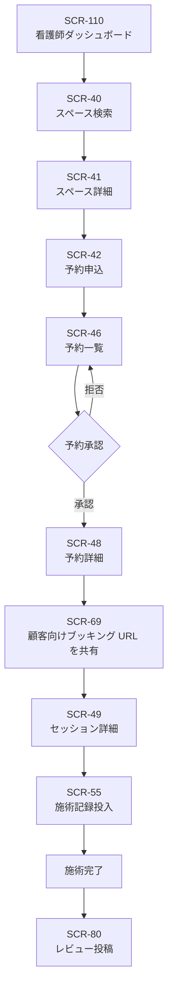
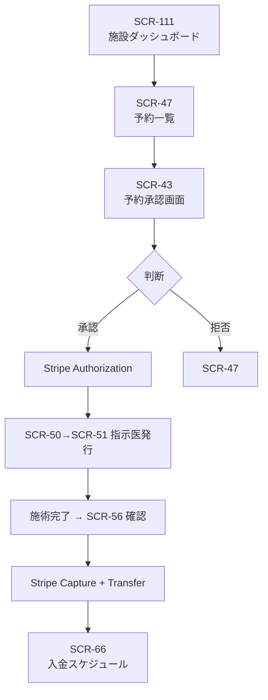
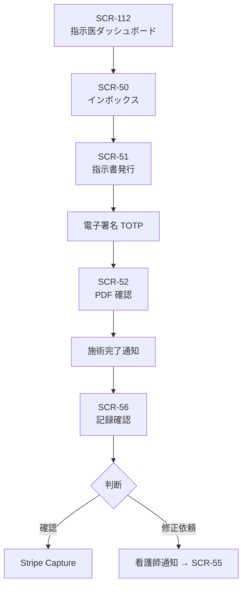
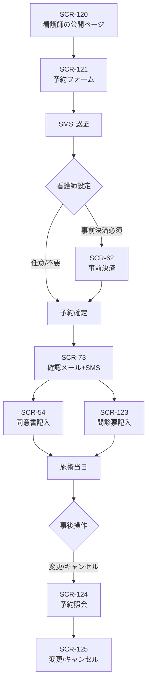
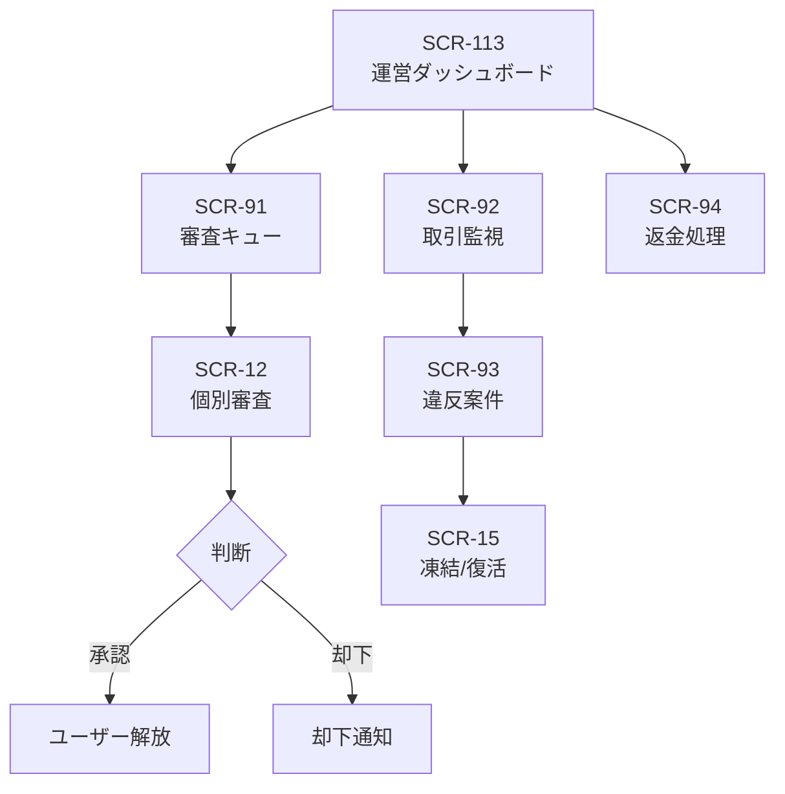
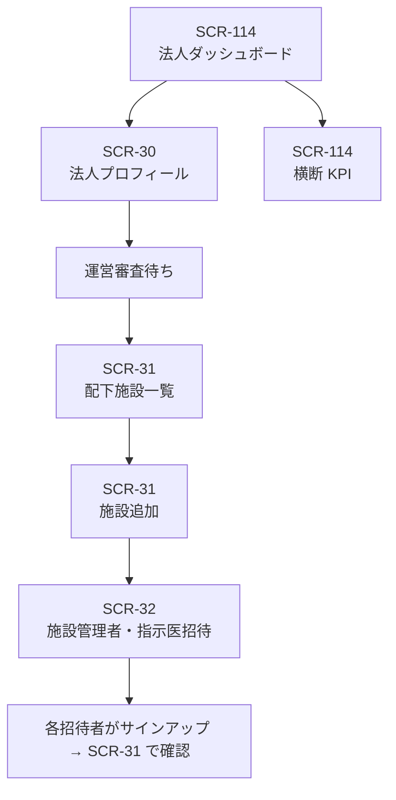
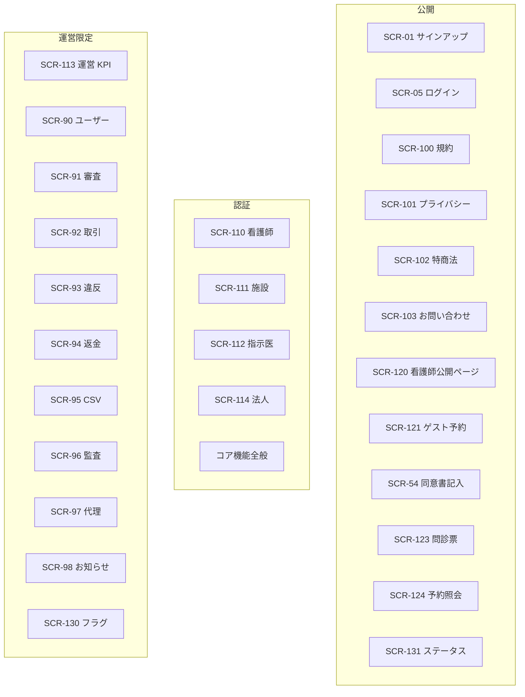

# 画面遷移図 — premake

> 各 features/FR-XX に登場する `related_screens: [SCR-XX]` を一覧化し、画面間の遷移関係を可視化する。

---

## 1. 画面一覧

### A. 認証・本人確認 (SCR-01〜16)
| 画面 ID | 画面名 | URL 案 | 認証 | 対象 | 関連 FR |
|---------|--------|--------|------|------|---------|
| SCR-01 | サインアップ（ロール選択） | /signup | 不要 | 全認証ユーザー | FR-01, FR-81 |
| SCR-02 | サインアップ確認 | /signup/confirm | 不要 | - | FR-01 |
| SCR-03 | 招待受諾 | /invite/{token} | 不要 | U-02, U-03 | FR-02, FR-03 |
| SCR-04 | 申請フォーム | /apply | 不要 | U-02 | FR-02 |
| SCR-05 | ログイン | /login | 不要 | 全認証 | FR-04, FR-81 |
| SCR-06 | パスワードリセット要求 | /password-reset | 不要 | 全認証 | FR-05 |
| SCR-07 | パスワードリセット実行 | /password-reset/{token} | 不要 | 全認証 | FR-05 |
| SCR-08 | メール確認 | /email-verify/{token} | 不要 | 全認証 | FR-06 |
| SCR-09 | MFA 設定 | /settings/mfa/setup | 必要 | 全認証 | FR-07 |
| SCR-10 | MFA 検証（ログイン時） | /login/mfa | 一時セッション | 全認証 | FR-07 |
| SCR-11 | 看護師免許アップロード | /onboarding/license | 必要 | U-01 | FR-08 |
| SCR-12 | 運営審査画面 | /ops/reviews/{id} | ops | U-04 | FR-08, FR-09, FR-10, FR-54 |
| SCR-13 | 医療機関開設届アップロード | /onboarding/facility-license | 必要 | U-02 | FR-09 |
| SCR-14 | 医師免許アップロード | /onboarding/doctor-license | 必要 | U-03 | FR-10 |
| SCR-15 | 運営: 凍結・復活 | /ops/users/{id}/suspend | ops | U-04 | FR-11 |
| SCR-16 | セッション管理 | /settings/sessions | 必要 | 全認証 | FR-12 |

### B. 法人・施設・スペース (SCR-20〜32)
| SCR-20 | 医療機関プロフィール編集 | /facility/profile | 必要 | U-02, U-06 | FR-13 |
| SCR-21 | スペース作成・編集 | /facility/spaces/{id}/edit | 必要 | U-02, U-06 | FR-14, FR-17 |
| SCR-22 | スペース料金設定 | /facility/spaces/{id}/pricing | 必要 | U-02, U-06 | FR-15 |
| SCR-23 | スペース空き枠カレンダー | /facility/spaces/{id}/calendar | 必要 | U-02, U-06 | FR-16 |
| SCR-24 | スペース一覧（施設目線） | /facility/spaces | 必要 | U-02, U-06 | FR-17 |
| SCR-25 | 指示医割当 | /facility/doctors | 必要 | U-02, U-06 | FR-18 |
| SCR-30 | 法人プロフィール | /org/profile | 必要 | U-06 | FR-82 |
| SCR-31 | 配下施設一覧 | /org/facilities | 必要 | U-06 | FR-83 |
| SCR-32 | 法人からの招待発行 | /org/invitations | 必要 | U-06 | FR-84 |

### C. 検索・予約 (SCR-40〜49)
| SCR-40 | スペース検索 | /search | 必要 | U-01 | FR-19 |
| SCR-41 | スペース詳細 | /spaces/{id} | 必要 | U-01 | FR-20 |
| SCR-42 | 予約申込フォーム | /spaces/{id}/book | 必要 | U-01 | FR-21 |
| SCR-43 | 予約承認画面（施設） | /facility/bookings/{id}/review | 必要 | U-02 | FR-22 |
| SCR-44 | 予約変更 | /bookings/{id}/modify | 必要 | U-01, U-02 | FR-23 |
| SCR-45 | 予約キャンセル | /bookings/{id}/cancel | 必要 | U-01, U-02 | FR-24 |
| SCR-46 | 予約一覧（看護師） | /bookings | 必要 | U-01 | FR-25 |
| SCR-47 | 予約一覧（施設） | /facility/bookings | 必要 | U-02, U-06 | FR-26 |
| SCR-48 | 予約詳細 | /bookings/{id} | 必要 | 関係者 | FR-27 |
| SCR-49 | セッション詳細 | /bookings/{id}/sessions/{sid} | 必要 | 関係者 | FR-88 |

### D. 医師指示・施術記録 (SCR-50〜57)
| SCR-50 | 指示医インボックス | /doctor/inbox | 必要 | U-03 | FR-28 |
| SCR-51 | 電子指示書発行 | /doctor/prescriptions/{bid}/issue | 必要 | U-03 | FR-29 |
| SCR-52 | 指示書 PDF 閲覧 | /prescriptions/{id}/view | 必要 | 関係者 | FR-30 |
| SCR-53 | 同意書テンプレート編集 | /facility/consent-templates / /nurse/consent-templates | 必要 | U-01, U-02 | FR-31 |
| SCR-54 | 同意書記入（利用客） | /c/consent/{token} | 不要 | U-05 | FR-32 |
| SCR-55 | 施術記録投入 | /bookings/{id}/record | 必要 | U-01 | FR-33 |
| SCR-56 | 施術記録確認（指示医） | /doctor/records/{id}/review | 必要 | U-03 | FR-34 |
| SCR-57 | 施術記録検索 | /records/search | 必要 | 権限内 | FR-35 |

### E. 決済 (SCR-60〜67)
| SCR-60 | 看護師カード登録 | /settings/card | 必要 | U-01 | FR-36 |
| SCR-61 | Stripe Connect 連携 | /facility/stripe / /org/stripe | 必要 | U-02, U-06 | FR-37 |
| SCR-62 | 利用客事前決済 | /c/pay/{token} | 不要 | U-05 | FR-39 |
| SCR-63 | 運営返金処理 | /ops/refunds | ops | U-04 | FR-40, FR-57 |
| SCR-64 | キャンセルポリシー閲覧 | /policies/cancel | 不要 | 全員 | FR-41 |
| SCR-65 | 手数料明細 | /finance/statements | 必要 | U-01, U-02, U-06 | FR-43 |
| SCR-66 | 入金スケジュール | /facility/payouts | 必要 | U-02, U-06 | FR-44 |
| SCR-67 | 施設別キャンセルポリシー上書き | /facility/cancel-policy | 必要 | U-02, U-06 | FR-86 |

### F. メッセージ (SCR-70〜71)
| SCR-70 | チャット | /bookings/{id}/chat | 必要 | U-01, U-02 | FR-45 |
| SCR-71 | 通知設定 | /settings/notifications | 必要 | 全認証 | FR-48 |

### G. レビュー (SCR-80〜83)
| SCR-80 | レビュー投稿（看護師→施設） | /reviews/new?type=facility | 必要 | U-01 | FR-49 |
| SCR-81 | レビュー投稿（施設→看護師） | /reviews/new?type=nurse | 必要 | U-02 | FR-50 |
| SCR-82 | レビュー一覧 | /spaces/{id}/reviews / /n/{handle}/reviews | 不要（公開のみ） | 全員 | FR-51 |
| SCR-83 | レビューモデレーション（運営） | /ops/reviews | ops | U-04 | FR-52 |

### H. 運営管理 (SCR-90〜98)
| SCR-90 | ユーザー一覧 | /ops/users | ops | U-04 | FR-53 |
| SCR-91 | 審査キュー | /ops/reviews | ops | U-04 | FR-54 |
| SCR-92 | 取引監視 | /ops/transactions | ops | U-04 | FR-55 |
| SCR-93 | 違反案件管理 | /ops/violations | ops | U-04 | FR-56 |
| SCR-94 | 返金処理画面 | /ops/refunds/{id} | ops | U-04 | FR-57 |
| SCR-95 | CSV エクスポート | /ops/exports | ops | U-04 | FR-58 |
| SCR-96 | 監査ログ閲覧 | /ops/audit-log | ops | U-04 | FR-59 |
| SCR-97 | 代理オンボーディング | /ops/managed-onboarding | ops | U-04 | FR-87 |
| SCR-98 | お知らせ配信 | /ops/announcements | ops | U-04 | FR-60 |

### I. 公開導線 (SCR-100〜103)
| SCR-100 | 利用規約 | /terms | 不要 | 全員 | FR-61 |
| SCR-101 | プライバシーポリシー | /privacy | 不要 | 全員 | FR-62 |
| SCR-102 | 特商法表記 | /commerce-disclosure | 不要 | 全員 | FR-63 |
| SCR-103 | お問い合わせ | /contact | 不要 | 全員 | FR-64 |

### J. ダッシュボード (SCR-110〜114)
| SCR-110 | 看護師ダッシュボード | / (after login as nurse) | 必要 | U-01 | FR-65 |
| SCR-111 | 施設ダッシュボード | / (as facility) | 必要 | U-02 | FR-66 |
| SCR-112 | 指示医ダッシュボード | / (as doctor) | 必要 | U-03 | FR-67 |
| SCR-113 | 運営 KPI ダッシュボード | /ops | ops | U-04 | FR-68 |
| SCR-114 | 法人ダッシュボード | / (as org admin) | 必要 | U-06 | FR-85 |

### K. 顧客予約ページ (SCR-120〜125)
| SCR-120 | 看護師の公開ブッキングページ | /n/{handle} | 不要 | U-05 | FR-69 |
| SCR-121 | 利用客の予約フォーム | /n/{handle}/book | 不要 | U-05 | FR-70 |
| SCR-122 | 問診票テンプレート編集 | /nurse/questionnaire-template | 必要 | U-01 | FR-71 |
| SCR-123 | 問診票記入 | /c/questionnaire/{token} | 不要 | U-05 | FR-72 |
| SCR-124 | 予約照会 | /c/lookup | 不要 | U-05 | FR-74 |
| SCR-125 | 利用客の予約変更・キャンセル | /c/bookings/{token} | 一時セッション | U-05 | FR-75 |

### 横断 (SCR-130〜131)
| SCR-130 | フィーチャーフラグ管理 | /ops/feature-flags | ops | U-04 | FR-79 |
| SCR-131 | 公開ステータスページ | /status | 不要 | 全員 | FR-80 |

---

## 2. 全体遷移図（簡略）

```mermaid
stateDiagram-v2
    [*] --> ランディング
    ランディング --> SCR-01: サインアップ
    ランディング --> SCR-05: ログイン
    SCR-01 --> SCR-08: メール確認
    SCR-08 --> SCR-11: 看護師免許 (U-01)
    SCR-08 --> SCR-13: 開設届 (U-02)
    SCR-08 --> SCR-14: 医師免許 (U-03)
    SCR-11 --> ダッシュボード
    SCR-13 --> ダッシュボード
    SCR-14 --> ダッシュボード
    SCR-05 --> ダッシュボード: 通常ログイン
    SCR-05 --> SCR-10: MFA 必要
    SCR-10 --> ダッシュボード
    state ダッシュボード {
        SCR-110: 看護師
        SCR-111: 施設
        SCR-112: 指示医
        SCR-113: 運営
        SCR-114: 法人
    }
```

---

## 3. コアフロー別遷移図

### 3.1 看護師の予約 → 施術完結フロー



### 3.2 施設の予約承認 → 入金フロー



### 3.3 指示医の指示書発行 → 施術記録確認



### 3.4 利用客のゲスト予約フロー



### 3.5 運営の審査 → 監視フロー



### 3.6 法人管理者のオンボーディング



---

## 4. 認証境界（公開/認証/運営）



---

## 5. 各画面の概要（主要 SCR のみ詳細記述）

> 各 features/FR-XX.md の `related_screens` と双方向に紐付け。詳細 UI は Phase 2「外部設計」04_画面設計.md で深掘りする。

---

バージョン: 1.0 / 作成日: 2026-05-10 / Phase 1 / 状態: User 確認待ち
