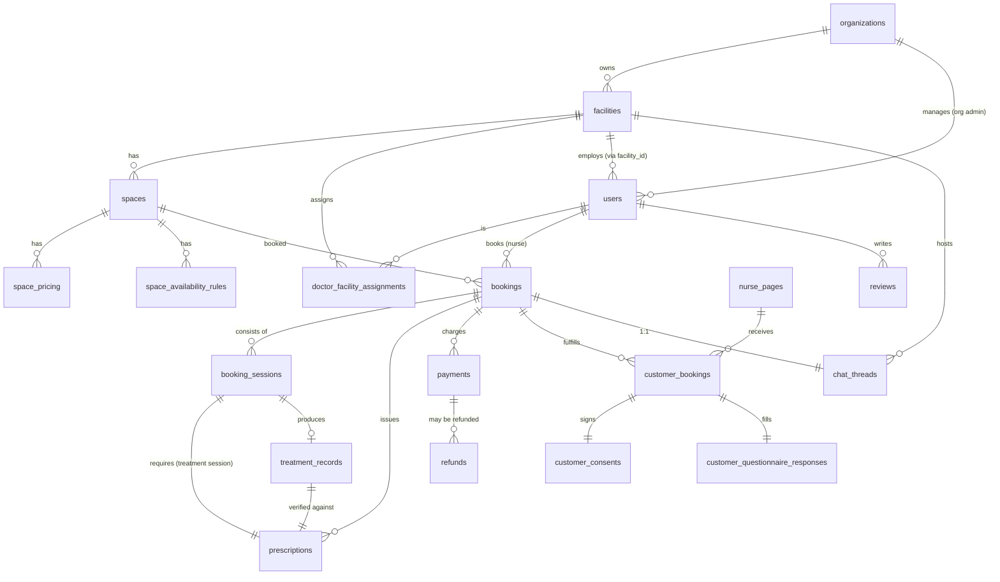
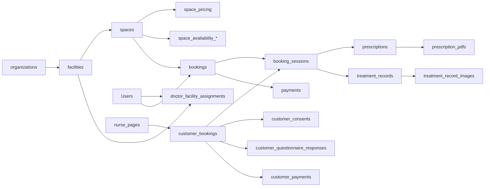
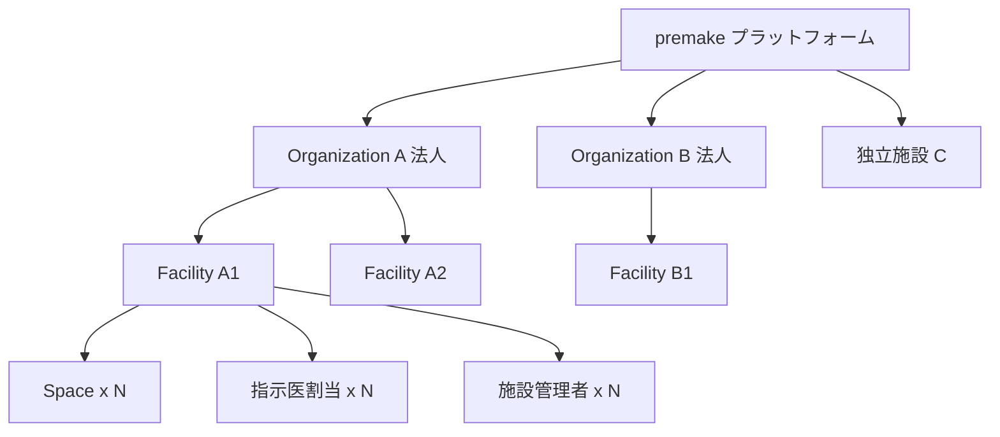

# DB 設計 — ER 図 / リレーション概要

> [00_index.md](00_index.md) に戻る

## 1. ER 図（主要エンティティ）

## 2. リレーション概要図

## 3. テナント階層

- 法人 (organizations) は 1〜N 施設 (facilities) を持つ
- 独立施設は organization_id = NULL
- 各施設は複数のスペース・指示医・管理者を持つ
- 看護師 (users with role=nurse) は施設に所属しない（プラットフォーム横断）

## 4. データフローの中核 6 系統

| 系統 | 流れ |
|---|---|
| **予約成立** | spaces × bookings × booking_sessions |
| **指示書フロー** | booking_sessions → prescriptions → prescription_pdfs |
| **施術記録** | booking_sessions → treatment_records → treatment_record_images |
| **決済** | bookings → payments → (refunds) |
| **顧客予約** | nurse_pages → customer_bookings → (customer_consents, customer_questionnaire_responses, customer_payments) |
| **監査・通知** | 全業務テーブル → audit_log / notifications |

---

[← 01_設計方針.md](01_設計方針.md) | [次: 03_tables_A_認証組織ユーザー.md →](03_tables_A_認証組織ユーザー.md)
