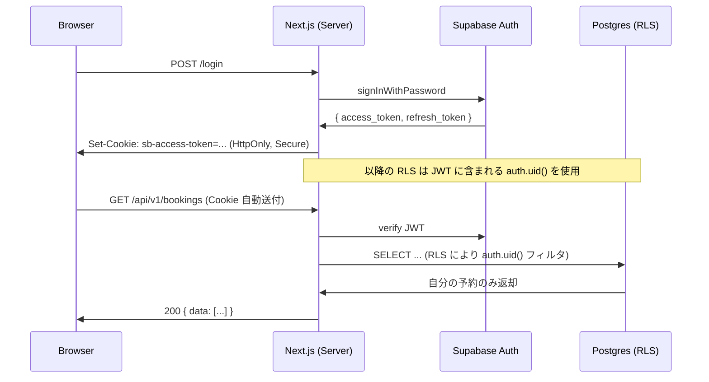

# API 仕様 — 認証・セッション共通

> [00_index.md](00_index.md) に戻る

## 1. Supabase Auth との統合

premake は Supabase Auth を一次認証基盤として採用 (DEC-21)。Next.js 側では `@supabase/ssr` を使い、サーバー / クライアント / middleware で sb-access-token Cookie を読み書きする。



## 2. JWT クレーム

| クレーム | 内容 |
|---|---|
| `sub` | users.id |
| `email` | users.email |
| `role` | "authenticated" (Supabase 標準)、業務ロールは `app_metadata.role` |
| `app_metadata.role` | nurse / facility_admin / doctor / ops / org_admin |
| `app_metadata.facility_id` | 施設管理者・指示医の所属（RLS で利用） |
| `app_metadata.organization_id` | 法人管理者の所属 |
| `app_metadata.license_status` | nurse / doctor のみ |
| `aal` | aal1 (パスワードのみ) / aal2 (MFA 通過後) |

> 業務ロール / facility_id 等は `app_metadata` に格納し、ユーザー自身は変更不可。サインアップ完了 / 審査 / 凍結時にサーバー側で更新する。

## 3. Cookie 設定

```
sb-access-token=<JWT>;        HttpOnly; Secure; SameSite=Lax; Path=/;     Max-Age=3600
sb-refresh-token=<refresh>;   HttpOnly; Secure; SameSite=Lax; Path=/;     Max-Age=2592000
```

- `remember_me=true` で `Max-Age=2592000` (30 日)
- `remember_me=false` で session cookie（ブラウザ閉じで失効）

## 4. リクエスト認証フロー（Route Handler / Server Action 共通）

```typescript
// app/api/v1/_lib/auth.ts
export async function requireUser(req: Request): Promise<User> {
  const supabase = createServerClient(...);
  const { data: { user }, error } = await supabase.auth.getUser();
  if (error || !user) throw new ApiError("UNAUTHORIZED", 401);
  return user;
}

export async function requireRole(req: Request, allowed: Role[]): Promise<User> {
  const user = await requireUser(req);
  const role = user.app_metadata?.role;
  if (!allowed.includes(role)) throw new ApiError("FORBIDDEN", 403);
  return user;
}
```

## 5. MFA フロー（aal2 要求）

特定のエンドポイント（電子指示書発行 EP-D003、運営の重要操作 EP-H003 等）は **aal2 必須**。aal1 のみで呼ばれた場合は `MFA_REQUIRED` エラーを返し、クライアントは MFA verify 画面に誘導する。

```typescript
// EP-D003 などで使用
async function requireAAL2(user: User) {
  const { data: { aal } } = await supabase.auth.mfa.getAuthenticatorAssuranceLevel();
  if (aal.currentLevel !== 'aal2') {
    throw new ApiError("MFA_REQUIRED", 403, { redirect: "/login/mfa" });
  }
}
```

## 6. Service Role の使用ルール

`SUPABASE_SERVICE_ROLE_KEY` は RLS をバイパスする最強権限。以下の場合のみ使用可能:

| 用途 | 場所 |
|---|---|
| Stripe Webhook 処理 | `app/api/webhooks/stripe/route.ts` |
| 運営の越境操作（凍結 / 監査閲覧） | Server Action 内部、`requireRole(['ops'])` で保護 |
| バックグラウンドジョブ | `worker_jobs` 取得・更新 |
| 代理オンボーディング (FR-87) | 運営のみ |

> Client Component から `createBrowserClient` で Service Role を使うのは絶対に禁止。CI で grep チェック。

## 7. 利用客（ゲスト）認証

利用客 (U-05) は Supabase Auth のユーザーではない（DEC-12）。代わりに以下:

### 7.1 SMS OTP による予約照会
```mermaid
sequenceDiagram
    participant C as Customer (browser)
    participant N as Next.js
    participant T as Twilio

    C->>N: POST /c/sms-verify/request {email, booking_number, phone_last4}
    N->>N: customer_bookings 検索（PII 漏洩防止のため曖昧成功）
    N->>T: Send SMS OTP
    T->>C: SMS "code: 123456"
    C->>N: POST /c/sms-verify {token, code}
    N->>C: Set-Cookie: guest_session=<short-lived JWT>; Max-Age=1800
    C->>N: GET /c/bookings/{token}
```

- ゲストセッショントークンは **30 分有効、HttpOnly Cookie**
- 当該予約 (customer_booking_id) のみアクセス可

### 7.2 同意書 / 問診票記入リンク
- メール内のリンクに **per-booking-session トークン**（72 時間有効）を含む
- トークン検証で当該 booking_session のみ書き込み可
- アクセス時に customer_email との一致を改めて検証

## 8. 招待トークン

[`invitations`](../01_DB設計/03_tables_A_認証組織ユーザー.md#tbl-invitations--招待) テーブルに記録。

- token: 100 桁ランダム（URL 用）
- code: 8 桁英数字（手入力用）
- 1 回限り使用、72 時間で失効
- 受諾時に invitations.consumed_at 設定 + users 作成

## 9. パスワードリセットトークン

- Supabase Auth の `resetPasswordForEmail` を使用
- 30 分有効、1 回限り
- リセット完了で全セッション無効化（FR-05 BR-04）

## 10. メール確認トークン

- Supabase Auth の `signUp` フローで自動発行
- 24 時間有効
- 失効時は `resend` API で再送

## 11. CSRF 保護

- Supabase Auth の SameSite=Lax Cookie で基本的に防御
- Server Action は Next.js 標準で CSRF 対策内蔵
- Route Handler の mutation は `Origin` ヘッダ検証 or POST のみ受付

## 12. セッションリフレッシュ

- middleware で `sb-access-token` の有効期限を確認
- 残り 5 分以内なら refresh_token で更新、新 access_token を Cookie に書き戻し
- refresh_token も失効していたら 401 → ログイン画面リダイレクト

```typescript
// middleware.ts
export async function middleware(req: NextRequest) {
  const supabase = createMiddlewareClient(req);
  const { data: { session } } = await supabase.auth.getSession();
  if (session?.expires_at && session.expires_at - now() < 300) {
    await supabase.auth.refreshSession();
  }
  return NextResponse.next();
}
```

---

[← 01_設計方針.md](01_設計方針.md) | [次: 03_endpoints_A_認証.md →](03_endpoints_A_認証.md)
