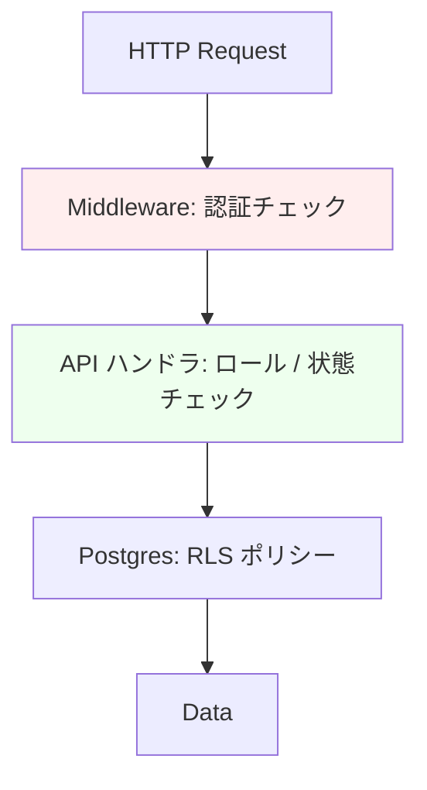

# 権限設計 — 権限モデル

> [00_index.md](00_index.md) に戻る

## 1. 採用方式

**RBAC（Role-Based Access Control）+ テナント属性（属性ベースの絞り込み）** のハイブリッド。

### 1.1 なぜ RBAC + テナント属性か
- Phase 1 の権限マトリクス（02_ユーザー像.md）が **明確な 6 ロール × 機能の表** で記述されている
- マルチテナント（法人 → 施設）の階層があるため、ロール単独では不十分
- ABAC（属性ベース）を本格導入するとポリシー記述が複雑化、AI コーディングエージェント (U-AI) のメンテ難度が上がる
- → 「ロール + テナント属性」が現実解

### 1.2 階層構造

```
プラットフォーム
└── 運営 (ops): 全データアクセス可
└── 法人 (organization_id)
    └── 法人管理者 (org_admin): 自法人配下全て
    └── 施設 (facility_id)
        └── 施設管理者 (facility_admin): 自施設のみ
        └── 指示医 (doctor): 自施設のみ
└── 看護師 (nurse): グローバル（自分のリソース + 公開リソース）
└── 利用客 (guest): 自分の予約のみ（OTP）
```

## 2. 認可の三層防御



### 2.1 第 1 層: Middleware
- JWT 検証（Supabase Auth）
- セッション期限チェック
- 認証必須エンドポイントへの未認証アクセスを 401

### 2.2 第 2 層: API ハンドラ
- ロールチェック（`requireRole(['ops'])`）
- 状態チェック（`license_status=approved` 等）
- aal2 要求（重要操作）
- ビジネスルール検証

### 2.3 第 3 層: PostgreSQL RLS
- **最後の砦**。ハンドラのバグで漏れても DB 層で防ぐ
- すべてのテーブルに RLS ENABLE
- ポリシーは `auth.uid()`、`auth.jwt() ->> 'role'`、`(auth.jwt() -> 'app_metadata' ->> 'facility_id')::uuid` を参照

## 3. JWT クレーム設計

```json
{
  "sub": "<users.id>",
  "email": "...",
  "role": "authenticated",
  "aal": "aal1" | "aal2",
  "app_metadata": {
    "role": "nurse" | "facility_admin" | "doctor" | "ops" | "org_admin",
    "facility_id": "<uuid>",
    "organization_id": "<uuid>",
    "license_status": "approved" | null,
    "can_book": true,
    "prescription_issue_enabled": true
  },
  "exp": 1234567890
}
```

> `app_metadata` はユーザー自身が編集不可。Server Action / Webhook 内でのみ更新する（例: 免許承認時）。

## 4. ロール変更タイミング

| イベント | role 更新先 |
|---|---|
| EP-A001 看護師サインアップ | nurse |
| EP-A003 施設管理者招待受諾 | facility_admin |
| EP-A003 指示医招待受諾 | doctor |
| EP-B001 法人登録（招待ベース） | org_admin |
| 運営アカウントの作成（手動） | ops |

## 5. テナント属性更新

- `facility_id` の変更: 招待受諾時 / 代理オンボーディング時
- `organization_id` の変更: 法人登録時 / 法人移管時
- 変更時は **JWT を再発行**（refresh token で次回ログインまで反映 or 即座に sign out 強制）

## 6. Service Role の使用ルール

`SUPABASE_SERVICE_ROLE_KEY` は RLS をバイパスする最強権限。以下の場合のみ使用:

| 用途 | 場所 | 検証 |
|---|---|---|
| Stripe Webhook 処理 | `app/api/webhooks/stripe/route.ts` | Stripe 署名検証 |
| 運営の越境操作 | Server Action 内、`requireRole(['ops'])` 後 | aal2 + 監査ログ |
| バックグラウンドジョブ | `worker_jobs` 取得・更新 | サーバープロセス内のみ |
| 代理オンボーディング (FR-87) | `app/actions/ops/managedOnboarding.ts` | ops + aal2 + 同意ログ |
| 監査ログ書き込み | 全 mutation API の subroutine | 自動付与 |
| マイグレーション | CI / migration runner | デプロイ環境のみ |

> **絶対禁止**: Client Component で `createBrowserClient(SUPABASE_SERVICE_ROLE_KEY)` を呼ぶこと。CI で grep チェックを必須化。

## 7. 利用客（Guest）の権限境界

利用客は Supabase Auth ユーザーではない（DEC-12）。代わりに:

- **ゲストセッショントークン**: 30 分有効、`customer_booking_id` を含む短命 JWT
- **記入用トークン**: 同意書 / 問診票記入リンクに含む 72 時間有効トークン
- これらのトークンは Server Action / Route Handler で検証し、対応する `customer_bookings.id` のみアクセス許可

```typescript
// 例: ゲストセッション検証
async function requireGuestSession(req: Request): Promise<{ customer_booking_id: string }> {
  const cookie = req.cookies.get('guest_session');
  if (!cookie) throw new ApiError("UNAUTHORIZED", 401);
  const payload = jwt.verify(cookie.value, GUEST_SECRET) as { customer_booking_id: string };
  return payload;
}
```

> RLS ポリシーで `customer_bookings` には認証ユーザーからのアクセスを限定（看護師は自分が受注したもの、運営は監査）。Guest セッションは Service Role + アプリ層チェックの組み合わせで対応。

---

[← 00_index.md](00_index.md) | [次: 02_ロール定義.md →](02_ロール定義.md)
