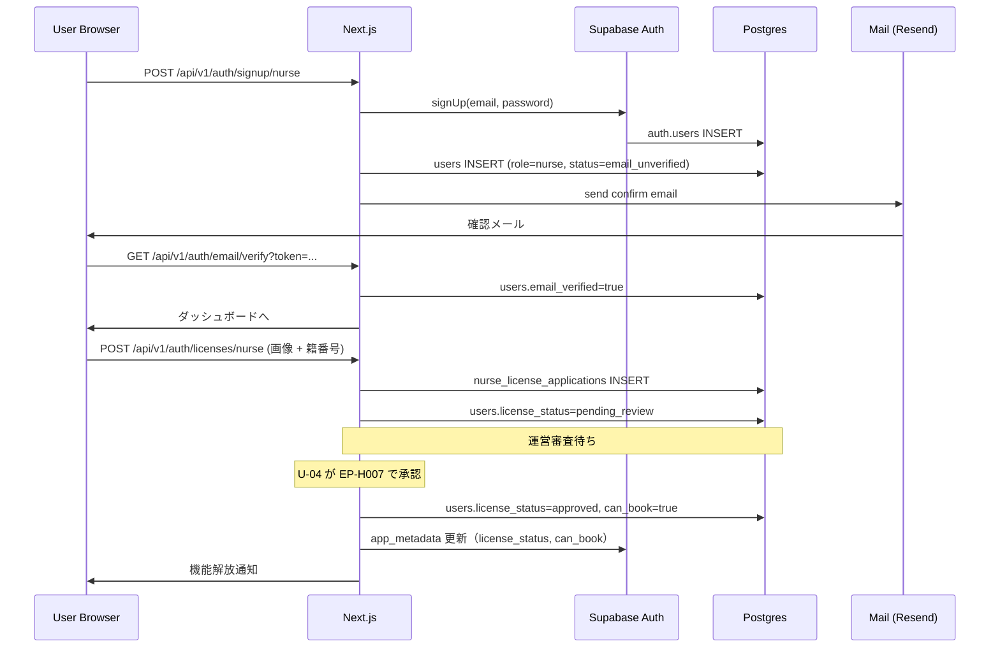
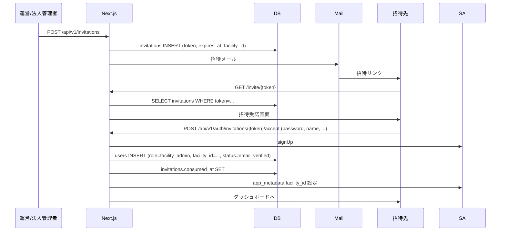
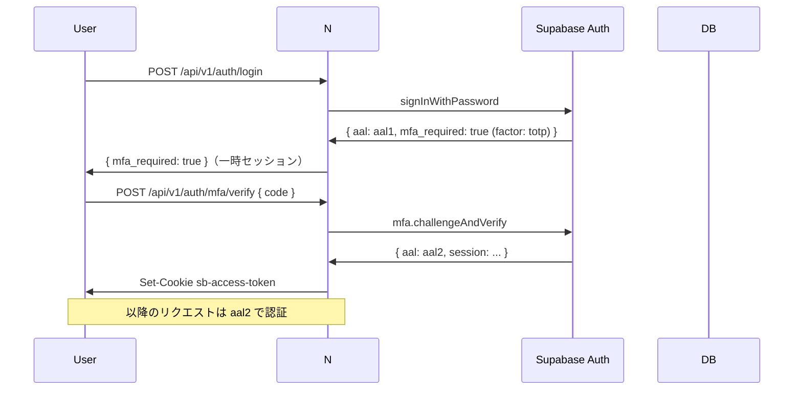
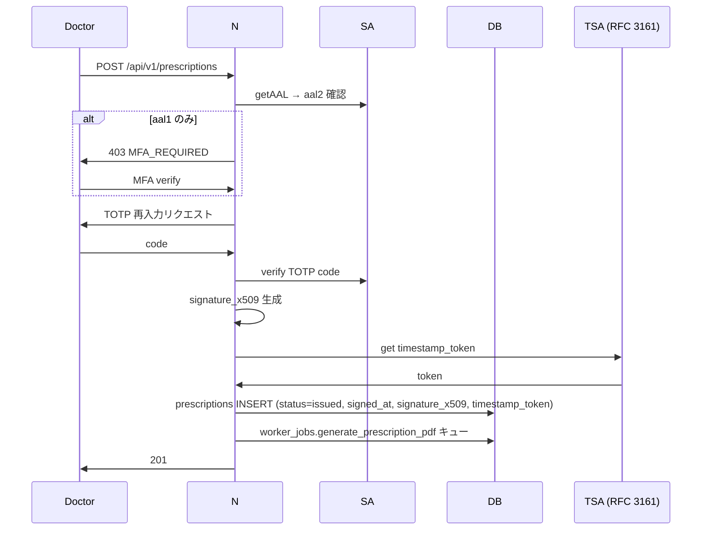
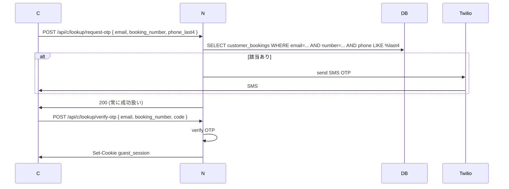
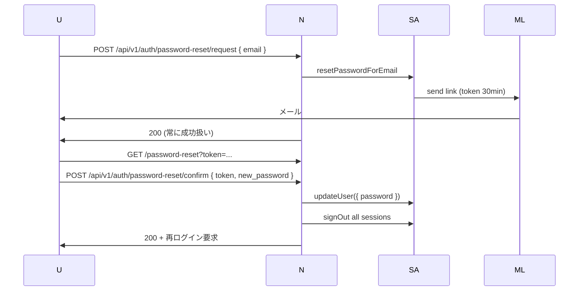
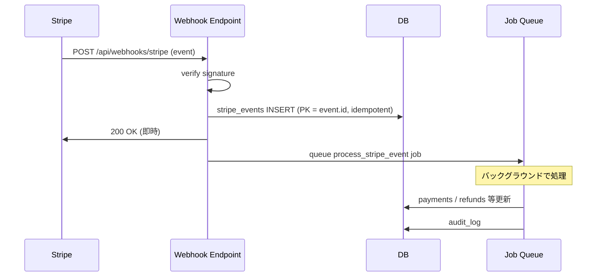

# 権限設計 — 認証フロー（シーケンス図）

> [00_index.md](00_index.md) に戻る

## 1. メールサインアップ → 看護師として完全機能まで



## 2. 招待型サインアップ（施設管理者）



## 3. ログイン + MFA



## 4. 電子指示書発行（aal2 必須）



## 5. 利用客（ゲスト）SMS OTP 認証

```mermaid
sequenceDiagram
    participant C as Customer Browser
    participant N as Next.js
    participant DB
    participant T as Twilio

    C->>N: POST /api/c/n/{handle}/bookings/draft (個人情報入力)
    N->>DB: customer_bookings INSERT (status=tentative)
    N->>T: send SMS OTP to phone
    T->>C: SMS code "123456"
    C->>N: POST /api/c/bookings/{draft_token}/verify-sms { code }
    N->>DB: customer_bookings.sms_verified_at, status=confirmed
    N->>N: guest_session JWT 生成 (30 分)
    N->>C: Set-Cookie: guest_session=...; HttpOnly; 30min
    C->>N: GET /api/c/bookings (with guest session)
    N->>N: verify guest_session
    N->>DB: SELECT customer_bookings (Service Role + customer_booking_id 限定)
    N->>C: 200
```

## 6. 予約照会（メール + 番号 + OTP）



## 7. パスワードリセット



## 8. Stripe Webhook 受信（決済確定）



---

[← 07_RLS_通知運営横断.md](07_RLS_通知運営横断.md) | [次: 09_セキュリティ考慮.md →](09_セキュリティ考慮.md)
