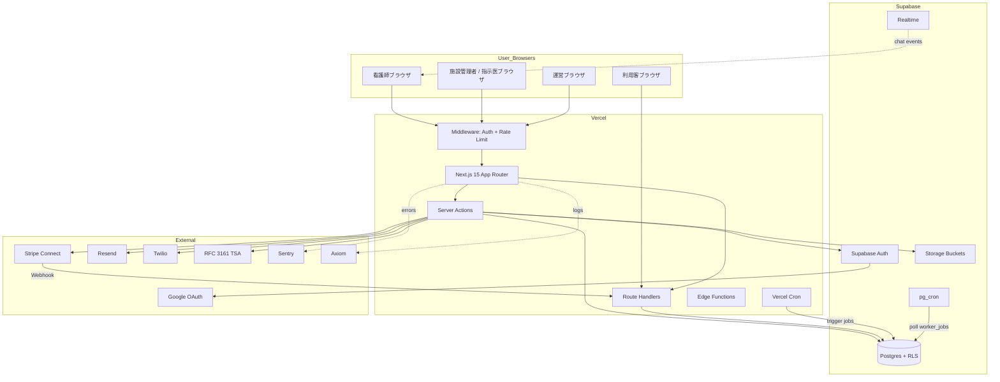
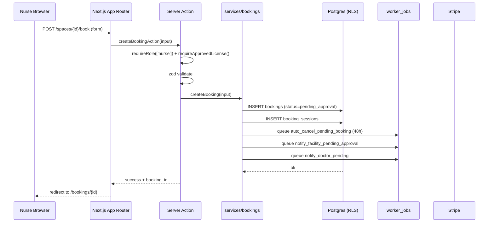
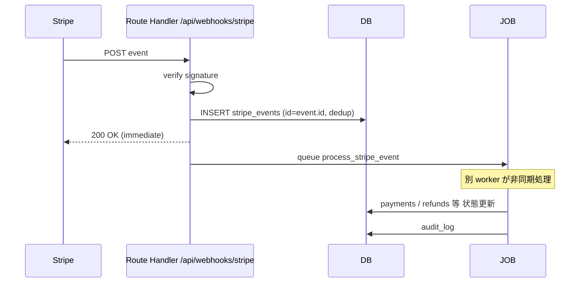
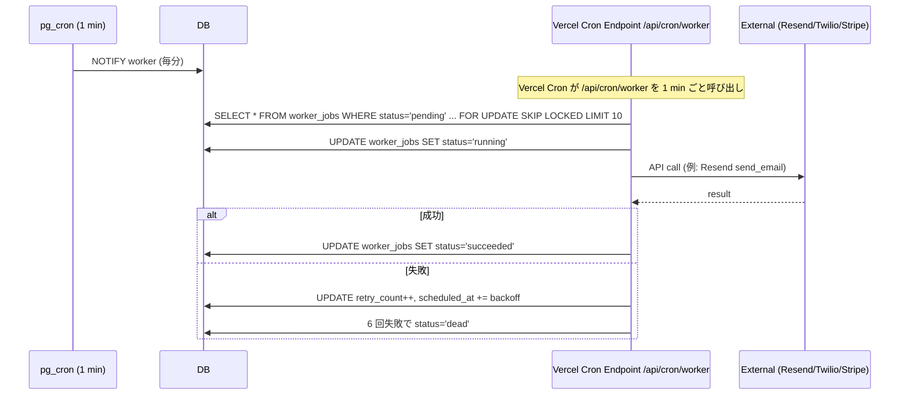

# アーキテクチャ設計 — premake

> Phase 2 で確定したスタック (DEC-20〜29) を、論理アーキとして整理する。

---

## 1. アーキテクチャ概要

- **パターン**: モノリシック（Next.js 15 App Router）+ BaaS（Supabase）+ 外部 SaaS 連携
- **理由**:
  - 1 人 + AI エージェントによる開発体制（小規模チームで運用負荷を最小化）
  - RSC + Server Actions でフロントとバックエンドの境界を最小化
  - Supabase で DB・認証・ストレージを統合 → 個別サービス連携コードを最小化
  - 将来モバイル拡張時は `services/` 層を共通化し、Route Handler を `/api/v1/...` 経由で公開

## 2. システム構成図



## 3. 技術スタック一覧

| カテゴリ | 技術 | バージョン | 選定理由（DEC 参照） |
|---|---|---|---|
| フレームワーク | Next.js | 15.x | App Router + Server Actions、AI 親和性 (DEC-20) |
| 言語 | TypeScript | 5.x strict | 型安全 |
| ランタイム | Node.js | 22 LTS | Next.js 推奨 |
| パッケージマネージャ | pnpm | 9.x | 高速、workspace 対応 |
| DB | Supabase Postgres | 15+ | RLS + pg_cron + PostGIS (DEC-21) |
| 認証 | Supabase Auth | latest | MFA / OAuth 統合 |
| ストレージ | Supabase Storage | latest | 暗号化 + 署名付き URL |
| Realtime | Supabase Realtime | latest | チャット (FR-45) |
| ホスティング | Vercel | Pro | Next.js Native (DEC-22) |
| 決済 | Stripe Connect Express | API 2024+ | DEC-03, DEC-27 |
| メール | Resend + React Email | latest | DEC-23 |
| SMS | Twilio Programmable Messaging | latest | DEC-24 |
| 監視 | Sentry | SDK 8.x | エラー監視 (DEC-25) |
| ログ | Axiom | latest | Vercel ネイティブ統合 |
| UI | Tailwind CSS + shadcn/ui + Lucide | v4 / latest | DEC-28 |
| フォーム | react-hook-form + zod | latest | DEC-29 |
| クライアントデータ取得 | TanStack Query | v5 | RSC と併用 |
| Stripe SDK | stripe-js + @stripe/react-stripe-js | latest | Elements |
| ジョブキュー | worker_jobs テーブル + pg_cron + Vercel Cron | - | DEC-26（β コスト最小） |
| PDF 生成 | react-pdf or pdfkit | latest | [仮決定] 実装時に検証 |
| QR | qrcode | latest | 電子指示書 QR |
| 検索 | Postgres FTS + pg_trgm | - | β は標準機能で対応 |
| 距離検索 | PostGIS | latest | FR-19 |
| テスト Unit/Integration | Vitest | v2 | DEC-29 |
| テスト E2E | Playwright | latest | DEC-29 |
| アクセシビリティ | axe-core + axe-playwright | latest | NFR-USB |
| CI/CD | GitHub Actions + Vercel Deploy | - | 標準 |
| Lint | Biome (or ESLint+Prettier) | latest | [仮決定] Biome 推奨（高速） |

## 4. レイヤー構成

```
プレゼンテーション層
  └─ app/                        Next.js App Router (RSC + Client Component)
  └─ src/features/{name}/components/

アプリケーション層（ユースケース / Server Action）
  └─ app/actions/{domain}/       Server Actions
  └─ src/features/{name}/actions/

ドメイン / サービス層（純粋ロジック、Web 非依存）
  └─ src/services/{domain}/      ビジネスロジック・将来モバイルで共有
  └─ src/schemas/{domain}/       Zod スキーマ（Server/Client 共有）

インフラストラクチャ層
  └─ src/lib/supabase/           Supabase クライアント生成
  └─ src/lib/stripe/             Stripe SDK ラッパー
  └─ src/lib/resend/             Resend ラッパー
  └─ src/lib/twilio/             Twilio ラッパー
  └─ src/lib/audit/              監査ログ書き込み
  └─ src/lib/jobs/               worker_jobs 操作

横断
  └─ src/lib/auth/               認可ヘルパー (requireRole, requireAAL2)
  └─ src/lib/errors/             AppError, エラーマッパー
  └─ src/lib/feature-flags/      フラグ評価
```

## 5. 中核データフロー

### 5.1 看護師の予約申込（FR-21）



### 5.2 Stripe Webhook 受信



### 5.3 worker_jobs ループ（DEC-26）



## 6. 設計原則

### 6.1 Server Components First
- デフォルト Server Components、Client は最小化
- `"use client"` はツリー末端のインタラクティブ要素のみ
- データ取得は基本 RSC、クライアント取得は TanStack Query

### 6.2 features 単位の機能凝集
- `src/features/{name}/` 配下に components / hooks / actions / schemas を集約
- features 間の直接 import 禁止（`index.ts` 経由のみ）
- 「この機能を消したい」ときフォルダごと消せる構造

### 6.3 型安全のフルパス
- Supabase の DB 型を自動生成（`supabase gen types`）
- zod スキーマでバリデーション、`z.infer<>` で TS 型導出
- Server Action の return も型付け、Client で type-safe に消費

### 6.4 三層認可（[03_権限設計](../02_外部設計/03_権限設計/01_権限モデル.md)準拠）
1. Middleware: JWT 検証
2. Server Action: requireRole / requireAAL2
3. DB: RLS が最後の砦

### 6.5 楽観的更新
- `useOptimistic` で UI 即時反映、失敗時にロールバック + Toast
- 既読化・通知操作などレイテンシが目立つ場面に適用

### 6.6 エラーバウンダリ
- `app/(...)/error.tsx` でレイアウト単位
- グローバル `app/global-error.tsx`
- Sentry 自動補足

### 6.7 YAGNI（Yet Another Generally Acceptable Now）
- 「将来モバイル」のために services/ を分離するのは OK
- ただし「将来必要かも」で抽象化を増やさない
- features → shared への昇格は 2 箇所利用が確定してから

### 6.8 AI 開発前提のコメント規約（Phase 5 詳述）
- 全ファイル冒頭に `@implements FR-XX, AC-XX-XX` を必須化
- Phase 4 整合性チェックが grep で逆引きする根拠

## 7. 環境構成

| 環境 | 用途 | URL |
|---|---|---|
| Local | 開発 | http://localhost:3000 + supabase local (54321) |
| Preview | PR ごとの確認 | Vercel preview deploy + Supabase Branch project |
| Staging | リリース前検証 | https://staging.premake.example.com |
| Production | 本番 | https://premake.example.com |

## 8. ブラウザ・端末サポート

- Chrome / Edge / Safari / Firefox 最新 2 メジャー
- iOS Safari 16+ / Android Chrome 最新
- ダーク モードは β 後対応

## 9. 国際化

- β は日本語のみ（DEC: Out of Scope）
- `next-intl` を導入だけしておき、メッセージは 1 言語

---

バージョン: 1.0 / 作成日: 2026-05-10 / Phase 3 / 状態: 確定
