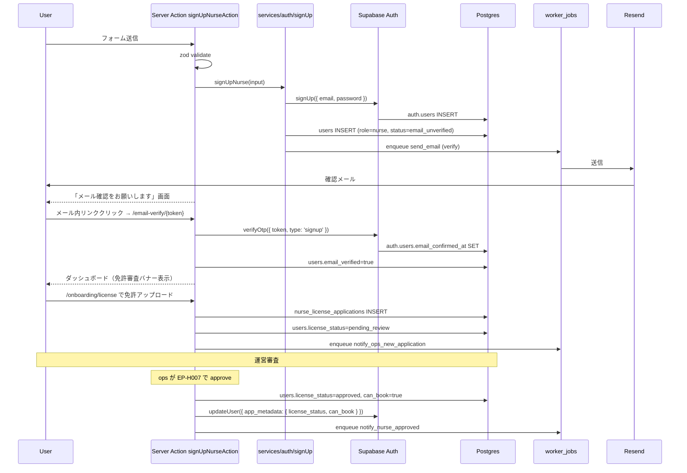
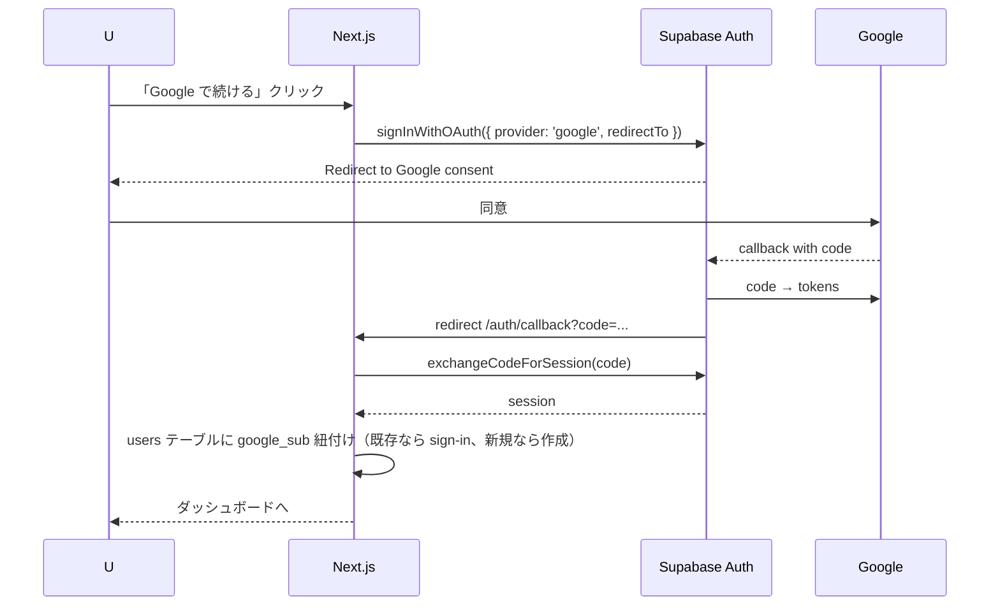
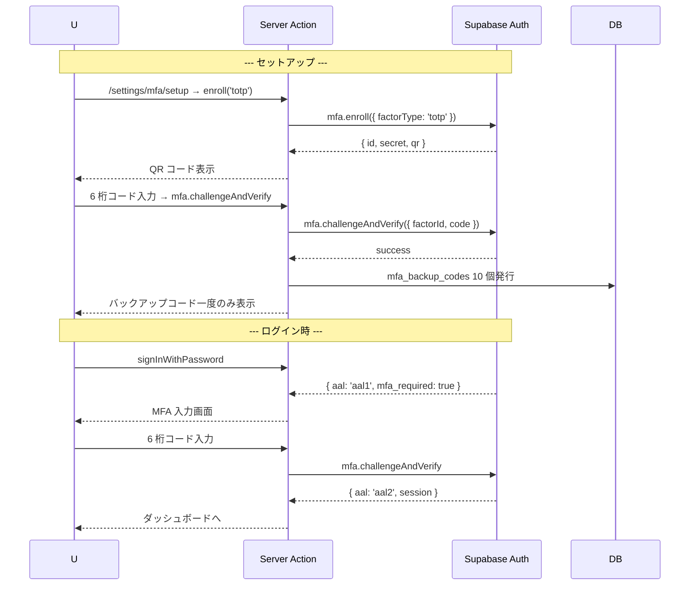
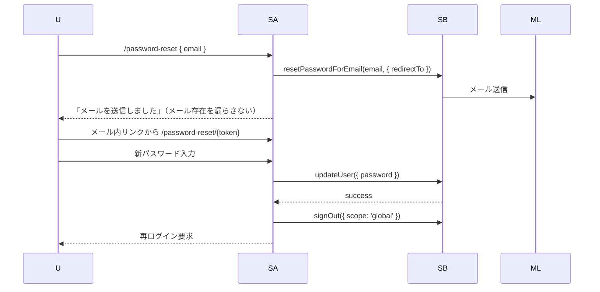
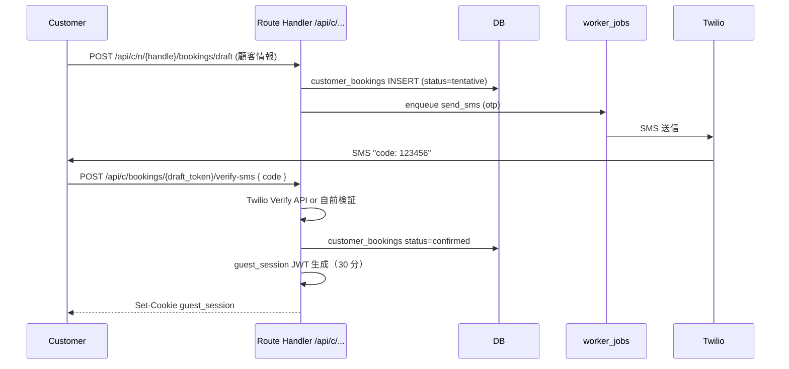

# 認証フロー — premake / 実装視点

> Phase 2 `03_権限設計/08_認証フロー.md` で論理フローを定義済み。本ファイルは Next.js / Supabase の実装に落とし込んだ手順とコードパターンを集約。

---

## 1. 認証方式まとめ

| ユーザー種別 | 認証方式 | aal |
|---|---|---|
| U-01 看護師 | メール+PW or Google OAuth | aal1 推奨、施術記録投入は aal2 推奨 |
| U-02 施設管理者 | 招待 + メール+PW or Google OAuth | aal1 |
| U-03 指示医 | 招待 + メール+PW or Google OAuth | **aal2 必須**（電子指示書発行時） |
| U-04 運営 | メール+PW + MFA 必須 | **aal2 常時** |
| U-05 利用客 | SMS OTP（Supabase ユーザーではない） | guest_session JWT |
| U-06 法人管理者 | 招待 + メール+PW or Google OAuth | aal1 |

## 2. セッション管理

| 項目 | 設定 |
|---|---|
| access_token | 1 時間有効 (JWT, HS256) |
| refresh_token | 30 日有効 |
| Cookie | HttpOnly + Secure + SameSite=Lax |
| remember_me | true なら refresh_token を 30 日、false なら session cookie |
| 自動リフレッシュ | middleware で残 5 分以下で更新 |
| 強制ログアウト | パスワード変更 / MFA 変更 / 凍結時 |

### 2.1 Supabase クライアント生成

```typescript
// src/lib/supabase/server.ts
import { createServerClient } from '@supabase/ssr';
import { cookies } from 'next/headers';

export async function createClient() {
  const cookieStore = await cookies();
  return createServerClient(
    env.NEXT_PUBLIC_SUPABASE_URL,
    env.NEXT_PUBLIC_SUPABASE_ANON_KEY,
    {
      cookies: {
        getAll: () => cookieStore.getAll(),
        setAll: (toSet) => toSet.forEach((c) => cookieStore.set(c.name, c.value, c.options)),
      },
    }
  );
}
```

```typescript
// src/lib/supabase/service.ts ★ サーバー専用、絶対に Client Component で import しない
import 'server-only';
import { createClient } from '@supabase/supabase-js';

export const supabaseService = createClient(
  env.NEXT_PUBLIC_SUPABASE_URL,
  env.SUPABASE_SERVICE_ROLE_KEY,
  { auth: { autoRefreshToken: false, persistSession: false } }
);
```

`'server-only'` パッケージで Client Component から import するとビルドエラーになる安全策。

---

## 3. 認証フロー詳細

### 3.1 サインアップ → 機能解放（FR-01, FR-06, FR-08）



### 3.2 Google OAuth（FR-81）



### 3.3 MFA セットアップ + ログイン時検証（FR-07）



### 3.4 パスワードリセット（FR-05）



### 3.5 ゲスト（利用客）SMS OTP（FR-70, FR-74）



---

## 4. Middleware 設計

```typescript
// src/middleware.ts
import { NextResponse } from 'next/server';
import { createMiddlewareClient } from '@/lib/supabase/middleware';
import { ratelimit } from '@/lib/rate-limit';

export async function middleware(req: NextRequest) {
  // 1. レート制限（認証系・SMS 系）
  if (isAuthRoute(req.nextUrl.pathname)) {
    const { success } = await ratelimit.auth.limit(req.ip);
    if (!success) return new NextResponse('Rate limited', { status: 429 });
  }

  // 2. Supabase セッション取得 + リフレッシュ
  const { supabase, response } = createMiddlewareClient(req);
  const { data: { session } } = await supabase.auth.getSession();

  // 3. ルートに応じた認証チェック
  const path = req.nextUrl.pathname;

  // 公開ルート
  if (isPublicRoute(path)) return response;

  // ゲストルート
  if (isCustomerRoute(path)) {
    return validateGuestSession(req) ?? NextResponse.redirect(new URL('/c/lookup', req.url));
  }

  // 認証必須ルート
  if (!session) {
    return NextResponse.redirect(new URL('/login', req.url));
  }

  // 運営ルート
  if (isOpsRoute(path) && session.user.app_metadata.role !== 'ops') {
    return NextResponse.redirect(new URL('/', req.url));
  }

  // セキュリティヘッダ
  response.headers.set('X-Frame-Options', 'DENY');
  response.headers.set('X-Content-Type-Options', 'nosniff');
  response.headers.set('Referrer-Policy', 'strict-origin-when-cross-origin');

  return response;
}

export const config = {
  matcher: [
    /*
     * Match all request paths except for:
     * - _next/static, _next/image
     * - favicon.ico
     * - api/webhooks (Stripe webhook は middleware 不要)
     */
    '/((?!_next/static|_next/image|favicon.ico|api/webhooks).*)',
  ],
};
```

### 4.1 認可ヘルパ

```typescript
// src/lib/auth/requireRole.ts
import 'server-only';
import { AppError } from '@/lib/errors/AppError';
import { createClient } from '@/lib/supabase/server';

export async function requireUser() {
  const supabase = await createClient();
  const { data: { user } } = await supabase.auth.getUser();
  if (!user) throw new AppError({ code: 'UNAUTHORIZED', status: 401 });
  return user;
}

export async function requireRole(roles: Role[]) {
  const user = await requireUser();
  const role = user.app_metadata?.role;
  if (!role || !roles.includes(role)) {
    throw new AppError({ code: 'FORBIDDEN', status: 403 });
  }
  return { user, role };
}

export async function requireAAL2() {
  const supabase = await createClient();
  const { data } = await supabase.auth.mfa.getAuthenticatorAssuranceLevel();
  if (data?.currentLevel !== 'aal2') {
    throw new AppError({ code: 'MFA_REQUIRED', status: 403 });
  }
}

export async function requireApprovedLicense() {
  const user = await requireUser();
  if (user.app_metadata?.license_status !== 'approved') {
    throw new AppError({ code: 'LICENSE_NOT_APPROVED', status: 403 });
  }
}
```

### 4.2 Server Action での使用例

```typescript
// src/features/bookings/actions/createBooking.ts
'use server';

/** @file
 * 機能: 看護師による予約申込
 * 入力: BookingFormData
 * 出力: { booking_id, status }
 * 例外: 400 / 403 LICENSE_NOT_APPROVED / 422 BOOKING_SLOT_TAKEN
 * 副作用: bookings INSERT, booking_sessions INSERT, worker_jobs キュー
 * セキュリティ: requireRole(['nurse']) + requireApprovedLicense() + RLS
 * @implements FR-21, AC-21-01, AC-21-02, AC-21-03, AC-21-04, AC-21-05
 */

import { requireRole, requireApprovedLicense } from '@/lib/auth';
import { createBookingSchema } from '@/schemas/bookings';
import * as bookingService from '@/services/bookings';
import { createClient } from '@/lib/supabase/server';

export async function createBookingAction(input: unknown) {
  const { user } = await requireRole(['nurse']);
  await requireApprovedLicense();
  const parsed = createBookingSchema.parse(input);
  const supabase = await createClient();
  return await bookingService.createBooking(supabase, user.id, parsed);
}
```

---

## 5. セキュリティ対策

| 攻撃手法 | 対策 | 実装方法 |
|---|---|---|
| ブルートフォース | レート制限 + アカウントロック | Vercel KV + 5 回失敗で 15 分ロック (FR-04) |
| 認証情報漏洩 | bcrypt cost 12+ | Supabase Auth 標準 |
| Session Hijack | HttpOnly Secure SameSite | Supabase SSR helper |
| CSRF | SameSite=Lax + Origin 検証 | Next.js Server Actions 標準 |
| XSS | DOM サニタイズ + CSP | React + CSP ヘッダ |
| SQL Injection | Parameterized クエリ | Supabase SDK |
| 越権アクセス | RLS + requireRole | Postgres RLS + アプリ層 |
| Service Role 漏洩 | サーバー専用、CI 検出 | `'server-only'` パッケージ |
| 招待トークン推測 | 100 桁ランダム + 72h 有効 | crypto.randomBytes |
| 改ざん（指示書 / 監査） | append-only + ハッシュチェーン | DB トリガー |
| Open Redirect | redirectTo を allowlist | next.config.ts |

### 5.1 CSP ヘッダ

```typescript
// next.config.ts
const csp = `
  default-src 'self';
  script-src 'self' 'nonce-{NONCE}' https://js.stripe.com https://www.google.com/recaptcha/ https://www.gstatic.com/recaptcha/;
  connect-src 'self' https://*.supabase.co https://api.stripe.com https://o*.ingest.sentry.io;
  img-src 'self' data: blob: https://*.supabase.co;
  frame-src https://js.stripe.com https://www.google.com/recaptcha/;
  font-src 'self' data:;
  object-src 'none';
  base-uri 'self';
  form-action 'self';
`;
```

---

## 6. エラーハンドリング

| エラー code | HTTP | ユーザー向け文言 | 処理 |
|---|---|---|---|
| UNAUTHORIZED | 401 | ログインが必要です | /login へリダイレクト |
| FORBIDDEN | 403 | このページにアクセスする権限がありません | /403 ページ |
| MFA_REQUIRED | 403 | 二段階認証が必要です | /login/mfa へリダイレクト |
| LICENSE_NOT_APPROVED | 403 | 看護師免許の審査完了後に利用可能です | ダッシュボードへ + バナー |
| ACCOUNT_LOCKED | 423 | 15 分後に再試行してください | ログイン画面 + メッセージ |
| ACCOUNT_SUSPENDED | 403 | アカウントが停止されています。サポートまで | エラー画面 |
| INVITATION_EXPIRED | 410 | 招待リンクの有効期限が切れています | 招待元への問い合わせ導線 |
| RATE_LIMITED | 429 | しばらくしてからお試しください | エラー画面 |

---

## 7. 関連 FR / EP / 画面

| FR | 主要 EP | 主要 SCR |
|---|---|---|
| FR-01 | EP-A001 | SCR-01 |
| FR-02 | EP-A003 | SCR-03 |
| FR-04 | EP-A005 | SCR-05 |
| FR-05 | EP-A010, A011 | SCR-06, SCR-07 |
| FR-06 | EP-A012 | SCR-08 |
| FR-07 | EP-A006, A014, A015 | SCR-09, SCR-10 |
| FR-11 | EP-A025 | SCR-15 |
| FR-12 | EP-A007〜A009 | SCR-16 |
| FR-81 | EP-A002 | SCR-01, SCR-05 |

---

バージョン: 1.0 / 作成日: 2026-05-10 / Phase 3 / 状態: 確定
