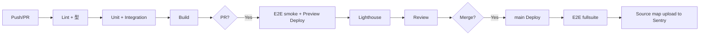

# 開発ガイドライン — premake

> 1 人 + AI エージェント開発の前提で、品質・整合性・Phase 4 drift 検出を可能にするためのルール集。

---

## 1. 環境構築手順

### 1.1 必要なもの
- Node.js 22 LTS
- pnpm 9.x
- Supabase CLI（最新）
- Stripe CLI（最新）
- Docker（Supabase ローカル起動用）
- Git
- VS Code（推奨拡張: ESLint / Prettier / Tailwind / Biome）

### 1.2 初回セットアップ

```bash
# 1. リポジトリ clone
git clone git@github.com:YU-Kawasaki-05/premake.git
cd premake

# 2. 依存インストール
pnpm install

# 3. 環境変数（.env.example から）
cp .env.example .env.local
# .env.local を編集（Supabase / Stripe / Resend / Twilio の鍵）

# 4. Supabase ローカル起動
supabase start
supabase db reset                  # マイグレーション + seed 実行

# 5. 開発サーバー起動
pnpm dev                            # localhost:3000

# 6. (別ターミナル) Stripe Webhook ローカル転送
stripe listen --forward-to localhost:3000/api/webhooks/stripe
```

### 1.3 主要 pnpm スクリプト

```json
{
  "scripts": {
    "dev": "next dev",
    "build": "next build",
    "start": "next start",
    "lint": "biome check ./src",
    "lint:fix": "biome check --apply ./src",
    "typecheck": "tsc --noEmit",
    "test": "vitest run",
    "test:watch": "vitest",
    "test:integration": "vitest run --config vitest.integration.config.ts",
    "test:e2e": "playwright test",
    "test:e2e:ui": "playwright test --ui",
    "db:reset": "supabase db reset",
    "db:diff": "supabase db diff",
    "db:gen-types": "supabase gen types typescript --local > src/types/database.generated.ts",
    "db:migrate": "supabase migration up",
    "drift:check": "node scripts/drift-check.mjs"
  }
}
```

---

## 2. Git 運用

### 2.1 ブランチ戦略: GitHub Flow

- main は常にリリース可能状態
- feature/* で作業 → PR → review → merge
- hotfix/* で緊急修正

### 2.2 ブランチ命名

```
feature/FR-21-create-booking-action
fix/booking-double-book
chore/upgrade-next-15-1
docs/update-runbook
```

### 2.3 コミット規約: Conventional Commits

```
<type>: <subject>

<body>

<footer>
```

type:
- `feat`: 新機能
- `fix`: バグ修正
- `docs`: ドキュメント
- `style`: フォーマット
- `refactor`: リファクタ
- `test`: テスト
- `chore`: ビルド・依存
- `perf`: パフォーマンス

例:
```
feat: 看護師サインアップを実装

@implements FR-01

- メール+パスワード形式
- zod バリデーション
- 確認メール送信ジョブ投入

Refs: #12
```

### 2.4 PR テンプレート

`.github/pull_request_template.md` に配置:

```markdown
## 概要
<!-- 何を実現する PR か -->

## 関連 FR / EP / SCR
- FR-XX
- EP-XX

## 変更内容
<!-- 主要なファイル変更点 -->

## スクリーンショット / 動画
<!-- UI 変更があれば -->

## テスト結果
- [ ] `pnpm typecheck` 通過
- [ ] `pnpm lint` 通過
- [ ] `pnpm test` 通過（カバレッジ目標達成）
- [ ] `pnpm test:e2e` smoke 通過

## レビュー観点
- [ ] RLS が破壊されていないか
- [ ] Service Role キーがクライアントに露出していないか
- [ ] @implements タグの整合性
- [ ] エラーハンドリング網羅
- [ ] 個人情報のログ漏洩
- [ ] コスト影響（外部 API コール頻度）
- [ ] UX 劣化なし

## 影響範囲
- DB マイグレーション: あり / なし
- 環境変数追加: あり / なし
- 外部サービス利用: あり / なし
```

### 2.5 PR レビューフロー

- 1 人開発でも **AI レビュー** を導入: `/ultrareview` を使う or 人間レビュアー（自分）が一晩寝かせて翌日見直す
- main へのマージは Squash Merge（履歴を綺麗に）
- PR タイトルが Conventional Commits 形式

---

## 3. コーディング規約

### 3.1 TypeScript

- **strict mode 必須**
- **`any` 禁止**（unknown + 型ガード）
- 関数の戻り値型を明示
- マジックナンバー禁止（`const MAX_RETRY = 6`）
- enum より union type 推奨（`type Status = 'pending' | 'approved'`）

### 3.2 エラーハンドリング

```typescript
// 統一エラー型
export class AppError extends Error {
  constructor(
    public readonly code: string,
    public readonly status: number,
    public readonly details?: unknown
  ) {
    super(code);
  }
}

// Server Action で throw、UI で catch
try {
  await createBookingAction(input);
} catch (e) {
  if (e instanceof AppError) {
    toast.error(errorMessages[e.code]);
  } else {
    Sentry.captureException(e);
    toast.error("予期しないエラーが発生しました");
  }
}
```

### 3.3 React Server Components

- デフォルト Server Component
- `"use client"` はインタラクティブな要素のみ
- Server Component から Client Component に渡せるのは serializable な値のみ
- データ取得は Server Component で完結させる（fetch / Supabase 直叩き）

### 3.4 Server Actions

```typescript
'use server';

// 必ず 'use server' を冒頭に
// 関数末尾に Action サフィックス
export async function createBookingAction(input: unknown) {
  // 1. 認可
  const { user } = await requireRole(['nurse']);
  // 2. バリデーション
  const parsed = createBookingSchema.parse(input);
  // 3. 業務ロジック呼び出し
  return await bookingService.createBooking(...);
}
```

### 3.5 1 コンポーネント = 1 責務

- 100 行超は分割検討
- 状態管理が多すぎる場合は hook 抽出
- 同一機能の Variant は props で切替（`<Button variant="destructive">`）

---

## 4. AI 生成コード規約 ★ 必須

### 4.1 ファイル冒頭コメント（必須）

**全 TypeScript ファイルの冒頭** に以下を付与:

```typescript
/** @file
 * 機能: 看護師による予約申込の Server Action
 * 入力: BookingFormData (zod 検証済み)
 * 出力: { booking_id: string, status: 'pending_approval' }
 * 例外:
 *   - 401 UNAUTHORIZED
 *   - 403 LICENSE_NOT_APPROVED
 *   - 422 BOOKING_SLOT_TAKEN
 *   - 422 NURSE_DOUBLE_BOOKING
 * 依存: createClient (server.ts), bookingService, BookingSchema
 * 副作用: bookings INSERT, booking_sessions INSERT, worker_jobs キュー (notify_facility, auto_cancel_48h)
 * セキュリティ: requireRole(['nurse']) + requireApprovedLicense() + RLS
 * @implements FR-21, AC-21-01, AC-21-02, AC-21-03, AC-21-04, AC-21-05
 */
```

### 4.2 `@implements` タグの必須化

- **該当する FR-XX、AC-XX-XX をすべて列挙**
- リファクタで対象が変わったら更新する
- 該当なしの shared / utility は `@implements -` と明記

### 4.3 テストファイルの規約

```typescript
/** @file
 * 検証: 看護師の予約申込が正常系・異常系で正しく動作する
 * @verifies AC-21-01, AC-21-02, AC-21-04
 */

import { describe, test, expect } from 'vitest';
// ...
```

各 `test()` の **直前コメント** で個別 AC を指定:

```typescript
// @verifies AC-21-01
test('正常系: 予約申込が pending_approval で作成される', async () => { ... });

// @verifies AC-21-02
test('異常系: 空き枠衝突でエラー', async () => { ... });
```

### 4.4 AI 生成コードの必須チェック（PR 前のセルフレビュー）

- [ ] 入出力の型が明示されているか
- [ ] エラーハンドリングが網羅されているか
- [ ] 環境変数の存在チェックがあるか（`env.ts` から import）
- [ ] ユーザー ID は JWT（`auth.uid()`）から取得しているか
- [ ] Service Role キーがクライアントに露出していないか
- [ ] テストが同時に生成されているか
- [ ] **`@implements` / `@verifies` タグが付与されているか**
- [ ] 個人情報がログに出ていないか（`maskPII` 使用）
- [ ] 外部 API 呼び出しは worker_jobs 経由 or レート制限がついているか

### 4.5 Phase 4 整合性チェックとの連動

`pnpm drift:check` は以下を検出:

1. **未実装 FR**: `_index.yml` に登録されているが、grep で `@implements FR-XX` が見つからない
2. **AC 未検証**: `_index.yml` の `ac_test_mapping` で AC-XX-XX が pending のまま
3. **タグ不一致**: コードの `@implements` に存在しない FR-ID が書かれている
4. **RLS 漏れ**: マイグレーションで `ENABLE ROW LEVEL SECURITY` がない新規テーブル

---

## 5. コンポーネント設計

### 5.1 Server vs Client

| 機能 | Server | Client |
|---|---|---|
| データ取得・表示 | ◎ | △ |
| useState / useEffect | × | ◎ |
| イベントハンドラ（onClick 等） | × | ◎ |
| Server Action 呼び出し | △ | ◎ |
| Stripe Elements | × | ◎ |
| Map / Chart | △ | ◎ |

### 5.2 "use client" はツリー末端に

```tsx
// ❌ NG: ページ全体を Client にする
// app/bookings/page.tsx
'use client';
export default function Page() { /* ... */ }

// ✅ OK: 必要なコンポーネントだけ Client
// app/bookings/page.tsx (Server)
export default async function Page() {
  const bookings = await fetchBookings(); // Server で取得
  return (
    <div>
      <BookingList bookings={bookings} />
      <BookingForm />  {/* この中身だけ "use client" */}
    </div>
  );
}
```

### 5.3 Props 型は同ファイル

```typescript
type BookingCardProps = {
  booking: Booking;
  onCancel?: () => void;
};

export function BookingCard({ booking, onCancel }: BookingCardProps) { /* ... */ }
```

---

## 6. エラーハンドリング（共通）

### 6.1 統一エラー型

```typescript
// src/lib/errors/AppError.ts
export class AppError extends Error {
  constructor(
    public readonly code: string,
    public readonly status: number = 500,
    public readonly details?: unknown
  ) {
    super(code);
    this.name = 'AppError';
  }

  static unauthorized(message?: string) {
    return new AppError('UNAUTHORIZED', 401, { message });
  }
  static forbidden(code = 'FORBIDDEN') {
    return new AppError(code, 403);
  }
  static ruleViolation(code: string, details?: unknown) {
    return new AppError(code, 422, details);
  }
}
```

### 6.2 エラーメッセージ国際化

```typescript
// src/lib/errors/messages.ts
export const errorMessages: Record<string, string> = {
  UNAUTHORIZED: 'ログインが必要です',
  FORBIDDEN: 'このページにアクセスする権限がありません',
  LICENSE_NOT_APPROVED: '看護師免許の審査完了後にご利用いただけます',
  BOOKING_SLOT_TAKEN: '指定の時刻は予約済みです',
  STRIPE_AUTH_FAILED: 'カードの認証に失敗しました',
  // ...
};
```

### 6.3 レイヤー別責務

- Server Actions / Route Handlers: try-catch + AppError → 統一 JSON
- Client: ErrorBoundary（`app/.../error.tsx`）+ Toast
- ログ: Sentry（>= 500 のみ alert）

```typescript
// app/(dashboard)/bookings/error.tsx
'use client';

export default function Error({ error, reset }: { error: Error; reset: () => void }) {
  useEffect(() => Sentry.captureException(error), [error]);
  return (
    <div>
      <h2>エラーが発生しました</h2>
      <button onClick={reset}>再試行</button>
    </div>
  );
}
```

---

## 7. テスト規約

詳細は [`../02_外部設計/06_テスト戦略.md`](../02_外部設計/06_テスト戦略.md)。ここでは抜粋。

### 7.1 必須対象

| レイヤー | 対象 |
|---|---|
| Unit | 全 zod スキーマ / 全 services / 全 ユーティリティ |
| Integration | 全 Server Action / 全 RLS ポリシー / Webhook |
| E2E | P0 コアフロー（認証 / 予約 / 指示書 / 顧客予約） |

### 7.2 命名と AC 紐付け

```typescript
// @verifies AC-21-01
test('正常系: 看護師の予約申込が pending_approval で作成', async () => { /* ... */ });
```

### 7.3 配置

- Unit: 対象ファイルと同階層に `*.test.ts`
- Integration: `tests/integration/`
- E2E: `tests/e2e/`
- Factory: `tests/factories/`

---

## 8. ESLint / Prettier（または Biome）

### Biome 採用（推奨、高速）

```json
// biome.json
{
  "$schema": "https://biomejs.dev/schemas/1.9.0/schema.json",
  "linter": {
    "enabled": true,
    "rules": {
      "recommended": true,
      "suspicious": {
        "noExplicitAny": "error"
      },
      "correctness": {
        "noUnusedVariables": "error"
      }
    }
  },
  "formatter": {
    "enabled": true,
    "indentStyle": "space",
    "indentWidth": 2,
    "lineWidth": 100
  },
  "organizeImports": {
    "enabled": true
  }
}
```

---

## 9. CI/CD パイプライン



### 9.1 主要 GitHub Actions

- `.github/workflows/ci.yml` — PR / main
- `.github/workflows/deploy.yml` — main → Vercel Production
- `.github/workflows/nightly.yml` — Visual Regression + Load Test
- `.github/workflows/codeql.yml` — セキュリティスキャン
- `.github/workflows/drift-check.yml` — Phase 4 整合性チェック（週次）

---

## 10. drift 検出スクリプト

`scripts/drift-check.mjs` を作成し、Phase 4 で利用:

```javascript
// 簡略例
import { readFileSync, readdirSync } from 'node:fs';
import { parse } from 'yaml';

const index = parse(readFileSync('docs/01_要件定義/_index.yml', 'utf8'));
const allFRs = index.features.map((f) => f.id);

// grep with rg
const implementedFRs = new Set();
// (rg "@implements\s+(FR-\d+)" --no-heading -o -r '$1' src/ で取得)

const missing = allFRs.filter((id) => !implementedFRs.has(id));
if (missing.length) {
  console.error(`未実装 FR: ${missing.join(', ')}`);
  process.exit(1);
}
```

CI で週次実行、漏れを Slack 通知。

---

## 11. ドキュメント保守

- Phase 1〜3 のドキュメントは **コードと同 PR で更新**
- 仕様変更時は `12_change_request` 経由
- README / docs/INDEX.md は `10_doc_README生成` で再生成

---

## 12. やらないこと（YAGNI）

- 抽象化のための抽象化（必要な箇所に必要なだけ）
- "将来モバイル" 以外の "将来" のための先回り設計
- カスタム DI コンテナ / IoC（Server Action の引数で十分）
- マイクロサービス分割（β中は不要）
- 独自認証システム（Supabase Auth で十分）
- 独自決済システム（Stripe で十分）

---

バージョン: 1.0 / 作成日: 2026-05-10 / Phase 3 / 状態: 確定
