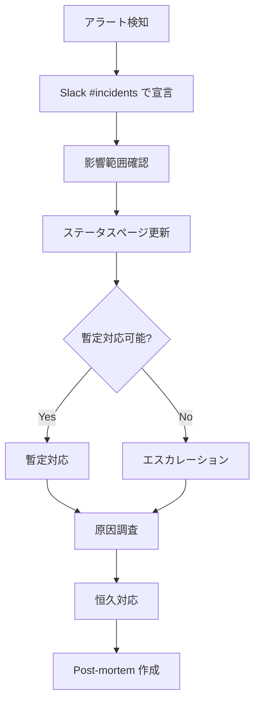

# 運用設計 — premake

> ローンチ後の観測・運用に必要な設計を初版から織り込む。コスト爆発防止が β 期最大の防御テーマ。

---

## 1. ログ設計

### 1.1 出力先

| 種類 | 出力先 | 保管期間 |
|---|---|---|
| アプリケーションログ | Vercel → Axiom | 90 日 |
| エラーログ | Sentry | 90 日 |
| 監査ログ (FR-76) | Postgres `audit_log` テーブル | **7 年**（医療法） |
| Stripe Webhook 受信ログ | `stripe_events` テーブル | 7 年 |

### 1.2 ログレベル

| レベル | 用途 | 例 |
|---|---|---|
| ERROR | 復旧不可・即対応 | DB 接続失敗、Stripe Webhook 処理失敗 |
| WARN | 復旧可能・要確認 | リトライで成功、SLA 接近 |
| INFO | 主要イベント | ログイン成功、予約承認、決済完了 |
| DEBUG | 開発時のみ | 内部状態（本番では出力しない） |

### 1.3 構造化ログフォーマット

```typescript
// src/lib/logger/index.ts
import { logger } from 'pino';

export const log = pino({
  base: {
    env: process.env.NODE_ENV,
    app: 'premake',
  },
  formatters: {
    level: (label) => ({ level: label }),
  },
  redact: ['*.password', '*.token', '*.email', '*.phone'],
});

// 使用例
log.info({
  request_id: '...',
  user_id: hashId(user.id),     // ハッシュ化
  feature: 'FR-21',
  action: 'booking_created',
  booking_id: '...',
}, '予約申込成功');
```

### 1.4 個人情報マスキング（FR-78 連動）

- メール: 末尾 4 文字以外をマスク（`yamada***@example.com` → `ya****@example.com`）
- 電話: ログに出さない（必要なら下 4 桁のみ）
- 住所: ログに出さない
- 認証トークン / Stripe ID: 絶対に出さない
- 氏名: イニシャル化

```typescript
// src/lib/pii/mask.ts
export const maskPII = {
  email: (e: string) => e.replace(/^(.{2}).+(@.+)$/, '$1****$2'),
  phone: (p: string) => `***-****-${p.slice(-4)}`,
  name: (n: string) => `${n.charAt(0)}.${n.split(' ').pop()?.charAt(0) ?? ''}`,
};
```

CI で `rg "email|phone_number" src/lib/logger` で平文出力箇所を検出。

---

## 2. メトリクス・アラート

### 2.1 計測指標

| 指標 | ツール | 警告閾値 | 重大閾値 | アラート先 |
|---|---|---|---|---|
| エラーレート (5xx) | Sentry | > 0.5% / 5min | > 1% / 5min | Slack #alerts |
| エラー数（突発） | Sentry | 前日比 +50% | +100% | Slack |
| p95 レイテンシ | Vercel Analytics | > 1s / 5min | > 2s / 5min | Slack |
| p99 レイテンシ | Vercel | > 3s | > 5s | Slack |
| Stripe Webhook 失敗 | Sentry + Stripe Dashboard | > 0.5% | > 2% | Slack + 即時調査 |
| 監査ログ書き込み失敗 | Sentry | > 0 件 | > 0 件 | **PagerDuty** |
| 通知配信遅延 | Axiom | > 1 分 | > 5 分 | Slack |
| DB 接続失敗 | Sentry | > 0.1% | > 0.5% | Slack |
| Vercel Function timeout | Vercel logs | > 10 件 / h | > 100 件 / h | Slack |

### 2.2 ビジネスメトリクス

| 指標 | ソース | 集計 | ダッシュボード |
|---|---|---|---|
| DAU | auth.users.last_login_at | 日次 | Metabase |
| 予約成立率 | bookings.status | 日次 | Metabase |
| キャンセル率 | bookings.status | 日次 | Metabase |
| GMV | payments.amount | 日次 / 月次 | Metabase |
| プラットフォーム手数料収益 | platform_revenue | 月次 | Metabase |
| アクティブ施設 | bookings.facility_id (DISTINCT) | 月次 | Metabase |
| アクティブ看護師 | bookings.nurse_user_id | 月次 | Metabase |

### 2.3 ダッシュボード

- 運営ダッシュボード（FR-68 / EP-J004）でリアルタイム表示
- Metabase で深掘り分析用ダッシュボード（β 期は手動 SQL クエリでも可）

---

## 3. コスト監視 ★ 最重要

### 3.1 監視対象とアラート

| サービス | β 月予算 | 警告 | 停止閾値 | 停止方法 |
|---|---|---|---|---|
| Twilio SMS | $30 | $25 | $40 | feature_flags.sms_enabled = false |
| Resend | $0（無料枠） | 2,500 通 / 月 | 2,900 通 | feature_flags.email_enabled = degraded |
| Stripe | 取引額連動 | - | - | （手数料は取引額に比例、暴走しない） |
| Vercel Function | Pro Plan 内 | bandwidth 60% | 90% | キャッシュ強化、画像最適化 |
| Supabase | Pro Plan 内 | DB CPU 70% | 90% | Pro Plus へアップグレード |
| Axiom | 無料枠 0.5GB | 0.4GB | 0.5GB | LOG_LEVEL=warn に切替 |

### 3.2 自動停止の仕組み

```typescript
// src/lib/cost-monitor/index.ts
// 日次 cron で各サービスの使用量を取得
export async function checkCostsAndKillSwitch() {
  const sms = await getTwilioUsage();
  if (sms.cost_usd >= 40) {
    await featureFlags.set('sms_enabled', false);
    await notifyOps('SMS kill switch 発動');
  }
  // ...
}
```

### 3.3 暴走防止のレート制限

| 対象 | 制限 |
|---|---|
| ユーザー全体 | 600 req/min |
| 認証エンドポイント（IP） | 10 req/min |
| SMS 送信（電話番号） | 5 通 / h |
| メール送信（メール） | 5 通 / h（パスワードリセット等） |
| 検索 API | 60 req/min/user |
| 通報 | 5 件 / day / user |

Vercel KV (Upstash Redis) + middleware で実装。

---

## 4. バックアップ・リストア

### 4.1 バックアップ計画

| 対象 | 頻度 | 保管期間 | 自動 / 手動 |
|---|---|---|---|
| DB（Supabase） | Daily（自動） | 7 日（Pro）/ 14 日（Pro Plus） | 自動 |
| DB（手動スナップショット） | 重要マイグレ前 | 30 日 | 手動 |
| Storage（医療記録） | β は Supabase 標準のレプリケーション、本番化で S3 同期検討 | - | 自動 |
| 環境変数 | パスワードマネージャに保管 | - | 手動 |
| マイグレーションファイル | Git で管理 | 永続 | Git |

### 4.2 試験リストア

- **四半期に 1 回**、テスト環境で実施
- 手順は `docs/runbooks/restore-from-backup.md`
- リストア時間（RTO）目標: 4 時間以内

---

## 5. インシデント対応 runbook

### 5.1 初動共通フロー



### 5.2 シナリオ別

#### S-01: DB ダウン
- **検知**: Supabase 監視 + Sentry エラー急増
- **初動**:
  1. Supabase ステータス確認 (`https://status.supabase.com/`)
  2. ベンダー障害ならステータスページ案内 → 復旧待ち
  3. 自社マイグレ起因なら直前のマイグレを revert
- **復旧後**: 失敗したリクエストの再実行可否を確認

#### S-02: Stripe Webhook 失敗急増
- **検知**: stripe_events.processed_at IS NULL が急増
- **初動**:
  1. Stripe Dashboard で Webhook 状況確認
  2. 内部エラーなら DLQ 確認 → 個別調査
  3. 当該機能を kill switch で一時停止
- **復旧後**: DLQ から再処理

#### S-03: コスト暴走
- **検知**: 日次コストアラート
- **初動**:
  1. 該当サービスの kill switch 発動
  2. 原因調査:
     - バグ（無限ループ等）
     - 攻撃（DoS / spam）
     - 想定通りの利用増
  3. Sentry / Axiom でリクエストパターン分析
- **恒久**: レート制限見直し / バグ修正 / プラン変更

#### S-04: 看護師免許の不正発覚
- **検知**: 通報 / 監査
- **初動**:
  1. 当該看護師を凍結（FR-11）
  2. 関連予約をキャンセル + 返金（FR-24, FR-40）
  3. 利用客への通知
- **恒久**: 審査プロセス強化、再発防止策

#### S-05: 個人情報漏洩疑い
- **検知**: 監査ログの異常 / 外部通報
- **初動**:
  1. **1 時間以内** に状況把握（NFR-SEC-14）
  2. 関連 stakeholder（運営・法務）に通知
  3. 該当アカウント凍結 / セッション破棄
  4. 個人情報保護委員会への報告（必要時）
- **恒久**: 原因特定、再発防止、影響を受けたユーザーへの通知

### 5.3 runbook 一覧（`docs/runbooks/`）

| ファイル | 内容 |
|---|---|
| `S-01-db-down.md` | DB ダウン対応 |
| `S-02-stripe-webhook-failure.md` | Stripe Webhook 障害 |
| `S-03-cost-runaway.md` | コスト暴走 |
| `S-04-license-fraud.md` | 免許不正 |
| `S-05-data-breach.md` | 個人情報漏洩 |
| `restore-from-backup.md` | バックアップからのリストア |
| `enable-kill-switch.md` | kill switch 発動手順 |
| `manual-stripe-refund.md` | Stripe Dashboard での手動返金 |
| `audit-chain-verify.md` | 監査ログハッシュチェーン検証 |

---

## 6. オンコール体制

### β期（1 人 + AI）
- **オンコール**: User 自身
- **アラート受信**: Slack #alerts + PagerDuty（重大のみ）
- **対応時間**: 平日 9-18 時はベストエフォート、夜間・休日は重大インシデントのみ

### 本番化以降
- 2 人以上のローテーション
- 当番制（週次）
- インシデント対応 SLA を明文化

---

## 7. デプロイ運用

### 7.1 デプロイフロー

```
PR 作成 → Vercel Preview Deploy 自動
       → Lint + Test + E2E smoke
       → レビュー
       → main へマージ
       → Vercel Production Deploy 自動
       → E2E fullsuite + Lighthouse
       → Sentry Source Map upload
       → リリースタグ作成（Semantic Versioning）
```

### 7.2 リリース頻度

- β中: **平日 1 日 1 回まで** デプロイ可能（夜間は緊急時のみ）
- 本番化以降: 週 数回（火・木にメインリリース）

### 7.3 ロールバック

- **Vercel: 1 click rollback**（Promote previous deployment）
- **DB マイグレーション: forward only**、必要なら新マイグレで修正
- **Stripe Webhook 用 idempotency** により Webhook の重複処理は安全

---

## 8. パフォーマンス監視

### 8.1 Web Vitals
Vercel Analytics で自動収集:
- LCP / INP / CLS
- 目標: NFR-PERF-01〜03

### 8.2 API レイテンシ
- Sentry Performance で全 Server Action を計測
- 重要 API（検索 / 予約 / 指示書）は専用ダッシュボード

### 8.3 DB クエリ
- 月次で Supabase の Slow Query Log をレビュー
- N+1 検出ツール（[count] of queries に閾値）

---

## 9. セキュリティ運用

### 9.1 定期作業
- 月次: `pnpm audit` 実行、依存ライブラリの脆弱性チェック
- 月次: 監査ログの異常パターン確認
- 四半期: 監査ログハッシュチェーン検証
- 半年: ペネトレーションテスト

### 9.2 シークレットローテーション
- Stripe Secret Key: 漏洩疑い時のみ
- Supabase Service Role Key: 半年ごと
- Webhook Secret: ローテーションは Vercel 環境変数で透過的に

---

## 10. 関連ファイル

- 監査ログ: [`audit_log` テーブル](../02_外部設計/01_DB設計/09_tables_G_運営監査.md#tbl-audit_log--監査ログ追記専用--月次パーティション)
- 違反案件: [`violations`](../02_外部設計/01_DB設計/09_tables_G_運営監査.md#tbl-violations--違反案件)
- 通報フロー: [FR-52, FR-56](../01_要件定義/features/FR-56_ops-violation-action.md)
- ヘルスチェック: [FR-80](../01_要件定義/features/FR-80_health-status.md)
- フィーチャーフラグ: [FR-79](../01_要件定義/features/FR-79_feature-flag.md)

---

バージョン: 1.0 / 作成日: 2026-05-10 / Phase 3 / 状態: 確定
