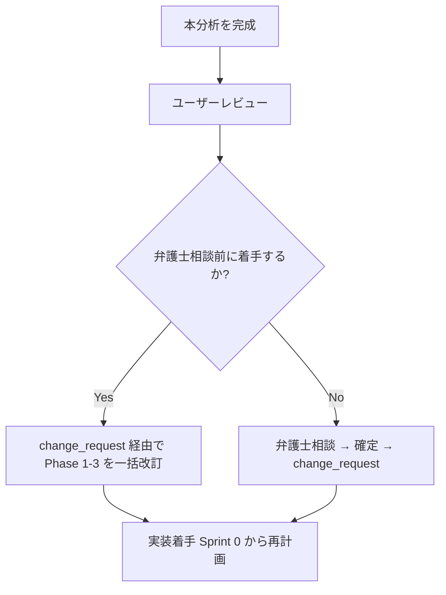

# 仕様変更検討 — premake / インデックス

> **目的**: 法務確認資料 v0.9（クリニック—看護師 業務委託モデル）を新方向性として確定するために、Phase 1-3 で構築した現行仕様との差分を綿密に洗い出す。

---

## 経緯

- **2026-05-10**: Phase 1-3 で初期仕様確定（DEC-08 A 案 = 提携医療機関の医師が指示を出すモデル）
- **2026-05-18**: 法務確認資料 v0.9 作成（仲間と法律リサーチを進めた結果、業務委託モデルの方がリスクと事業運営コストが小さくなる可能性を確認）
- **本ブランチ**: 弁護士相談前に、現行仕様と業務委託モデルの差分を整理し、影響範囲・修正対象を可視化する

> **新方向性は確定方針**。本検討は「採用するかどうか」ではなく「採用した場合に何をどう変えるか」の整理。

---

## ファイル構成

| ファイル | 内容 | ステータス |
|---|---|---|
| [00_index.md](00_index.md) | このファイル | 確定 |
| [01_新旧モデル比較サマリー.md](01_新旧モデル比較サマリー.md) | 全体マップ：何が変わって何が維持されるか | 確定 |
| [02_新方向性の確定整理.md](02_新方向性の確定整理.md) | 法務確認資料 v0.9 からの中核要件抽出 | 作成中 |
| [03_差分_契約と実施主体.md](03_差分_契約と実施主体.md) | 業務委託契約の登場、医療提供主体の明確化 | 未着手 |
| [04_差分_お金の流れと手数料.md](04_差分_お金の流れと手数料.md) | 患者→クリニック→看護師の流れに変更 | 未着手 |
| [05_差分_予約マッチングと公開ページ.md](05_差分_予約マッチングと公開ページ.md) | マッチングの意味、看護師公開ページの位置づけ | 未着手 |
| [06_差分_責任分界とログ管理.md](06_差分_責任分界とログ管理.md) | 責任の所在、医療記録・指示書の管理主体 | 未着手 |
| [07_差分_利用者権限と表示範囲.md](07_差分_利用者権限と表示範囲.md) | 各ロールの権限見直し、医療広告規制との関係 | 未着手 |
| [08_AI追加観点.md](08_AI追加観点.md) | ユーザーが思いつかない可能性のある論点を AI が補完 | 未着手 |
| [09_影響マップ_DEC_リスク.md](09_影響マップ_DEC_リスク.md) | 既存 DEC ログ / リスク登録簿への影響 | 未着手 |
| [10_影響マップ_Phase1_要件定義.md](10_影響マップ_Phase1_要件定義.md) | FR / AC / ユーザー像 / 画面遷移 への影響 | 未着手 |
| [11_影響マップ_Phase2_外部設計.md](11_影響マップ_Phase2_外部設計.md) | DB / API / 権限 / 画面設計 への影響 | 未着手 |
| [12_影響マップ_Phase3_技術設計Sprint.md](12_影響マップ_Phase3_技術設計Sprint.md) | アーキ / Sprint 計画 への影響 | 未着手 |
| [13_法務確認追加質問案.md](13_法務確認追加質問案.md) | 弁護士相談時に v0.9 に追加して確認したい論点 | 未着手 |
| [14_次のアクション.md](14_次のアクション.md) | 仕様変更を反映する具体的手順とスケジュール | 未着手 |

---

## 進め方

---

## 凡例

- **現行**: Phase 1-3 で確定済みの内容（DEC-01〜29、FR-01〜88 等）
- **新方向性**: 法務確認資料 v0.9 で示されている業務委託モデル
- **差分**: 現行 → 新方向性 で「何が変わるか」「何が削られるか」「何が追加されるか」
- **影響**: 既存ドキュメントのどこを書き換える必要があるか

---

## 思考と判断理由を残す方針 ★

User 指示（2026-05-18）に基づき、本フォルダの全ドキュメントは以下のルールで記述する。
**後から判断の経緯を遡れる**ことを最優先する。

### ルール

1. **選択肢ごとにメリット・デメリットを明記**
   結論だけでなく「A 案 / B 案 / C 案 とそれぞれの判断軸」を残す。

2. **「なぜそう決めたか」を必ず書く**
   特に DEC-XX 追加・改訂の際は **理由**・**代替案**・**未採用案の不採用理由** を残す。

3. **User 確認の時系列を残す**
   重要決定には `[User 確認: 2026-05-18]` のように出所を付ける。

4. **[仮決定] / [推測] タグを使い分け**
   仮決定は弁護士確認や追加 User 確認待ちの暫定値、推測は AI 補完で要 User 検証。

5. **DEC-XX を改訂する場合は元の DEC を残す**
   `撤回` ステータス + 改訂先 DEC-ID への参照を残す（決定事項ログのフォーマット）。

6. **「思考の足跡」セクション**
   各差分ファイルの末尾に「検討した別案 / 未採用にした理由 / 残された問い」を残す。

---

## User 確認済み事項のタイムライン

| 日付 | 確認内容 | 反映先 |
|---|---|---|
| 2026-05-18 | 新方向性は確定方針（業務委託モデルで進める） | 全ファイル |
| 2026-05-18 | 弁護士相談前に仕様変更着手を開始 | 14_次のアクション |
| 2026-05-18 | ブランチ: feature/spec-revision-analysis | git |
| 2026-05-18 | 看護師の公開ページからの予約フローは維持 | 01, 05 |
| 2026-05-18 | premake は代理受領しない（クリニックが Stripe で直接受領） | 04 |
| 2026-05-18 | premake はクリニックから別途利用料を請求（予約ログから金額確定） | 04 |
| 2026-05-18 | 弁護士 OK 後の次 Sprint で事前決済を本格導入 | 04, 14 |
| 2026-05-18 | 業務委託費は premake が推奨料率提示 + クリニック⇔看護師の相談で決定 | 04 |
| 2026-05-18 | クリニック最低取り分（N 円）の前提を設ける | 04 |
| 2026-05-18 | 業務委託契約書は premake が雛形提供 + 電子署名サービス連携、将来は内製化 | 03 |
| 2026-05-18 | 看護師は複数クリニックと業務委託契約可（制限なし） | 03 |
| 2026-05-18 | **業務委託契約完了後にのみ、当該クリニックの空きベッド予約画面に表示される（重要）** | 03, 05 |
| 2026-05-18 | **患者の決済手段は柔軟（Stripe / 現金 / QR コード / 銀行振込 等）**、予約ログで取引額把握可 | 04, 11 |
| 2026-05-18 | **料率計算ロジック = クリニック最低取り分を下回ったら看護師取り分を自動縮減**（リタッチ・クーポン対応） | 04 |
| 2026-05-18 | 看護師取り分が 0 未満になる料金設定は ValidationError でブロック | 04 |

---

バージョン: 0.3 / 作成日: 2026-05-18 / ブランチ: feature/spec-revision-analysis
