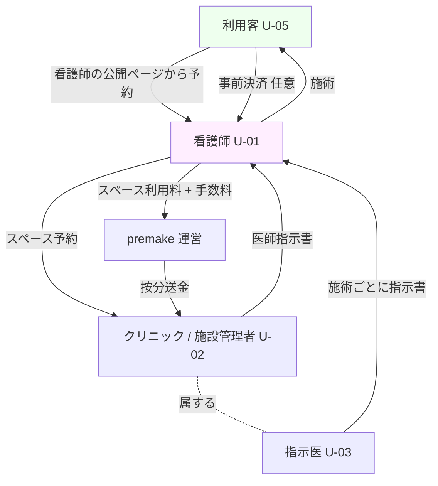
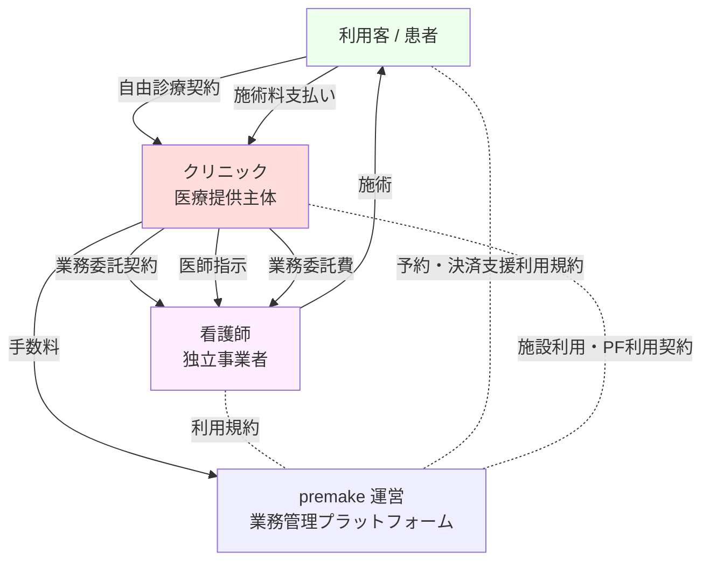
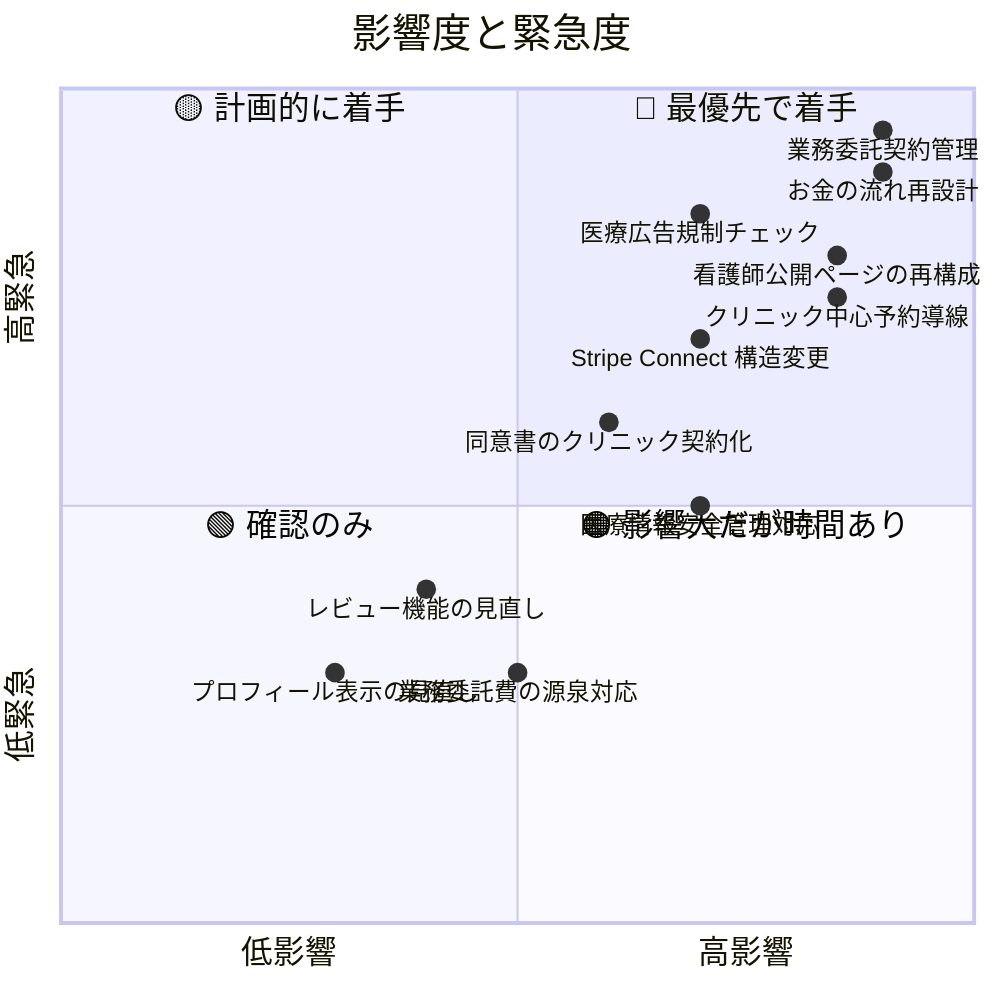

# 新旧モデル比較サマリー — premake

> [00_index.md](00_index.md) に戻る
>
> Phase 1-3 の現行仕様 vs 法務確認資料 v0.9 の業務委託モデル の全体マップ。

---

## 1. 三主体の関係性比較

### 1.1 現行モデル（DEC-08 A 案）

**ポイント**:
- 看護師は独立事業者として行動（プラットフォーム横断、フリーランス）
- 看護師の公開ページ (FR-69) から利用客が直接予約
- 看護師がスペース利用料を施設に支払い、施術料は看護師に入る前提
- premake は看護師×施設のマッチング + 決済中継 + 場所貸し管理

### 1.2 新方向性モデル（法務確認資料 v0.9）

**ポイント**:
- **クリニックが医療提供主体・契約主体**
- **クリニック ↔ 看護師の業務委託契約**（看護師は独立事業者だが、クリニックの指揮下で施術）
- **患者の支払いはクリニック宛**（クリニック → 看護師の業務委託費に分配）
- premake は **予約・決済支援・業務管理のプラットフォーム**に徹し、医療提供主体ではない
- 看護師はクリニックごとに業務委託契約を締結（複数クリニック可）

---

## 2. 観点別ハイレベル差分

| 観点 | 現行（Phase 1-3） | 新方向性（v0.9） | 影響度 |
|---|---|---|:---:|
| **医療提供主体** | 暗黙的にクリニック（但し明示弱い） | **クリニック明示**、利用者画面でも明示 | 大 |
| **看護師の立場** | フリーランス・プラットフォーム横断 | クリニックとの業務委託（複数クリニック可） | **特大** |
| **看護師 ↔ クリニック契約** | スペース予約（時間貸し） | **業務委託契約**（恒常的 or 案件ごと、要 User 確認） | **特大** |
| **患者 ↔ クリニック契約** | 自由診療（暗黙） | **自由診療契約 + 同意書**（明示） | 大 |
| **患者の予約導線** | 看護師の公開ページから予約 | **看護師の公開ページから予約（フロー維持）**。ただし「施術はクリニック X が提供」を明示、医療広告規制対応 | 中（運用継続、表現調整） |
| **premake の立ち位置** | マッチング + 決済 + 手数料収益 | **業務管理 SaaS + 決済支援**、医療提供主体ではない | 大 |
| **お金の流れ** | 看護師 → 運営 → 施設 + 利用客 → 看護師 | **患者 → クリニック → 看護師業務委託費 / premake 手数料** | **特大** |
| **手数料モデル** | 看護師スペース利用料 + 利用客取引 | クリニックからの手数料（業務管理サービス料） or 取引手数料 | 大 |
| **指示書発行** | 指示医（クリニック所属）が発行 | **クリニック所属医師が発行**（変わらず、明文化強化） | 中 |
| **施術記録 / 写真** | 看護師中心、施設も閲覧 | **クリニックの診療録に該当**、premake は保管補助 | 大 |
| **同意書** | プラットフォーム経由 | **クリニックの自由診療契約の一部**として再設計 | 大 |
| **問診票** | 看護師ごとカスタム | **クリニック中心**（医師の判断材料）+ 看護師補助 | 中 |
| **看護師公開ページ (K)** | 看護師中心、看護師がリンク共有 | **クリニック / 施術案内ページ**として再設計、医療広告規制対応 | **特大** |
| **レビュー機能** | 看護師⇄施設、公開可 | **医療広告規制の制約あり**、限定解除要件と整合 | 大 |
| **利用客の事前決済 (FR-39)** | 看護師の Connect 受領 | **クリニックの Connect 受領**に変更 | 大 |
| **看護師 Connect** | 必要 (FR-37 / FR-39) | **基本不要**（看護師は業務委託費受領） | 中 |
| **責任分界** | 看護師が主、施設が場所・医師が指示 | **クリニック・医師が主、看護師は施術手技** | 大 |
| **広告主体** | 看護師・施設・運営が混在 | **クリニックを主**として再整理、医療広告ガイドライン準拠 | 大 |
| **法人 / 多店舗 (U-06)** | 法人 → 施設 → スペース | 構造は維持、契約は店舗単位の可能性 | 中 |
| **運営代理オンボーディング (FR-87)** | 個別アカウント代理入力 | **業務委託契約書のテンプレート提供**まで拡張可能 | 中 |
| **キャンセルポリシー** | 共通 + 施設別 | クリニックが患者と契約するため、**クリニック主導**へ | 中 |
| **ログ管理・監査** | 監査ログ FR-76 | **医療情報の安全管理 (厚労省ガイドライン)** 準拠強化 | 大 |
| **個人情報の取り扱い** | 標準 PII 保護 | **要配慮個人情報 / 診療情報**として再設計 | 大 |

---

## 3. 維持される（変更なし or 軽微）部分

| 機能 / 概念 | 理由 |
|---|---|
| 60 テーブル中の多くの構造（spaces / bookings / sessions / etc）| データモデルの骨格は維持、用途と所有者の整理が変わるのみ |
| 法人 - 施設 階層 (DEC-16) | 法的にも自然な階層 |
| 7 ロール (U-01〜U-06 + U-AI) | 主要ロールは維持、関係性のみ再定義 |
| Stripe Connect 利用 (DEC-03) | 受領主体が変わるが Stripe 自体は維持 |
| 技術スタック (DEC-20〜29) | 全て維持 |
| MFA / RLS / 監査ログ基盤 (FR-07 / FR-76〜78) | 強化方向、廃止なし |
| 電子指示書フロー (FR-29 / FR-30) | 強化方向（必須化を明示）、設計は維持 |
| 同意書 / 問診票 (FR-31 / FR-32 / FR-71 / FR-72) | 構造は維持、所有者を「クリニック」に明示 |
| 施術記録 (FR-33 / FR-34 / FR-35) | 構造維持、診療録該当性を明示 |
| ダッシュボード (FR-65〜68, FR-85) | 表示内容の一部修正、構造維持 |
| 12 週 Sprint 計画 | 修正範囲を吸収しても枠は維持できる見込み |

---

## 4. 削除 or 大幅縮小される可能性のある部分

| 機能 | 削除/縮小の理由 |
|---|---|
| **看護師→施設のレビュー (FR-49)** | 業務委託関係なので「評価」よりも内部フィードバックに |
| **看護師のスペース利用料決済 (FR-38)** | 業務委託モデルでは不要（クリニックが場所提供、看護師はクリニックから報酬） |
| **看護師の Stripe Connect (FR-37 看護師向け)** | 患者から看護師へ直接の支払いがなくなる → 不要 |
| **利用客の予約照会 (FR-74) のうち看護師主体部分** | 主体は維持できるが、予約番号体系・データ所有者の表現調整 |

> **FR-69 看護師の公開ページは維持**。User 確認済（2026-05-18）: 「看護師の予約ページから顧客が予約をするのは現行と変わらない想定」。
> 維持理由: 看護師個人の専門性・実績を活かした集客は事業価値の核。ただし医療広告規制との整合のため、ページ内に「医療提供主体: クリニック X」「医師の判断・指示下」を明示する文言調整は必要（DEC-36 案）。

---

## 5. 追加が必要な部分

| 機能 / 概念 | 必要性 |
|---|---|
| **クリニック ↔ 看護師 業務委託契約管理** | 契約締結・更新・解除のワークフロー |
| **業務委託契約書テンプレート** | 法務確認資料 §6.1 の骨子に基づく PDF / 電子契約 |
| **クリニック側の業務委託費精算機能** | 患者支払い → クリニック収益 → 看護師業務委託費 の自動計算 |
| **医療広告規制チェック** | 公開コンテンツの自動 / 手動チェックフロー |
| **クリニックの自由診療契約・同意書** | 患者 ↔ クリニックの契約として再構築 |
| **医療情報安全管理ガイドライン準拠** | 厚労省ガイドライン第 6.0 版への対応マトリクス |
| **広告主体表示の明示化** | 「premake は予約支援、施術はクリニックが提供」の画面文言徹底 |
| **業務委託のステータス管理** | 「業務委託契約締結中」「業務委託停止中」「解除済」 |
| **看護師 → 個別クリニックの紐付管理** | doctor_facility_assignments と同様、nurse_facility_assignments の追加可能性 |
| **業務委託費の源泉徴収・インボイス対応** | 看護師が事業者でも、源泉対象の場合あり |

---

## 6. 影響度の俯瞰

---

## 7. このサマリーを起点にした各論

以下の各ファイルで観点ごとに詳細化:

- **契約・実施主体** → [03_差分_契約と実施主体.md](03_差分_契約と実施主体.md)
- **お金の流れ** → [04_差分_お金の流れと手数料.md](04_差分_お金の流れと手数料.md)
- **予約とマッチング** → [05_差分_予約マッチングと公開ページ.md](05_差分_予約マッチングと公開ページ.md)
- **責任分界とログ** → [06_差分_責任分界とログ管理.md](06_差分_責任分界とログ管理.md)
- **利用者権限と表示** → [07_差分_利用者権限と表示範囲.md](07_差分_利用者権限と表示範囲.md)
- **AI が追加で考える観点** → [08_AI追加観点.md](08_AI追加観点.md)

---

## 8. 重要な前提確認（ユーザー向け）

このサマリーの方向性が User の理解と合っているか、次の論点を明らかにしておきたい:

1. **看護師の業務委託の頻度・期間**:
   - 案件単位（予約 1 件ごとに業務委託）か、定期的（月単位の継続契約）か、両方か？
   - 業務委託契約書を毎回作るのか、包括契約 + 個別の指示書なのか？

2. **看護師の収益受領経路**:
   - クリニックが患者から受領 → クリニックが看護師へ業務委託費を払う、で確定か？
   - **暫定的に「クリニック経由」が原則** と仮定して進めるが、premake が決済代行する代理受領の余地はあるか？

3. **看護師の公開ページの扱い**:
   - 完全廃止か、クリニック配下の「担当看護師紹介」として残すか、その他？
   - 「看護師個人で集客」を残すなら医療広告規制の壁が大きい

4. **業務委託費の決定方式**:
   - クリニックと看護師で個別交渉？ premake が標準率を示す？

これらは [03〜07] の各差分ファイルで詳細化していくが、特に大きく方針が分かれる場合は **本サマリー段階で User に確認** したい。

---

バージョン: 0.1 / 作成日: 2026-05-18 / 状態: 初版作成、User 確認待ち
