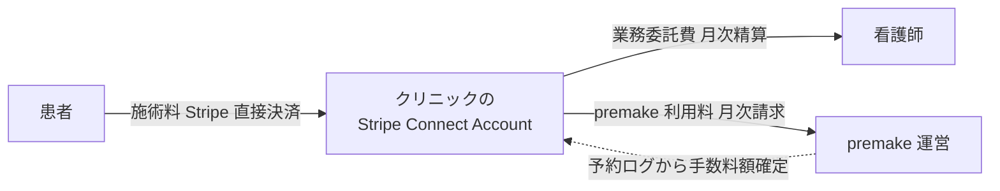

# 新方向性の確定整理 — premake

> [00_index.md](00_index.md) に戻る
>
> 法務確認資料 v0.9 + User 確認事項から、新方向性の中核要件を整理する。Phase 1-3 を改訂するための基準ドキュメント。

---

## 1. 中核モデル（確定事項）

### 1.1 三者関係

- **クリニック**: 医療提供主体。患者と自由診療契約を締結。看護師と業務委託契約を締結。
- **看護師**: 独立事業者。クリニックの業務委託を受け、医師指示の下で施術。**複数クリニックと業務委託契約可能**。
- **premake**: 予約・決済支援・業務管理プラットフォーム。**医療提供主体ではない**。

### 1.2 患者と契約する主体

- **患者 ↔ クリニック**: 自由診療契約 + 同意書（医療契約）
- **患者 ↔ premake**: 予約・決済支援利用規約 + プライバシーポリシー（システム利用契約）

### 1.3 お金の流れ（User 確認済み）

- **patient → clinic への支払いは Stripe で直接** (premake は代理受領しない)
- **premake はクリニックへ別途利用料を請求**（予約ログから金額を確定）
- **クリニック → 看護師の業務委託費** はクリニック内部の精算
- **事前決済の本格導入は弁護士確認後の次 Sprint** で実装

### 1.4 看護師の公開ページ（User 確認済み）

- **看護師の予約ページから顧客が予約をするフロー自体は維持**
- ただし以下は調整が必要:
  - **医療提供主体はクリニック**であることを明示
  - 看護師プロフィール・レビュー・症例写真は **医療広告規制（限定解除要件）に準拠**
  - 「premake 認定看護師」等の表現は禁止
  - 看護師のページに **「施術はクリニック X が提供」「医師の判断・指示下」** を明示

---

## 2. 法務確認資料 v0.9 からの抽出

### 2.1 確認済み主体定義（§1.1）

| 項目 | 主体 |
|---|---|
| 医療提供主体 | クリニック |
| 医学的判断・指示 | クリニック所属または関与医師 |
| 施術実施者 | 看護師（クリニックとの業務委託） |
| 場所提供 | クリニック |
| プラットフォーム | premake 運営 |
| 利用客 | アートメイク希望者（クリニックの自由診療として施術を受ける） |

### 2.2 premake が「行うこと／行わないこと」（§1.2）

| 区分 | 内容 |
|---|---|
| **行うこと** | 予約枠管理、スペース掲載、看護師・施設アカウント管理、資格書類アップロード、決済支援、通知、記録保存補助、トラブル受付窓口 |
| **行わないこと** | 診断、診察、施術可否判断、医師指示、施術、医療上の安全性保証、施術結果保証、医療機関の代替、看護師への医療上の指示 |

### 2.3 契約関係（§2）

| 当事者 | 契約・文書 |
|---|---|
| クリニック ↔ 看護師 | **アートメイク施術業務委託契約** |
| クリニック ↔ premake | 施設利用・プラットフォーム利用契約 |
| 看護師 ↔ premake | 看護師向け利用規約 |
| 患者 ↔ クリニック | 自由診療契約・同意書 |
| 患者 ↔ premake | 予約・決済支援利用規約 / プライバシーポリシー |
| 医師 ↔ クリニック | 雇用契約・業務委託・院内規程等 |

### 2.4 責任分界（§3）

| 論点 | 一次責任 |
|---|---|
| 施術可否判断 | **医師・クリニック** |
| 医師指示書発行 | **医師・クリニック** |
| 施術実施 | 看護師 |
| 施術場所・衛生 | クリニック |
| 患者説明・同意 | **医師・クリニック** 中心 |
| 施術記録・写真 | **クリニック中心** / premake は保管補助 |
| 決済・返金 | 契約設計依存 |
| 事故・副作用対応 | **クリニック・医師** 中心 |
| 広告・プロフィール | 表示主体ごとに整理 |
| システム障害・情報漏えい | premake 中心 |

### 2.5 表現方針（§3.1）

避ける表現:
- 「premake が施術を提供する」
- 「premake 認定で安全」
- 「premake が施術可否を判断」

代替表現:
- 「施術・診療・医師指示・医療上の判断は、提携医療機関および医師・看護師が行う」
- premake の役割は「予約管理、決済支援、業務管理、情報連携、書類保管補助」に限定

### 2.6 運用フロー（§4）

1. クリニック登録
2. 看護師登録
3. **契約締結（クリニック ↔ 看護師 業務委託契約）**
4. 予約枠作成（クリニックが利用可能スペース・日時・料金を登録）
5. 患者予約（看護師の予約リンク等から）
6. **医師確認**（問診・必要情報を確認、施術可否判断）
7. **指示書発行**（医師が施術ごとに、指示書未発行なら施術不可）
8. 施術実施（看護師が医師指示・院内規程に従って）
9. 記録保存
10. 決済・精算
11. トラブル対応

### 2.7 システムガードレール（§4.1）

- **医師指示書未発行 → 「施術実施」ステータスに進めない**（Phase 1-3 で既設計済 / 維持）
- **看護師免許・契約・保険・院内規程同意未完了 → 予約受付不可**（追加要件: **業務委託契約・院内規程同意・保険加入** を予約条件に）
- 患者同意書・問診票未完了 → 医師確認へ進めない
- 施術後記録未提出 → 次回予約や精算を制限
- 事故・副作用報告 → 医師・クリニック・premake 運営に即時通知

### 2.8 業務委託契約に入れる条項（§6.1）

- 目的・契約形態（業務委託である旨明示、雇用ではない）
- 業務範囲
- 医師指示遵守義務
- 資格・研修
- 場所・設備の利用ルール
- **報酬・費用**（消費税・インボイス・源泉徴収）
- 記録・個人情報の取扱
- 事故・苦情対応
- 責任・保険
- 解除・停止

---

## 3. Phase 1-3 との整合性チェック

### 3.1 維持できる Phase 1-3 の決定

- **DEC-08 A 案（指示医モデル）**: 中核は維持。「医師指示」「電子指示書」は新方向性でも必須。
- **DEC-15 予約セッションモデル**: 維持。カウンセリング + 施術のステップは変わらず。
- **DEC-16 法人 - 施設 階層**: 維持。
- **U-01〜U-06 + U-AI**: 維持。関係性のみ再定義。
- **電子指示書 (FR-29) / 施術記録 (FR-33) / 同意書 (FR-32)**: 構造維持、所有者の整理。

### 3.2 改訂が必要な Phase 1-3 の決定

- **DEC-05 手数料モデル**: 看護師から徴収 → クリニックから徴収 に変更
- **DEC-09 MVP P0**: 一部機能の主体・所有者を変更
- **DEC-11 K カテゴリ顧客予約**: 看護師の公開ページは維持するが、運営上の主体明示・医療広告対応を追加
- **DEC-27 Stripe Connect Express**: 看護師個別 Connect は **不要**、クリニック Connect が主役

### 3.3 追加が必要な決定（DEC-30〜）

| DEC-ID 案 | 内容 |
|---|---|
| DEC-30 | クリニック ↔ 看護師 業務委託契約モデル採用 |
| DEC-31 | premake の立ち位置 = 業務管理 SaaS + 決済支援 + 業務委託マッチング（医療提供主体ではない） |
| DEC-32 | お金の流れ = 患者 → クリニック → 看護師業務委託費 / premake 利用料 |
| DEC-33 | Stripe = クリニック単独 connected_account（看護師個別 Connect は廃止） |
| DEC-34 | 業務委託の頻度 = （別途確定） |
| DEC-35 | 医療広告規制への準拠方針（限定解除要件 / 表現ガイドライン） |
| DEC-36 | 看護師の公開ページは維持。ただし「クリニック X が提供」を明示、医療広告規制に準拠 |

---

## 4. 残された確認事項

### 4.1 弁護士確認待ち

法務確認資料 §5 の最優先質問が未解決:
1. 業務委託モデルの法的成立性
2. 医師指示の要件（診察 / オンライン / 院内滞在 / 緊急時）
3. 職業紹介 / 派遣 / 募集情報等提供 該当性
4. 偽装請負・実質雇用リスク
5. 決済・代理受領・手数料の設計
6. 個人情報・診療録の管理体制
7. 医療広告規制の限定解除要件
8. 事故・副作用時の責任分界

### 4.2 User 確認待ち（本ブランチで決定）

- **業務委託の頻度・期間**: 案件単位 / 月単位継続 / 両方（→ 03_差分_契約と実施主体.md でメリデメ提示）
- 業務委託費の **決定方式・標準率の有無**
- 看護師の **複数クリニック兼任時の競業避止** の扱い
- **保険加入** の必須化（看護師 / クリニック双方）
- **緊急時オンコール体制** の運用設計
- **業務委託契約書** を premake が雛形として提供するか

---

## 5. 本ブランチで作るべきもの（Phase 1-3 の改訂対象）

| 対象 | 内容 |
|---|---|
| **DEC ログ** | DEC-30〜DEC-36 追加、DEC-05, 09, 11, 27 の改訂 |
| **リスク登録簿** | 業務委託モデル固有のリスク追加（偽装請負・医療広告等） |
| **用語集** | 「業務委託」「業務委託費」「自由診療契約」「医療広告ガイドライン」を追加 |
| **Phase 1 FR** | 影響を受ける FR の本文改訂（11_ で詳細） |
| **Phase 2 DB** | nurse_facility_engagements（業務委託契約）テーブル追加など |
| **Phase 2 API / 権限** | クリニック中心の権限再整理 |
| **Phase 2 画面** | 「クリニック X が提供」の文言追加、看護師ページのレビュー扱い |
| **Phase 3 アーキ** | お金の流れ図の差し替え |
| **Phase 3 Sprint** | Sprint 4 / 7 の決済タスクの再構成 |
| **法務確認資料** | 弁護士相談用の追加質問を準備（13_ で詳細） |

---

バージョン: 0.1 / 作成日: 2026-05-18
