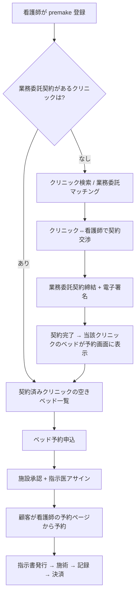

# 差分: 契約と実施主体 — premake

> [00_index.md](00_index.md) に戻る

---

## 1. 何が変わるか（要約）

| 観点 | 現行 | 新方向性 |
|---|---|---|
| 看護師の身分 | 独立事業者（プラットフォーム横断、スペース時間貸し） | 独立事業者だが、クリニックの **業務委託受託者** |
| クリニック↔看護師の関係 | スペース貸主⇔利用者（場所の取引） | **業務委託契約に基づく医療業務の受託者** |
| 医療提供主体 | 暗黙的（明示弱い） | **クリニック明示** |
| 予約の前提条件 | 看護師は誰でも検索・予約可 | **業務委託契約が締結済みのクリニックのみ予約可** |
| 契約書 | スペース利用契約（軽量） | **業務委託契約書**（重量）+ 院内規程同意 + 保険加入確認 |

---

## 2. 業務委託の頻度・期間：選択肢比較 [User 検討中]

User 回答: **「メリットデメリットをください」**。以下、3 案を比較。

### 2.1 三案の比較

| 案 | 内容 | 想定運用 |
|---|---|---|
| **A: 包括業務委託 + 案件アサイン** | クリニックと看護師が一度業務委託契約を締結。以降は予約発生のたびに「個別アサイン（業務指示）」で運用 | 「契約は 1 回、施術は何回でも」 |
| **B: 案件単位の業務委託** | 予約 1 件ごとに業務委託（または スポット契約） | 「毎回契約、毎回終了」 |
| **C: 月次継続業務委託** | 1 ヶ月単位の継続業務委託、月内は複数施術 OK | 「1 ヶ月契約、自動更新」 |

### 2.2 メリット・デメリット詳細

#### A 案: 包括業務委託 + 案件アサイン（推奨）

**メリット**:
- 契約締結の手間が 1 回で済む → 看護師・クリニックの onboarding が高速
- premake のサービス価値（雛形 + 電子署名）の効果が長期間続く
- 業務委託契約自体は法的に安定（継続的取引として扱える）
- 個別案件は「指示書」「業務指示」レベルで処理 → 法的書類負担が軽い
- 看護師の **複数クリニック契約** が現実的（クリニック X / Y / Z それぞれ包括契約）
- スプリント的に拡大しやすい

**デメリット**:
- 「実質雇用」と見なされるリスクがやや高い（包括契約 + 継続指示）
- 契約終了の取り扱いが複雑（既予約の扱い等）
- クリニックは「契約しているがほぼ稼働しない看護師」を抱える可能性

**法的論点**:
- 偽装請負・実質雇用と評価されないために、業務指揮の度合いを明確化（看護師の独立性を契約で担保）

#### B 案: 案件単位の業務委託

**メリット**:
- 「雇用と区別される」最も明確な形（1 件 = 1 契約）
- 契約終了の取り扱いが単純（案件完了で自動解除）
- 看護師は完全に独立した事業者として行動できる

**デメリット**:
- 契約締結のオーバーヘッドが大きい（電子署名でも認知負荷）
- premake の業務委託契約サービスの利用頻度は高い（プラスの面でもある）
- 法的書類が大量に生成される → 保存・管理コスト
- スピード感のある予約フローと相性が悪い

**法的論点**:
- 「準委任」「請負」のいずれが妥当かを 1 件ごとに判定する必要

#### C 案: 月次継続業務委託

**メリット**:
- 中間案として安定（包括ほど雇用視されず、案件単位ほど煩雑でない）
- 月次精算と相性が良い

**デメリット**:
- 中途半端なため両案の課題を中途半端に抱える
- 月をまたぐ予約の扱いが面倒
- ライトユーザー（年数回しか使わない看護師）に合わない

### 2.3 推奨案

**A 案 + B 案のハイブリッド** を [仮決定] として推奨:

- **デフォルト = A 案（包括業務委託）**
- **個別の単発スポット案件** には B 案を選択可能（クリニック判断）
- 包括契約締結中の予約は「包括契約に基づく業務指示」、スポット案件は「単発業務委託」

理由:
- 大半のケース（リピート利用）で A 案の高速性
- B 案を選択肢として残すことで法的柔軟性確保
- C 案は中途半端なので採用しない

---

## 3. 業務委託契約の前提と予約フローの変更 ★ 重要

[User 確認: 2026-05-18] による新仕様:

> **クリニック ↔ 業務委託の契約が完了したのちに、看護師が空きベッドを予約できる（看護師がベッドを確保する予約画面に表示される）**

### 3.1 新しい予約フロー（二段階）

### 3.2 現行 (Phase 1-3) との比較

| ステップ | 現行 | 新方向性 |
|---|---|---|
| 看護師の検索範囲 | 全 published スペース | **業務委託契約済クリニックのみ** |
| クリニック発見方法 | 検索 (FR-19) | 「マッチング」フロー（新規追加） + 既存契約クリニックの予約画面 |
| ベッド予約 | スペース検索 → 申込 | 契約済クリニック → 空き枠選択 → 申込 |
| 契約締結 | スペース予約時に都度 | **事前に業務委託契約を 1 回** |

### 3.3 影響を受ける既存機能

| 機能 | 影響 |
|---|---|
| FR-19 スペース検索 | スコープを「契約済クリニックの空きベッド」に絞る変形機能化、または別画面化 |
| FR-21 予約申込 | 「業務委託契約あり」を前提条件にバリデーション追加 |
| FR-25 予約一覧 | 「業務委託契約一覧」「予約一覧」の二画面化 |

### 3.4 新規必要な機能（DRAFT）

| 仮機能 ID | 機能名 | 用途 |
|---|---|---|
| **FR-NEW-01** | 業務委託マッチング検索（看護師→クリニック） | 契約候補クリニックを地域・条件で検索 |
| **FR-NEW-02** | 業務委託契約申込（看護師→クリニック） | 看護師から「業務委託契約したい」と意思表示 |
| **FR-NEW-03** | 業務委託契約締結ワークフロー（クリニック⇔看護師） | 条件交渉 → 契約書生成 → 電子署名 |
| **FR-NEW-04** | 業務委託契約一覧（看護師 / クリニック双方の画面） | 締結済 / 申込中 / 解除済の管理 |
| **FR-NEW-05** | 業務委託契約解除フロー | 終了申請 + 既予約の処理 |
| **FR-NEW-06** | 業務委託契約条件の改定フロー | 料率改定等を相互合意で |

### 3.5 削除・縮小される機能

| 機能 | 削除/縮小 |
|---|---|
| FR-19 一般検索 | 「契約済クリニック内検索」に変形 |
| FR-21 申込時のスペース検索的フロー | 「契約済クリニック → 空き枠選択」フローに統合 |

---

## 4. 業務委託契約書の取扱（雛形 + 電子署名）

[User 確認: 2026-05-18]:
- premake が **雛形提供 + 電子署名サービス連携**
- 将来は内製化視野（弁護士監修必要、後期機能拡張）
- 最初は既存ツール（**Cloud Sign / freee 電子署名 / DocuSign** 等）

### 4.1 雛形の中身（法務確認資料 §6.1 ベース）

| セクション | 内容 | 出所 |
|---|---|---|
| 第 1 条: 目的・契約形態 | 業務委託である旨明示、雇用ではない | §6.1 |
| 第 2 条: 業務範囲 | 施術・事前準備・説明補助・記録・術後対応 | §2.1 / §6.1 |
| 第 3 条: 医師指示 | 医師指示書発行前の施術禁止、指示外施術禁止 | §6.1 |
| 第 4 条: 資格・研修 | 看護師免許、研修履歴、技術要件、保険加入 | §6.1 |
| 第 5 条: 場所・設備 | クリニック指定場所・設備の利用ルール | §6.1 |
| 第 6 条: 報酬・費用 | 報酬計算、支払時期、キャンセル時、消費税、インボイス、源泉徴収 | §6.1 |
| 第 7 条: 記録・個人情報 | 施術記録、写真、同意書、患者情報の取扱、SNS 掲載禁止、秘密保持 | §6.1 |
| 第 8 条: 事故・苦情対応 | 副作用、感染、医療事故、クレーム、返金請求時の連絡・対応フロー | §6.1 |
| 第 9 条: 責任・保険 | 看護師の過失、クリニックの施設管理責任、医師判断、premake システム責任分担 | §6.1 |
| 第 10 条: 解除・停止 | 重大違反、資格喪失、無断キャンセル、虚偽記録、患者情報漏洩 | §6.1 |
| 第 11 条: 競業避止 | （User 確認: 制限なし）→ 第 11 条は **オプション条項として** 雛形に含めるが既定は無効 | User 確認 2026-05-18 |
| 第 12 条: 期間・更新 | 包括契約の期間（自動更新 等）、案件単位の有効期限 | A 案前提 |

### 4.2 電子署名サービス選定（候補）

| サービス | 月額 | 機能 | 国内対応 |
|---|---|---|---|
| **Cloud Sign（弁護士ドットコム）** | 無料 + 従量 | 国内 No.1、医療系実績 | ◎ |
| freee 電子署名 | プランによる | freee エコシステム連携 | ○ |
| DocuSign | $10〜 | 海外標準 | △ |

→ **[仮決定] Cloud Sign** で進める。理由: 国内シェア・医療系実績・弁護士ドットコム監修の安心感。

### 4.3 内製化の検討（将来）

- 内製化により電子署名サービス費用を削減
- 弁護士の監修（雛形のリーガルチェック + 電子契約フローの法的有効性確認）が必須
- RFC 3161 タイムスタンプは既に FR-29 で導入予定 → 流用可能
- **β中は外部サービス利用、本番化後に内製化検討** を方針とする

---

## 5. 看護師の複数クリニック契約：制限なし [User 確認]

[User 確認: 2026-05-18]: **制限なし**。

- 看護師は何件でもクリニックと業務委託契約を締結可
- データモデル: `nurse_facility_engagements`（M:N）を新規追加
- 看護師ダッシュボードに「業務委託契約一覧」セクション追加

### 5.1 競業避止について

- **デフォルト: 競業避止なし**
- クリニック側が任意で競業避止条項を入れる場合の **オプション機能** を提供（雛形のフラグ）
- ただし「実質的に競業避止 = 雇用関係」と見なされるリスクは弁護士確認事項

---

## 6. 医療提供主体としてのクリニックの責任（明示化）

### 6.1 ユーザー画面での明示

[法務確認資料 §3.1] の表現方針を反映:
- 看護師の公開ページに **「医療提供主体: クリニック X（住所: ...）」** を明示
- 「医師の判断・指示のもと、医療機関で実施されます」と明示
- 予約フロー全体で **「クリニック X が提供する自由診療」** と表記

### 6.2 同意書 (FR-32) の改訂

- 同意書を **クリニックの自由診療契約の一部** として再構成
- 看護師個人への同意ではなく、**クリニック X への同意**
- 同意書のタイトル: 「クリニック X におけるアートメイク施術についての同意書」
- 看護師は施術者として記名（責任ではなく事実）

### 6.3 患者向け利用規約 (FR-61) の改訂

- 既存利用規約に **「premake は予約・決済支援のプラットフォーム、施術はクリニックが提供」** を明示
- 「クリニックが医療提供主体」「premake は施術責任を負わない」を明文化

---

## 7. 思考の足跡

### 7.1 検討した別案

#### 別案 X: premake が看護師の「派遣元」になる
- 不採用理由: 労働者派遣事業の許認可が必要、責任が premake に集中、現実的でない

#### 別案 Y: 看護師が法人化して人材紹介事業者として行動
- 不採用理由: 看護師の負担が大きすぎる、ハードルが上がりすぎる

### 7.2 残された問い

- 法務確認資料 §5.1 質問 4 「偽装請負・実質雇用と評価されるリスク」を弁護士で確認
- 包括業務委託の場合の「業務指示と医療上の指示の区別」をどう契約書で書くか
- 業務委託契約の **電子データ保存** が「7 年保存」の対象になるか

### 7.3 今後の改訂候補

- 業務委託契約完了の後の **クリニック・看護師の onboarding チュートリアル**
- 業務委託契約の **更新・解除のリマインド**
- 看護師の **クリニックへの初回挨拶 / 院内オリエンテーション** フロー

---

バージョン: 0.1 / 作成日: 2026-05-18
