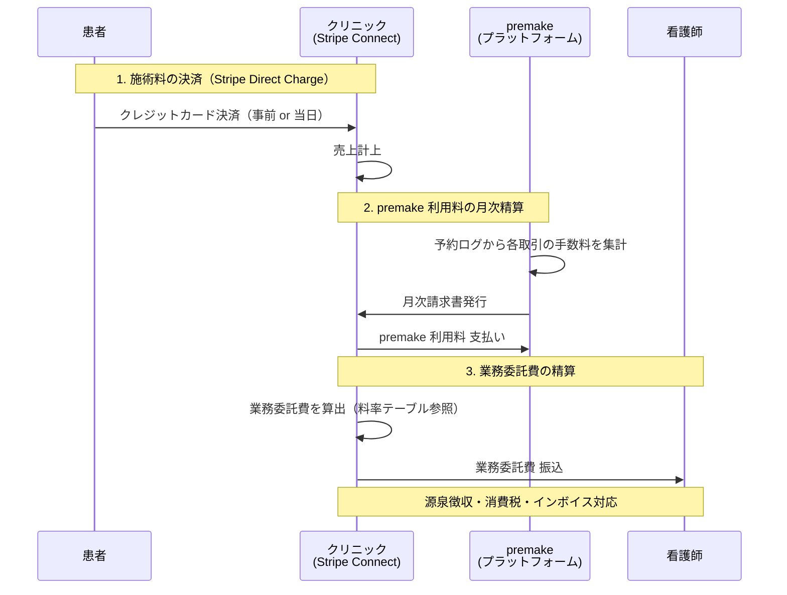
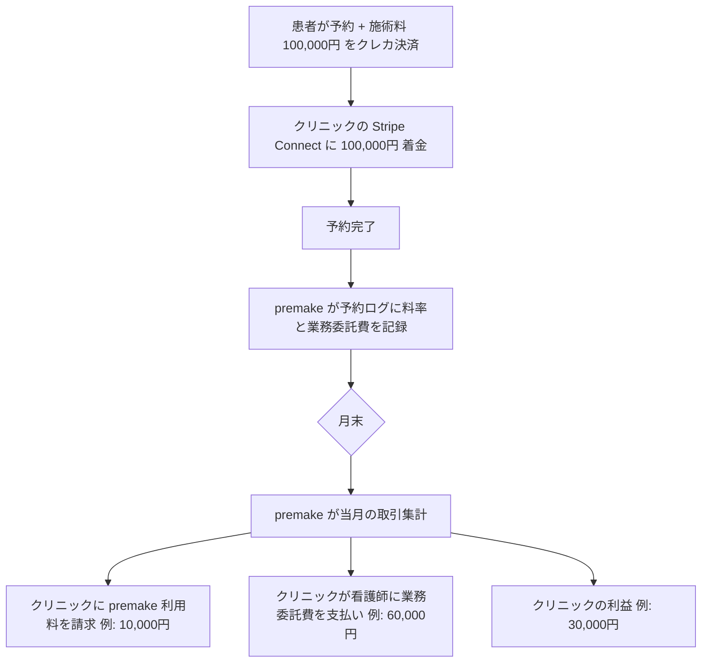
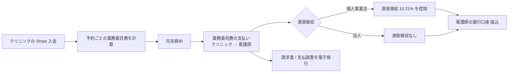

# 差分: お金の流れと手数料 — premake

> [00_index.md](00_index.md) に戻る

---

## 1. 何が変わるか（要約）

| 観点 | 現行 | 新方向性 |
|---|---|---|
| 患者の支払い先 | 看護師（事前決済時）or 不明（当日現金等） | **クリニック（Stripe 直接決済）** |
| 看護師の収入経路 | 患者から直接 / 事前決済の場合は premake 経由 | **クリニックからの業務委託費**（クリニック内部精算） |
| premake の収入 | 看護師スペース利用料 + 利用客取引手数料 | **クリニックからの利用料（月次請求）** |
| 受領主体 | 看護師個別 Connect / 施設 Connect | **クリニック単独 Connect**（看護師個別 Connect 廃止） |
| 代理受領 | 部分的（事前決済） | **しない** [User 確認: 2026-05-18] |
| 手数料計算 | 取引額 × 固定率 | 予約ログから自動算出 → 月次請求 |

---

## 2. 新しいお金の流れ図 [User 確認済み]



### 2.1 各取引のフロー（1 件の予約あたり）



---

## 3. 料率モデル [User 確認済み]

[User 確認: 2026-05-18]:
> premake が推奨料率を提示して、個別にカスタマイズしていく方針
> - 施術料金は看護師本人が決定するので看護師ごとに異なる
> - 病院に最低限 N 円が残るような前提の範囲で、看護師の料率を premake が提示し、病院 ⇔ 看護師の相談のうえで決定される

### 3.1 料率モデルの構造

業務委託契約に紐づく以下のパラメータを管理:

| パラメータ | 説明 | 決定者 |
|---|---|---|
| **menu_price** | 施術メニューの料金（円） | 看護師本人 |
| **clinic_minimum_amount** | クリニックに残す最低金額（円） | premake が初期値提示、クリニック⇔看護師の交渉で決定 |
| **platform_fee_rate** | premake 取り分（料率 %） | premake が初期値提示、クリニック・看護師合意で確定 |
| **nurse_share_rate** | 看護師取り分（料率 %） | クリニック⇔看護師の交渉で決定 |
| **clinic_share_calculation** | クリニック取り分 | 残額（= menu_price - platform_fee - nurse_share）、**最低 clinic_minimum_amount 以上** |

### 3.2 料率計算ロジック（提案）

```pseudo
nurse_amount = menu_price * nurse_share_rate
platform_fee = menu_price * platform_fee_rate
clinic_amount = menu_price - nurse_amount - platform_fee

if clinic_amount < clinic_minimum_amount:
    raise ValidationError("クリニック取り分が最低 {clinic_minimum_amount} 円を下回るため、料率を再調整してください")
```

### 3.3 料率提示の UI 例

業務委託契約締結時の料率交渉画面:

```
施術メニュー: 眉アートメイク
料金: 100,000 円（看護師本人が決定）

[premake 推奨料率]
看護師: 60% (60,000 円)
クリニック: 30% (30,000 円)
premake: 10% (10,000 円)

[クリニック最低取り分（必須）]
[ 25,000 円 ]

[カスタマイズ]
看護師取り分: [ 60 ]%   = 60,000 円
premake 取り分: [ 10 ]%  = 10,000 円
クリニック取り分: 自動計算 = 30,000 円 (>= 25,000 ✓)

[ 合意して契約締結 ]
```

### 3.4 料率の決定タイミング

| シナリオ | タイミング |
|---|---|
| A 案: 包括業務委託 | 契約締結時に料率を決定、契約期間中は固定 |
| 料率改定 | クリニック⇔看護師の合意で随時改定可能（履歴保持） |
| 個別案件で例外 | 業務委託に基づくが、料率は包括契約のものを使う |
| メニュー追加 | 新メニュー追加時に料率を再決定 |

### 3.5 [仮決定] 初期推奨料率

| 項目 | 推奨値 |
|---|---|
| premake 取り分 | **10%** |
| クリニック取り分（推奨） | **30%** |
| 看護師取り分（推奨） | **60%** |
| クリニック最低取り分 | **メニュー料金の 25%** または **絶対値 N 円**（要 User 確認） |

→ 弁護士確認 + クリニック数社へのヒアリング後に確定。

---

## 4. premake 利用料の請求モデル

### 4.1 現行 → 新方向性の比較

| 項目 | 現行 | 新方向性 |
|---|---|---|
| 徴収主体 | 看護師 / 利用客 | **クリニック** |
| 徴収タイミング | 各取引時 | **月次集計 + 月末請求書** |
| 計算方法 | 取引額 × 固定率 | 予約ログから集計（取引 × platform_fee_rate） |
| 決済方法 | Stripe で自動引き落とし | クリニックの選択（Stripe / 銀行振込 / カード払い） |

### 4.2 月次請求書の構造

```
premake 月次請求書 - 2026 年 5 月分

宛先: 山田クリニック
発行日: 2026-06-01

【取引明細】
| 日付 | 予約番号 | 看護師 | メニュー | 取引額 | premake 料率 | 利用料 |
| 5/3  | B-XXX   | 山田 H | 眉      | 100,000 | 10%        | 10,000 |
| 5/4  | B-YYY   | 鈴木 T | リップ   | 80,000  | 10%        | 8,000  |
| ...

【請求額】
- 取引件数: 30 件
- 取引合計: 3,000,000 円
- premake 利用料合計: 300,000 円
- 消費税: 30,000 円
- **請求合計: 330,000 円**

支払期限: 2026-06-30
お支払方法: 銀行振込（または Stripe 自動引き落とし）
```

### 4.3 料率の透明性

- クリニックダッシュボード（FR-66）に **「premake 利用料の見込み額」** を リアルタイム表示
- 予約ごとに「この予約から premake 利用料 X 円」を明示
- 月末に確定請求

---

## 5. 看護師の業務委託費精算

### 5.1 クリニック → 看護師の支払いフロー



### 5.2 premake の役割

- **計算補助**: 予約ログから業務委託費を自動算出 → 看護師ダッシュボード (FR-65) で確認可
- **明細生成**: 看護師・クリニック双方の明細を月次生成
- **支払いそのものはクリニック責任**（premake は代理受領しない）
- 将来的に **支払い自動化** をオプション機能として検討（クリニックが希望すれば）

### 5.3 看護師ダッシュボードの表示

```
看護師ダッシュボード - 売上

| 月 | 完了予約 | 業務委託費合計 | 源泉控除後 | 受領済 |
| 5月 | 12 件   | 720,000 円    | 646,488 円| 受領待ち |
| 4月 | 10 件   | 600,000 円    | 538,740 円| 受領済   |

【今月の予約別明細】
| 日付 | クリニック | メニュー | 業務委託費 | 源泉控除 | 支払い予定 |
| 5/3  | 山田C   | 眉      | 60,000   | 6,126   | 5/31     |
```

---

## 6. 削除・縮小される機能

### 6.1 看護師の Stripe Connect (FR-37 看護師向け)

- **理由**: 看護師は患者から直接受領しないため不要
- **影響**: FR-37 はクリニック・法人向けのみに縮小、FR-39（利用客事前決済）も再設計

### 6.2 看護師のカード登録 (FR-36)

- **現行**: 看護師がスペース利用料を支払うためのカード登録
- **新方向性**: **不要**。看護師はクリニックから業務委託費を受領するだけで、premake / クリニックへの支払いはない
- **削除候補**: FR-36

### 6.3 スペース利用料の決済 (FR-38)

- **現行**: 看護師 → 運営 → 施設（按分送金）
- **新方向性**: **不要**。クリニックが場所を提供、業務委託費にスペース利用が含まれる
- **削除候補**: FR-38

### 6.4 利用客事前決済 (FR-39)

- **現行**: 看護師の Connect 受領
- **新方向性**: **クリニックの Connect 受領** に変更（事前決済自体は維持）
- **弁護士確認後、次 Sprint で本格導入** [User 確認: 2026-05-18]

### 6.5 入金スケジュール (FR-44)

- **現行**: 看護師・施設・法人それぞれの入金ビュー
- **新方向性**: **クリニック視点に統合**。看護師の業務委託費明細を別ビュー化

---

## 7. 追加・新規機能（DRAFT）

| 仮機能 ID | 機能名 | 用途 |
|---|---|---|
| **FR-NEW-10** | 業務委託契約の料率管理 | menu_price / 各料率 / clinic_minimum_amount の設定・改定 |
| **FR-NEW-11** | premake 利用料の月次請求書生成 | 取引集計 → PDF 請求書 → クリニックへ送信 |
| **FR-NEW-12** | premake 利用料の決済 | クリニックから月次振込 or Stripe 自動引き落とし |
| **FR-NEW-13** | 看護師業務委託費の精算明細（看護師ダッシュボード） | 月次明細 + 源泉控除計算 |
| **FR-NEW-14** | 業務委託費の支払調書生成 | 法人クリニック用、税務対応 |

---

## 8. 既存機能の改訂

| FR | 改訂内容 |
|---|---|
| FR-15 スペース料金設定 | **メニュー料金管理に変更**（看護師がメニュー × 料金を設定、クリニックはスペース料金を持たない） |
| FR-22 予約承認時の Stripe Authorization | **クリニックの Connect への Authorization** に変更 |
| FR-38 スペース利用料決済 | **削除候補**（または「業務委託費精算補助」に再定義） |
| FR-40 返金処理 | **クリニックからの返金** に変更（patient → clinic への返金） |
| FR-41 キャンセルポリシー | クリニックの自由診療契約として再定義、患者と看護師の双方への影響を整理 |
| FR-42 Stripe Webhook | クリニック Connect 用に整理（看護師 Connect 廃止） |
| FR-43 手数料明細 | クリニック / 看護師 / 法人 それぞれの視点で再構成 |
| FR-44 入金スケジュール | クリニック中心、看護師は業務委託費明細ビュー |
| FR-86 施設別キャンセルポリシー | **業務委託契約ごとのキャンセルポリシー** に拡張可能性 |

---

## 9. データモデル変更案

### 9.1 既存テーブルの改訂

#### TBL-payments
- `recipient_type` カラム削除 or 'clinic' 固定
- `nurse_share_amount`, `clinic_share_amount`, `platform_fee` の 3 つを明示記録
- `stripe_connect_account_id` は clinic の Connect ID のみ

#### TBL-customer_payments (FR-39 用)
- `recipient_clinic_id` を追加（受領クリニック）
- 看護師 Connect への transfer は削除

#### TBL-space_pricing
- **大幅縮小 or 削除**: スペース料金から **メニュー料金 + 料率テーブル** に置き換え
- 既存の time_window / weekday 倍率は **メニュー料金にも引き継ぐ** か検討

### 9.2 新規テーブル（提案）

#### TBL-nurse_facility_engagements（業務委託契約）
- id, nurse_user_id, facility_id
- contract_type ('umbrella'/'spot')
- status ('draft'/'pending_signing'/'active'/'paused'/'terminated')
- contract_started_at, contract_ended_at
- signed_pdf_url (Cloud Sign 等)
- esignature_provider, esignature_envelope_id
- created_at, updated_at

#### TBL-engagement_pricing（業務委託料率）
- id, engagement_id (FK)
- menu_id (FK, または NULL = 全メニュー共通)
- nurse_share_rate, platform_fee_rate, clinic_minimum_amount
- effective_from, effective_to
- created_at

#### TBL-clinic_invoices（月次請求書）
- id, clinic_id, period_month
- total_gmv, total_platform_fee, tax_amount, total_amount
- status ('draft'/'sent'/'paid'/'overdue')
- pdf_url, sent_at, paid_at, due_at
- created_at

#### TBL-nurse_payouts（業務委託費精算明細）
- id, engagement_id, nurse_user_id, clinic_id, period_month
- gross_amount, withholding_tax_amount, net_amount
- status ('pending'/'paid')
- paid_at, payment_method
- created_at

---

## 10. 思考の足跡

### 10.1 検討した別案

#### 別案 X: premake が代理受領（Stripe Connect Custom or Marketplace）
- 不採用理由 [User 確認: 2026-05-18]: クリニックが直接受領する方針。代理受領は Stripe Connect の許認可的負担 + 法的論点が多い

#### 別案 Y: 看護師個人が直接 Stripe で受領（クリニック経由しない）
- 不採用理由: 業務委託モデルでは医療提供主体がクリニック、患者の支払先もクリニックが法的に整合

### 10.2 残された問い

- **クリニック最低取り分の決定方式**: 固定額 N 円 vs メニュー料金 ×%
- **源泉徴収の取り扱い**: 個人事業主の看護師に対する 10.21% 源泉徴収の判断（クリニック実施が原則）
- **インボイス制度対応**: 看護師がインボイス登録番号を持つ前提か
- **月次請求のサイクル**: クリニックが「毎月締め日 + 翌月支払い」を選べるオプションが必要か
- **施術キャンセル時のお金の流れ**: 患者返金 → クリニック損失 → 業務委託費どう調整

### 10.3 弁護士に確認したい論点

1. premake が代理受領せず、クリニック直接受領で **特定商取引法** 上の表記の主体は誰か
2. premake の **月次利用料は SaaS 利用料か役務提供対価か**、税務上の扱い
3. 看護師個人事業主への **源泉徴収義務** はクリニック側にあるか
4. キャンセル時の患者返金 → クリニック → 看護師業務委託費 への影響

---

バージョン: 0.1 / 作成日: 2026-05-18
