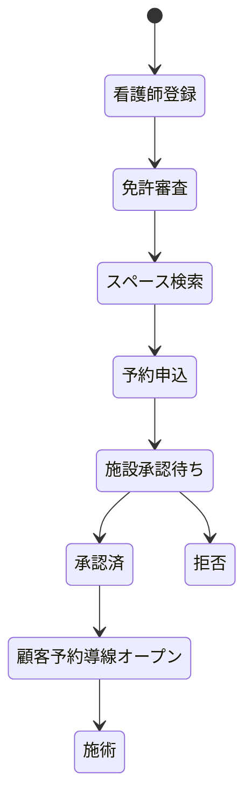
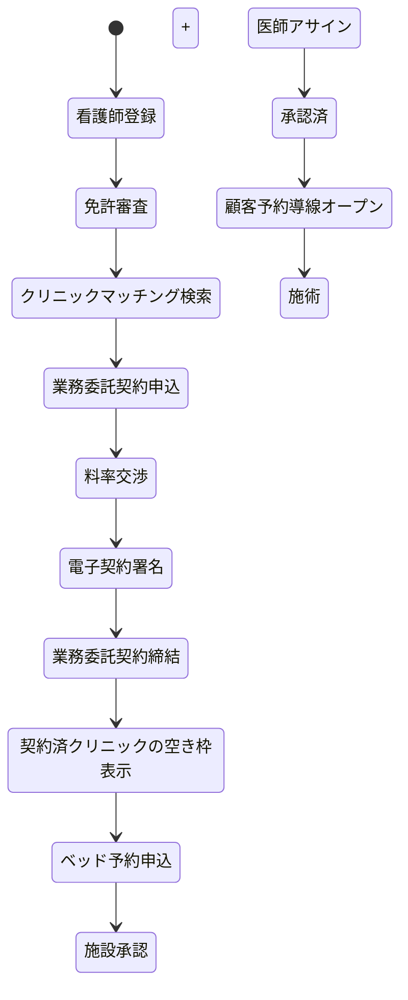
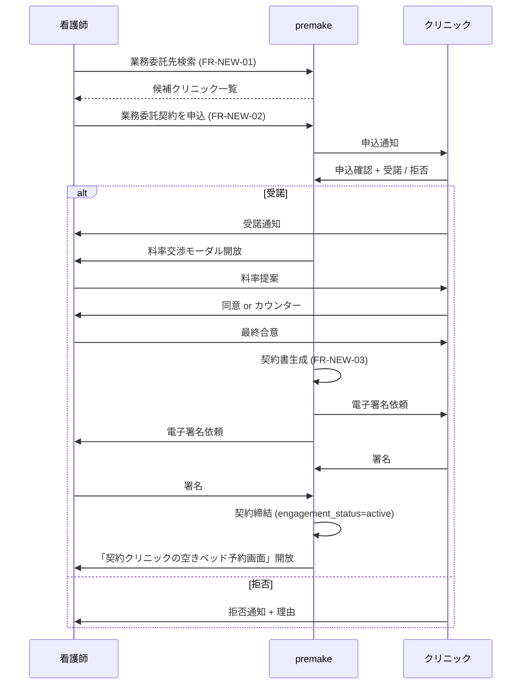

# 差分: 予約マッチングと公開ページ — premake

> [00_index.md](00_index.md) に戻る

---

## 1. 何が変わるか（要約）

| 観点 | 現行 | 新方向性 |
|---|---|---|
| 看護師の検索範囲 | 全 published スペース（自由検索） | **業務委託契約済クリニックのスペースのみ**（フィルタ強制） |
| クリニックとの初接触 | スペース予約申込 | **業務委託マッチング → 契約 → 予約** の二段階 |
| 看護師の公開ページ (FR-69) | **維持** [User 確認: 2026-05-18] | 維持。文言調整 + 医療広告対応 |
| 利用客の予約導線 | 看護師の公開ページから | **同上**（変更なし） |
| 看護師主体での集客 | 自由 | 維持。**ただしクリニック主体の表記を併記** |
| マッチング機能 | スペース予約のみ | **業務委託マッチング（新規）** + スペース予約 |

---

## 2. 看護師の予約フロー：新旧比較

### 2.1 現行フロー（Phase 1-3）



### 2.2 新方向性フロー [User 確認: 2026-05-18 重要]



### 2.3 重要な変更点

> **業務委託契約完了がベッド予約の前提条件**

- 看護師は **契約済クリニックの空きベッドしか予約できない**
- 「初めてのクリニック」と取引したい場合は、**まず業務委託マッチングから**
- 検索 (FR-19) は二種類に分化:
  - **マッチング検索**: 業務委託したいクリニックを探す（新規）
  - **ベッド検索**: 契約済クリニックの空きベッドを探す（FR-19 改訂）

---

## 3. 看護師の公開ページ：維持しつつ表現調整 [User 確認: 2026-05-18]

> User 確認: **「看護師の予約ページから顧客が予約をするのは現行と変わらない想定」**

### 3.1 維持される機能

| FR | 機能 | 維持/改訂 |
|---|---|---|
| FR-69 看護師の公開ブッキングページ | URL /n/{handle} | **維持**（表現調整） |
| FR-70 利用客のゲスト予約 | SMS OTP 認証 | **維持** |
| FR-71 問診票テンプレート | 看護師カスタマイズ可 | **維持**（クリニックテンプレートとの統合検討） |
| FR-72 問診票記入 | 利用客記入 | **維持** |
| FR-73 確認メール / SMS | | **維持** |
| FR-74 予約照会 | メール + 番号 | **維持** |
| FR-75 利用客の変更・キャンセル | | **維持** |

### 3.2 公開ページ上の表現調整（必須）

医療広告規制 + 業務委託モデルに合わせて、看護師の公開ページに以下を **追加表示**:

```
┌─────────────────────────────────────────────┐
│  premake / 山田 H 看護師の予約ページ          │
│                                              │
│  ┌──────────┐                              │
│  │ プロフ写真 │ 山田 H（看護師）              │
│  │          │                              │
│  └──────────┘                              │
│                                              │
│  ▣ 施術を提供する医療機関                   │
│  山田クリニック（東京都新宿区...）              │
│  ★ 施術は山田クリニックの自由診療として       │
│    医師の判断・指示のもと実施されます ★     │
│                                              │
│  ▣ 提供メニュー                              │
│  ...                                         │
└─────────────────────────────────────────────┘
```

### 3.3 公開ページが選択するクリニック

- 看護師の業務委託契約が **複数クリニック** にある場合、看護師は予約ページ上で「このメニューは X クリニック」「あのメニューは Y クリニック」を選択
- メニューごとに 1 クリニックを紐づけ
- 利用客は **施術を提供するクリニックを明示認識** したうえで予約

### 3.4 「premake 認定看護師」等の表現禁止

[法務確認資料 §7] の表現方針を反映:

| 避ける | 代替 |
|---|---|
| 「premake が安全なアートメイクを提供します」 | 「提携医療機関・医師・看護師による施術の予約・業務管理を支援します」 |
| 「premake 認定看護師だから安心」 | 「登録看護師の資格情報・対応可能範囲を確認できます」 |
| 「医師不要／簡単に施術可能」 | 「医師の判断・指示のもと、医療機関で実施されます」 |
| 「絶対に失敗しない／副作用なし」 | 「リスク・副作用を確認し、医師の判断を受けてください」 |

---

## 4. 業務委託マッチング機能（新規）

### 4.1 概要

看護師がクリニックと業務委託契約を結ぶための、premake が提供する **マッチング機能**。

### 4.2 検索条件

| 軸 | 例 |
|---|---|
| 地域 | 東京都 / 区市町村 / 駅徒歩 N 分 |
| 受入条件 | 看護師の経験年数・専門領域 |
| クリニック種別 | 美容クリニック / 一般診療所 / 病院 |
| 設備 | 拡大鏡 / 滅菌器 等 |
| 推奨料率 | クリニックの提示料率 |
| 利用可能日時 | 看護師の希望と整合する空き |

### 4.3 マッチング画面（モックアップ）

```
┌──────────────────────────────────────────────────────┐
│  業務委託先クリニックを探す                            │
├──────────────────────────────────────────────────────┤
│  地域: [東京都 ▾]   経験: [3 年以上 ▾]                 │
│  種別: [美容クリニック ▾]                              │
│                                                       │
│  ┌──────────────────────────────────────────────┐  │
│  │ 山田クリニック (新宿)                          │  │
│  │ 提示料率: 看護師 60% / クリニック 30% / PF 10% │  │
│  │ 受入: 経験 2 年以上、月 5 件以上稼働           │  │
│  │ 設備: 拡大鏡 / Wi-Fi / 滅菌器                  │  │
│  │ [ 業務委託契約を申込む → ]                     │  │
│  └──────────────────────────────────────────────┘  │
│  ...                                                   │
└──────────────────────────────────────────────────────┘
```

### 4.4 マッチング → 契約締結のワークフロー



---

## 5. 影響を受ける既存機能の詳細

### 5.1 FR-19 スペース検索 → 「契約済クリニック内ベッド検索」

| 観点 | 改訂内容 |
|---|---|
| 検索範囲 | nurse の `engagement_status=active` クリニックのみ |
| 表示単位 | スペース → **クリニック × ベッド × 空き枠** |
| フィルタ | 地域 / 設備 / 料金 → **契約済クリニックを横断した空き枠絞り込み** |
| デフォルト表示 | 「今日 / 明日」「今週」「メニューに必要な時間」 |

### 5.2 FR-21 予約申込 → 業務委託契約前提化

新しい予約申込ロジック:

```pseudo
function createBooking(nurse, space, sessions) {
    facility = space.facility
    engagement = getActiveEngagement(nurse, facility)
    if engagement is None:
        throw "業務委託契約が締結されていません"
    if engagement.status != 'active':
        throw "業務委託契約が有効ではありません"
    // 既存チェック (空き枠衝突、自分の他予約衝突、etc)
    booking = insertBooking(...)
    booking.engagement_id = engagement.id  // 契約紐付け
    return booking
}
```

### 5.3 FR-25 予約一覧（看護師）

タブ追加:

| タブ | 内容 |
|---|---|
| **業務委託契約** | active / pending / paused / terminated |
| **予約一覧** | 既存（契約済クリニックの予約） |

---

## 6. 顧客向け予約導線：細部の整理

### 6.1 顧客の予約フロー（変更なしの部分）

1. 顧客が看護師の公開ページにアクセス
2. メニュー選択
3. 日時選択（看護師の確保した空き枠から）
4. 個人情報入力
5. SMS OTP 認証
6. 予約完了

### 6.2 改訂が必要な部分

| ステップ | 改訂 |
|---|---|
| 1. 公開ページ | 「施術を提供する医療機関: X クリニック」を明示 |
| 2. メニュー選択 | メニューごとに「提供クリニック」を併記 |
| 3. 日時選択 | 看護師が **特定のクリニックで確保した枠** であることを明示 |
| 4. 個人情報入力 | 「クリニックへの自由診療契約申込」と「premake への予約利用申込」を分離表示 |
| 5. 同意書 | クリニック X の自由診療同意書として再構成（FR-32 改訂） |
| 6. 確認画面 | 「クリニック X が施術を提供」「premake が予約・決済を支援」を明示 |

---

## 7. 思考の足跡

### 7.1 検討した別案

#### 別案 X: 業務委託契約なしでも検索可能、予約時に契約締結
- 不採用理由: 予約時に契約締結すると **その場で電子署名を求めることになり、UX が破壊される**。事前契約のほうが体験良い

#### 別案 Y: 看護師の公開ページを廃止して、クリニックの提供ページに統合
- 不採用理由 [User 確認: 2026-05-18]: 看護師個人の集客力を活かせない、看護師の事業価値を棄損する

#### 別案 Z: マッチング検索を premake が手動で行う（運営による紹介）
- 不採用理由: スケールしない、運営コストが高い、サービスとしての価値が薄い

### 7.2 残された問い

- **業務委託マッチング検索 (FR-NEW-01) は MVP に含めるか β 後か**
  → 1 施設のクローズドα段階では「運営代理」で間に合わせる選択肢あり
- **看護師の複数クリニック契約時の UI**: メニューごとにクリニックを紐づけるとどう見せるか
- **業務委託契約が解除された場合**: 既存予約の扱い（残予約は履行 vs 全キャンセル）
- **看護師の公開ページに表示するクリニック情報の範囲**: クリニック名のみ vs 住所・連絡先含む（医療法と整合）

### 7.3 弁護士に確認したい論点

- **業務委託マッチング機能が「職業紹介」「募集情報等提供」に該当するか** (法務確認資料 §5.1 質問 3)
- 看護師の公開ページに **クリニック X が表示される** ことの医療広告規制との整合
- 看護師の **複数クリニック表示** を一括公開ページに置くことの可否

---

バージョン: 0.1 / 作成日: 2026-05-18
