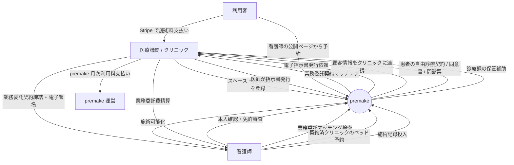

# 影響マップ: Phase 1 要件定義 — premake 仕様変更

> [00_index.md](00_index.md) に戻る

---

## 1. 影響を受ける Phase 1 ドキュメント

| ファイル | 影響度 | 内容 |
|---|---|---|
| `docs/01_要件定義/00_サマリー.md` | 中 | KPI / 仮決定事項の更新 |
| `docs/01_要件定義/01_業務理解.md` | **大** | ビジネスモデル全面改訂（業務委託モデルへ） |
| `docs/01_要件定義/02_ユーザー像.md` | 中 | ロールの権限マトリクス調整 |
| `docs/01_要件定義/03_スコープ.md` | **大** | 機能カテゴリの追加・改訂 |
| `docs/01_要件定義/04_画面遷移図.md` | 中 | 新規 SCR の追加（業務委託フロー） |
| `docs/01_要件定義/_index.yml` | 中 | features の追加・改訂を反映 |
| `docs/01_要件定義/features/FR-XX.md` | **大** | 多数の FR 改訂 + 新規 FR 追加 |

---

## 2. 業務理解 (01_業務理解.md) の改訂内容

### 2.1 §1.1 現状の課題 → 維持（業務委託モデルでも課題認識は同じ）

### 2.2 §1.2 現在の対処方法 → 維持

### 2.3 §2 プロジェクト目的 → 一部改訂

**「適法に・安全に施術できる仕組み」** を **「業務委託モデルで法的整合性を担保しつつ、安全に施術できる仕組み」** に強化

### 2.4 §3.1 In Scope（機能カテゴリ） → **大幅改訂**

カテゴリ A〜K に **L. 業務委託契約管理** を追加:

| ID | カテゴリ | 状態 |
|---|---|---|
| A〜K | 既存 | 一部 FR 改訂 |
| **L** | **業務委託契約管理（新規）** | FR-NEW-01〜FR-NEW-10 |

### 2.5 §4.2 To-Be フロー → **全面改訂**

新しい To-Be フロー:

### 2.6 §6 ステークホルダー整理 → 関係性再定義

- クリニック: **医療提供主体** として明示
- 看護師: クリニックの **業務委託受託者**
- premake 運営: **業務管理 SaaS + 決済支援 + 業務委託マッチング**（医療提供主体ではない）

---

## 3. ユーザー像 (02_ユーザー像.md) の改訂内容

### 3.1 ロール定義の調整

| ロール | 主な調整 |
|---|---|
| U-01 看護師 | 「独立事業者、複数クリニックと業務委託契約」を明示 |
| U-02 施設管理者 | 「クリニック運営者、業務委託契約管理を担当」を明示 |
| U-03 指示医 | 維持 |
| U-04 運営 | 「業務委託モデレーション」「医療広告規制チェック」を追加 |
| U-05 利用客 | 「クリニックとの自由診療契約者」を明示 |
| U-06 法人管理者 | 「業務委託の法人マスター契約」を追加検討 |

### 3.2 権限マトリクスの更新

[02_ユーザー像.md §3] の権限マトリクスに以下を追加:

| 機能カテゴリ / 操作 | U-01 | U-02 | U-03 | U-04 | U-06 |
|---|---|---|---|---|---|
| **L. 業務委託契約** | | | | | |
| 業務委託先検索 | ◎ | × | × | △(監査) | × |
| 業務委託契約申込 | ◎ | × | × | × | × |
| 業務委託契約受諾・拒否 | × | ◎(自施設) | × | × | ◎(配下) |
| 業務委託料率設定 | △(交渉) | ◎(自施設) | × | △ | ◎(配下) |
| 業務委託契約解除 | ○(自分) | ○(自施設) | × | ◎ | ○(配下) |
| **新 E. 決済（クリニック中心）** | | | | | |
| 患者からの決済受領 | × | ◎(自施設) | × | △ | ◎(配下) |
| premake 利用料の月次精算 | × | ◎(自施設) | × | △ | ◎(配下) |
| 看護師への業務委託費支払い | × | ◎(自施設) | × | △ | ◎(配下) |

---

## 4. スコープ (03_スコープ.md) の改訂内容

### 4.1 機能カテゴリ追加

**L. 業務委託契約管理** を追加:

| 機能 ID | 機能名 | 優先度 | 対象 |
|---|---|---|---|
| FR-NEW-01 | 業務委託マッチング検索（看護師→クリニック） | P0 | U-01 |
| FR-NEW-02 | 業務委託契約申込（看護師→クリニック） | P0 | U-01 |
| FR-NEW-03 | 業務委託契約締結ワークフロー（電子署名連携） | P0 | U-01, U-02 |
| FR-NEW-04 | 業務委託契約一覧 | P0 | U-01, U-02 |
| FR-NEW-05 | 業務委託契約解除フロー | P0 | U-01, U-02 |
| FR-NEW-06 | 業務委託契約条件改定 | P0 | U-01, U-02 |
| FR-NEW-07 | 業務委託料率設定 | P0 | U-02 |
| FR-NEW-08 | 院内オリエンテーション完了管理 | P0 | U-01, U-02 |
| FR-NEW-09 | 看護師の独立事業者証明（開業届等）アップロード | P1 | U-01 |
| FR-NEW-10 | 看護師の保険加入証明アップロード + 期限管理 | P0 | U-01 |

**新規追加: 月次決済・精算カテゴリ（E カテゴリ拡張）**

| 機能 ID | 機能名 | 優先度 |
|---|---|---|
| FR-NEW-11 | premake 月次請求書生成 | P0 |
| FR-NEW-12 | クリニックの premake 利用料決済 | P0 |
| FR-NEW-13 | 看護師業務委託費精算明細 | P0 |
| FR-NEW-14 | 業務委託費の支払調書生成 | P1 |

**運用ガイドライン拡張**

| 機能 ID | 機能名 | 優先度 |
|---|---|---|
| FR-NEW-20 | 月次アクセスレポート（医療情報安全管理 GL 対応） | P0 |
| FR-NEW-21 | 患者の開示請求受付（クリニック経由） | P1 |
| FR-NEW-22 | 安全管理措置文書（クリニック契約付録） | P1 |
| FR-NEW-23 | 重大事故・副作用の即時通知ワークフロー | P0 |
| FR-NEW-30 | 業務委託指揮命令独立性条項管理 | P0 |
| FR-NEW-31 | 看護師の独立事業者証明管理（再掲: FR-NEW-09） | - |
| FR-NEW-32 | 看護師の同時稼働状況可視化 | P1 |
| FR-NEW-33 | 院内オリエンテーション完了管理（再掲: FR-NEW-08） | - |
| FR-NEW-34 | 緊急時連絡先テンプレート | P0 |
| FR-NEW-35 | 緊急時通報ボタン | P0 |
| FR-NEW-36 | 救急搬送先事前登録 | P1 |
| FR-NEW-37 | 保険加入証明（再掲: FR-NEW-10） | - |
| FR-NEW-38 | 契約解除予告期間 + 既存予約履行ルール | P0 |
| FR-NEW-39 | 契約解除時の既存予約自動振替 | P1 |
| FR-NEW-40 | クリニック閉院時の医療情報引き継ぎ | P2 |
| FR-NEW-41 | 施術コース管理（複数施術） | P1 |
| FR-NEW-42 | 医師の事前判断フロー | P0 |
| FR-NEW-43 | 看護師の研修履歴・スキルレベル管理 | P1 |

**合計新規 FR 候補: 約 30 件**（うち P0 が 20 件程度）

### 4.2 既存 FR の改訂対象（主要のみ抜粋）

| FR | 改訂内容 |
|---|---|
| FR-15 スペース料金設定 | **メニュー料金管理** に変更 |
| FR-19 スペース検索 | **契約済クリニック内** に絞り込み |
| FR-21 予約申込 | engagement_status=active バリデーション追加 |
| FR-31 同意書テンプレ | nurse 個別削除、clinic 中心に |
| FR-36 看護師カード登録 | **削除候補** |
| FR-37 Stripe Connect | 看護師向け削除、クリニック向けのみ |
| FR-38 スペース利用料決済 | **削除候補**（または再定義） |
| FR-39 利用客事前決済 | クリニック Connect 受領に変更 |
| FR-40 返金処理 | クリニックからの返金 |
| FR-41 キャンセルポリシー | クリニックの自由診療契約として再定義 |
| FR-42 Stripe Webhook | クリニック Connect 用に整理 |
| FR-43 手数料明細 | クリニック / 看護師 / 法人 視点で再構成 |
| FR-44 入金スケジュール | クリニック中心、看護師は業務委託費明細ビュー |
| FR-49〜52 レビュー | 公開廃止 or 限定解除要件遵守 |
| FR-61 利用規約 | 業務委託モデル + premake 立ち位置明示 |
| FR-62 プライバシーポリシー | 要配慮個人情報・診療情報強化 |
| FR-69 看護師公開ページ | クリニック明示の表現追加 |
| FR-70〜75 顧客予約フロー | クリニック明示・同意書改訂 |

### 4.3 削除候補 FR

| FR | 理由 |
|---|---|
| FR-36 看護師カード登録 | 業務委託モデルでは不要 |
| FR-37 看護師個別 Stripe Connect | 同上 |
| FR-38 スペース利用料決済 | 不要 or 再定義 |
| FR-49 看護師→施設レビュー | 業務委託関係なので公開不要、内部 fb に |
| FR-50 施設→看護師レビュー | 同上 |

---

## 5. 画面遷移図 (04_画面遷移図.md) の改訂内容

### 5.1 新規 SCR 追加

| SCR | 画面名 | URL | 関連 FR |
|---|---|---|---|
| **SCR-NEW-01** | 業務委託マッチング検索 | /engagements/search | FR-NEW-01 |
| **SCR-NEW-02** | クリニック詳細 + 業務委託申込 | /engagements/clinics/{id} | FR-NEW-02 |
| **SCR-NEW-03** | 業務委託契約締結 + 電子署名 | /engagements/{id}/sign | FR-NEW-03 |
| **SCR-NEW-04** | 業務委託契約一覧（看護師 / 施設双方） | /engagements | FR-NEW-04 |
| **SCR-NEW-05** | 業務委託料率設定（施設管理者） | /facility/engagements/{id}/pricing | FR-NEW-07 |
| **SCR-NEW-06** | 業務委託費精算明細（看護師ダッシュ） | /finance/engagement-payouts | FR-NEW-13 |
| **SCR-NEW-07** | premake 月次請求書（施設ダッシュ） | /facility/finance/invoices | FR-NEW-11 |
| **SCR-NEW-08** | 緊急時通報モーダル | (any) | FR-NEW-35 |

### 5.2 既存 SCR の改訂

| SCR | 改訂内容 |
|---|---|
| SCR-40 スペース検索 | 「契約済クリニック内検索」に変形 |
| SCR-42 予約申込 | engagement 確認バナー追加 |
| SCR-46 予約一覧（看護師） | タブに「業務委託契約」を追加 |
| SCR-47 予約一覧（施設） | 同上 |
| SCR-50 指示医インボックス | 維持 |
| SCR-54 同意書記入 | 「クリニック X の自由診療同意書」表記に |
| SCR-60 看護師カード登録 | **削除候補** |
| SCR-61 Stripe Connect 連携 | 看護師向け削除、クリニック向けのみ |
| SCR-65 手数料明細 | クリニック視点で再構成 |
| SCR-100 利用規約 | 全面改訂 |
| SCR-101 プライバシーポリシー | 全面改訂 |
| SCR-120 看護師の公開ページ | クリニック明示の表記追加 |

---

## 6. features/FR-XX.md ファイルへの影響

### 6.1 改訂が必要な FR ファイル（一覧）

| FR | 変更タイプ |
|---|---|
| FR-15, 19, 21, 25, 26, 27 | 改訂（業務委託契約前提化） |
| FR-31, 32 | 改訂（クリニック契約化） |
| FR-36, 37 | 削除候補 / 看護師向け削除 |
| FR-38 | 削除候補 |
| FR-39, 40, 41, 42, 43, 44 | 改訂（クリニック中心） |
| FR-49, 50 | 公開停止 / 内部 fb 化 |
| FR-51, 52 | 改訂（クリニック中心、限定解除対応） |
| FR-61, 62 | 全面改訂 |
| FR-69, 70, 71, 72, 73, 74, 75 | 改訂（クリニック明示） |
| FR-77 (worker_jobs) | 新規ジョブタイプ追加（月次請求生成、業務委託費計算等） |

### 6.2 新規 FR ファイル作成（30 件程度）

`features/FR-NEW-01_engagement-matching-search.md` 〜 `features/FR-NEW-43_nurse-skill-management.md`

各ファイル Phase 1 と同じテンプレートで作成:
- frontmatter
- 概要 / アクター / 入力データ / 出力 / 結果
- ビジネスルール (BR-NEW-XX-YY)
- エラーケース
- 受入基準 (AC-NEW-XX-YY)
- サブ機能
- 実装ステータス

---

## 7. 思考の足跡

### 7.1 改訂規模の見積もり

- **既存 FR の改訂**: 約 25 件
- **既存 FR の削除候補**: 約 5 件
- **新規 FR の追加**: 約 30 件
- **新規 AC の追加**: 約 100 件
- **既存 AC の改訂**: 約 50 件

工数見積もり（AI 駆動）:
- features ファイル改訂: 1-2 人日
- features ファイル新規作成: 3-5 人日
- _index.yml 全件更新: 半日

### 7.2 アプローチ

1. 本ブランチで **影響範囲を確定**
2. 別ブランチ（または同ブランチ）で **change_request 経由** で実際に Phase 1 ファイルを改訂
3. 並行して Phase 2 / Phase 3 の影響対応

### 7.3 残された問い

- 削除候補 FR を **完全削除** か **archived フラグ** で残すか
- FR-NEW-XX を **正式 FR 番号（FR-89〜FR-XXX）** に振り替えるタイミング
- features ファイルの **DEC-XX 連動** を自動チェックする仕組み

---

バージョン: 0.1 / 作成日: 2026-05-18
