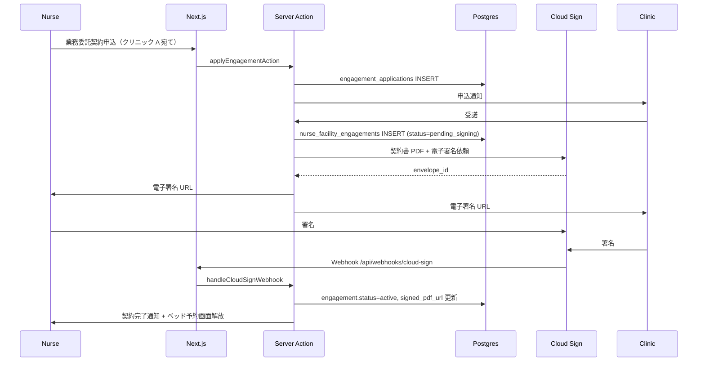

# 影響マップ: Phase 3 技術設計・Sprint — premake 仕様変更

> [00_index.md](00_index.md) に戻る

---

## 1. 影響を受ける Phase 3 ドキュメント

| ファイル | 影響度 | 内容 |
|---|---|---|
| `03_技術設計/00_サマリー.md` | 中 | 全レイヤー網羅性表の更新 |
| `03_技術設計/01_アーキテクチャ.md` | 中 | お金の流れ図差し替え、新規系統追加 |
| `03_技術設計/02_ディレクトリ構成.md` | 中 | features/engagements/ 追加 |
| `03_技術設計/03_外部サービス.md` | 中 | Cloud Sign 等の電子契約サービス追加 |
| `03_技術設計/04_認証フロー.md` | 軽微 | 業務委託の確認フロー追加 |
| `03_技術設計/05_開発ガイドライン.md` | 軽微 | 既存ルール維持 |
| `03_技術設計/06_運用設計.md` | 中 | 医療情報安全管理 GL の運用追加 |
| `03_技術設計/07_Sprint計画.md` | **大** | Sprint 再計画 |
| `03_技術設計/08_ローンチ計画.md` | 中 | クローズドα/β条件の追加（業務委託契約の手動運用等） |
| `03_技術設計/_index.yml` | 中 | 全件更新 |

---

## 2. アーキテクチャへの影響

### 2.1 お金の流れ図の差し替え

[01_アーキテクチャ.md §5] のシーケンス図を以下に変更:

- 旧: 看護師 → 運営 → 施設 への按分送金
- 新: 患者 → クリニック の Stripe Direct Charge + クリニック ⇔ premake の月次精算 + クリニック → 看護師の業務委託費

### 2.2 新規データフロー: 業務委託契約締結



### 2.3 features ディレクトリ構成への追加

```
src/features/
  ├── engagements/          ← 新規
  │   ├── actions/
  │   ├── components/
  │   ├── hooks/
  │   ├── schemas/
  │   ├── types.ts
  │   └── index.ts
  ├── nurse-finance/        ← 新規（業務委託費精算明細）
  ├── clinic-finance/       ← 新規（月次請求書）
  ├── incidents/            ← 新規（事故報告）
  └── （既存）
```

services 層への追加:

```
src/services/
  ├── engagements/          ← 新規
  │   ├── applyEngagement.ts
  │   ├── signEngagement.ts
  │   ├── terminateEngagement.ts
  │   └── ...
  ├── pricing-engine/       ← 新規（料率計算）
  ├── invoicing/            ← 新規（月次請求書生成）
  └── （既存）
```

---

## 3. 外部サービスへの影響

### 3.1 新規サービス: 電子契約（Cloud Sign）

[Phase 2 03_外部サービス.md] に追加:

| サービス | 用途 | 月額 |
|---|---|---|
| **Cloud Sign（弁護士ドットコム）** | 業務委託契約書の電子署名 | 無料 + 従量（送信 1 件 200 円〜） |

### 3.2 既存サービスへの影響

| サービス | 変更 |
|---|---|
| Stripe Connect Express | 看護師 Connect 廃止、クリニック・法人のみ |
| Resend | 業務委託契約・請求書送信用テンプレ追加 |
| Twilio | 緊急時通報用の番号追加 |
| Supabase Storage | バケット追加: `engagement-contracts`（電子契約書） |

### 3.3 コスト試算の更新

| サービス | β月額 | 本番月額 |
|---|---|---|
| Cloud Sign | $0〜10（契約数次第） | $50〜200 |

合計の β コスト見積もりへの影響: **+ 約 ¥1,000-2,000 / 月** （契約数次第）。

---

## 4. 認証フローへの影響

### 4.1 業務委託確認フロー追加

予約申込 (FR-21) の前段に以下のチェック追加:

```typescript
// src/lib/auth/requireActiveEngagement.ts
export async function requireActiveEngagement(facilityId: string) {
  const user = await requireUser();
  const { data } = await supabase
    .from('nurse_facility_engagements')
    .select('id')
    .eq('nurse_user_id', user.id)
    .eq('facility_id', facilityId)
    .eq('status', 'active')
    .single();
  if (!data) {
    throw new AppError('ENGAGEMENT_REQUIRED', 403);
  }
}
```

### 4.2 ロール権限ヘルパーへの追加

```typescript
// src/lib/auth/requireApprovedLicenseAndEngagement.ts
export async function requireApprovedLicenseAndEngagement(facilityId: string) {
  await requireApprovedLicense();
  await requireActiveEngagement(facilityId);
}
```

---

## 5. 運用設計への影響

### 5.1 医療情報安全管理ガイドライン §6.4 対応の追加

[06_運用設計.md] に新セクション追加:

```markdown
## 8. 医療情報安全管理ガイドライン対応

### 8.1 クリニック向け月次アクセスレポート
- 当該クリニックの医療データへの全アクセス履歴を月次 PDF 生成
- クリニックダッシュボード (FR-66) からダウンロード可

### 8.2 委託契約での明示
- クリニック ⇔ premake の利用契約に「医療情報安全管理 GL 準拠」を明記
- 安全管理措置の文書を契約付録として提供

### 8.3 アクセス権限の最小化
- RLS で実現 (既存)
- 運営の医療データアクセスは閲覧理由必須 (既存)

### 8.4 2 要素認証強化
- 医療データ閲覧時の aal2 要求を強化
- 指示医・運営は標準で aal2 必須 (既存)

### 8.5 越境移転の同意
- プライバシーポリシーで海外クラウド利用を明示
- サインアップ時の同意項目に追加
```

### 5.2 新規 runbook の追加

| runbook | 内容 |
|---|---|
| `S-06-medical-incident.md` | 重大事故・副作用発生時の対応 |
| `S-07-engagement-termination.md` | 業務委託契約の緊急解除手順 |
| `S-08-data-disclosure-request.md` | 患者からの自己情報開示請求対応 |

### 5.3 コスト監視の更新

- Cloud Sign の月予算追加
- 業務委託契約数 = ライセンス指標として可視化

---

## 6. Sprint 計画への影響（最重要）

### 6.1 12 週 Sprint 計画の再構築

業務委託モデル追加で、**Sprint S2-S4 が大きく変わる**。

### 6.2 改訂後の Sprint 計画案

| Sprint | 期間 | ゴール | 主要 FR / 改訂 |
|---|---|---|---|
| S0 | Week 0 | 基盤（変化なし） | - |
| **S1** | Week 1 | 認証・登録 + **看護師の独立事業者証明** | A + FR-NEW-09, 10 |
| **S2 (改訂)** | Week 2 | 施設・スペース + **業務委託マッチング基盤** | B + FR-NEW-01〜04, 07 |
| **S3 (新規)** | Week 3 | **業務委託契約締結ワークフロー + 電子署名連携** | FR-NEW-03, 05, 06, 08, 30 |
| **S4 (改訂)** | Week 4 | 検索・予約（業務委託契約前提化）+ 予約セッション | C + FR-19, 21 改訂 |
| **S5 (改訂)** | Week 5 | 決済（Stripe Direct + 月次精算）+ クリニック中心 | E 改訂 + FR-NEW-11〜14 |
| **S6 (改訂)** | Week 6 | 指示書・同意書・問診票 + クリニック契約化 | D + FR-31, 32 改訂 |
| **S7 (改訂)** | Week 7 | 施術記録・確認 + 業務委託費精算 + 緊急時通報 | D + FR-NEW-23, 34, 35 |
| **S8 (改訂)** | Week 8 | 顧客予約（クリニック明示）+ 公開ページ表現調整 | K + FR-69〜75 改訂 + DEC-36 |
| **S9 (改訂)** | Week 9 | メッセージ・通知 + レビュー（医療広告規制対応） | F + G 改訂 |
| **S10 (改訂)** | Week 10 | 運営機能 + 業務委託モデレーション + 医療情報安全管理 | H + FR-NEW-20, 22 |
| **S11 (改訂)** | Week 11 | ダッシュボード + 公開 + 規約改訂 | J + I 改訂 |
| **S12 (改訂)** | Week 12 | テスト完成 + ペネトレ + a11y | - |
| **S13 (新規)** | Week 13 | クローズドα（1 施設 × 1 看護師） + 業務委託契約締結 1 件 | - |

→ **12 → 13 週**に延長。または S0 を 0.5 週に圧縮して 12 週内に収める。

### 6.3 Sprint 追加・削除の判断

| 判断 | 内容 |
|---|---|
| **S3 新規追加が必要** | 業務委託契約締結ワークフローは中核機能、独立 Sprint で扱うのが妥当 |
| **S2 の負担増** | 業務委託マッチング基盤を S2 に統合 |
| **S5 の改訂** | お金の流れの抜本変更で工数増 |

### 6.4 タスク数の変化

| Sprint | 旧タスク数 | 新タスク数（見込み） |
|---|---|---|
| S0 | 12 | 12 |
| S1 | 15 | 17 (+2) |
| S2 | 12 | 16 (+4) |
| S3 | 14 | **新規 12** |
| S4 | 13 | 14 (+1) |
| S5 | 14 | 14 |
| S6 | 10 | 12 (+2) |
| S7 | 14 | 16 (+2) |
| S8 | 10 | 12 (+2) |
| S9 | 16 | 18 (+2) |
| S10 | 14 | 16 (+2) |
| S11 | 10 | 12 (+2) |
| S12 / S13 | - / - | - / - |

**追加タスク 約 30 件**。1 タスク 半日〜1 日 と仮定すると、**15-30 人日の追加工数**。

### 6.5 リスケジュール案

| 案 | 期間 | リスク |
|---|---|---|
| **A 案: 12 週維持、優先度の高い機能から実装、低優先度は β 後** | 12 週 | クローズドα 機能不足の可能性 |
| **B 案: 13 週に延長** | 13 週 | スケジュール遵守の難度上昇 |
| **C 案: 14-15 週に延長 + 並行作業の最大化** | 14-15 週 | バーンアウト リスク |

**推奨: B 案（13 週）**。S0 を 0.5 週に圧縮 + 業務委託の手動運営フォールバックで 12 週も視野。

---

## 7. ローンチ計画への影響

### 7.1 クローズドα の条件追加

[08_ローンチ計画.md] の クローズドα条件に以下追加:

- **業務委託契約 1 件が締結済**（運営代理オンボーディング含む）
- **クリニックの Stripe Connect が稼働中**
- **電子契約サービス（Cloud Sign）の運用テスト完了**

### 7.2 段階展開の見直し

| フェーズ | 看護師数 | クリニック数 | 業務委託契約数 |
|---|---|---|---|
| 内部α | 〜数名 | - | テスト用 |
| クローズドα | 1 名 | 1 施設 | 1 件 |
| クローズドβ | 100 名 | 20 施設 | 100-200 件 |
| 限定公開 | + 100 名 | + 100 施設 | + 数百件 |
| 一般公開 | 全員 | 全員 | - |

### 7.3 ローンチ前チェックリストへの追加

- [ ] 業務委託契約の電子署名フロー動作確認
- [ ] クリニック向け月次請求書生成テスト
- [ ] 業務委託費精算明細の正確性検証
- [ ] 看護師の保険加入確認 UI 動作
- [ ] 緊急時通報フロー動作確認
- [ ] 医療広告規制準拠の表現確認（全画面）
- [ ] 弁護士による業務委託契約書最終確認
- [ ] 利用規約 / プライバシーポリシー法務確認

---

## 8. _index.yml の改訂

- sprints セクションに S13 追加
- monitoring セクションに Cloud Sign Webhook 監視追加
- cost_kill_switches セクションに Cloud Sign 追加
- launch.phases に詳細条件追加
- provisional_decisions に PD-XX を追加（業務委託関連の仮決定）

---

## 9. 思考の足跡

### 9.1 工数見積もり総合

- Phase 1 改訂: 約 5-10 人日
- Phase 2 改訂: 約 10-13 人日
- Phase 3 改訂: 約 2-3 人日（本文書）
- **合計: 約 17-26 人日**（仕様変更ドキュメント改訂のみ）

実装工数の追加: 約 15-30 人日（Sprint タスク追加分）

### 9.2 リスケジュール

User の方針「クローズドα = 1 施設 1 看護師、12-13 週で β 公開」を維持しつつ、業務委託モデルの実装を含める。

### 9.3 残された問い

- 業務委託モデルの **どこまでを MVP に含めるか** vs **β 後対応か** の優先度判断
- 電子契約サービスの **手動代替** が可能か（β 段階で premake が PDF 送付 + メール署名で代替）
- 12 週 vs 13 週 vs 14 週 の最終判断は User 決定

---

バージョン: 0.1 / 作成日: 2026-05-18
