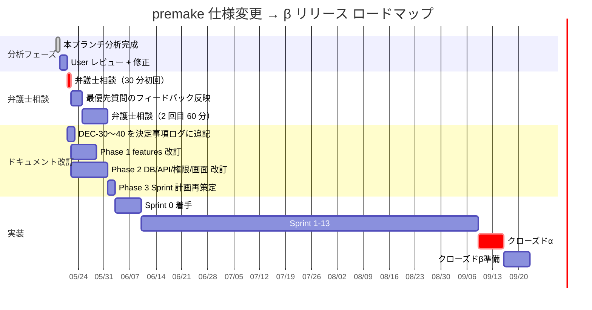

# 次のアクション — premake 仕様変更

> [00_index.md](00_index.md) に戻る
>
> 本ブランチの分析を踏まえて、仕様変更を実装に反映するための具体的アクションプランを示す。

---

## 1. ロードマップ全体像



---

## 2. 短期アクション（今週中）

### 2.1 本ブランチ完成 → User レビュー

- [x] 本フォルダ 15 ファイル作成完了
- [ ] **User がレビュー** し、修正点を指摘
- [ ] 修正反映後、ブランチを main にマージ判断

### 2.2 決定事項ログ・リスク登録簿への反映

- [ ] `00_共通/決定事項ログ_decision-log.md` に DEC-30〜40 追記
- [ ] `00_共通/リスク登録簿_risks.md` に RISK-17〜25 追記
- [ ] `00_共通/用語集_glossary.md` に新語追記（[09_影響マップ §4](09_影響マップ_DEC_リスク.md)）

### 2.3 弁護士相談の準備

- [ ] **法務確認資料 v0.9 を v1.0 に更新**（本ブランチの内容を反映）
- [ ] [13_法務確認追加質問案.md](13_法務確認追加質問案.md) の最優先 4 件を準備
- [ ] 弁護士へのアポ取り（医療法務専門推奨、紹介依頼可）
- [ ] 相談時の追加資料（システム構成図 / お金の流れ図 / 看護師ページモック）を準備

---

## 3. 中期アクション（弁護士相談後 2 週間）

### 3.1 弁護士フィードバックの反映

- [ ] 弁護士相談の議事録を `docs/00_共通/legal_consultation_log/` に保存（新規フォルダ）
- [ ] 各質問への回答を 13_法務確認追加質問案.md に追記
- [ ] 重大な仕様変更があれば、本ブランチに更に追記

### 3.2 Phase 1 ドキュメントの改訂

- [ ] `docs/01_要件定義/01_業務理解.md` → 業務委託モデル反映
- [ ] `docs/01_要件定義/02_ユーザー像.md` → 権限マトリクス更新
- [ ] `docs/01_要件定義/03_スコープ.md` → カテゴリ L 追加
- [ ] `docs/01_要件定義/04_画面遷移図.md` → 新規 SCR 追加
- [ ] `docs/01_要件定義/features/FR-XX_*.md` → 既存 FR 改訂 + 新規 FR-NEW-XX 追加
- [ ] `docs/01_要件定義/_index.yml` → 全件更新

### 3.3 Phase 2 ドキュメントの改訂

- [ ] `docs/02_外部設計/01_DB設計/` → 新規テーブル + 既存テーブル改訂
- [ ] `docs/02_外部設計/02_API仕様/` → 新規 EP + 既存 EP 改訂
- [ ] `docs/02_外部設計/03_権限設計/` → RLS 全面再確認
- [ ] `docs/02_外部設計/04_画面設計/` → 新規ファイル 15_業務委託画面.md
- [ ] `docs/02_外部設計/05_非機能要件.md` → NFR-CMPL 強化
- [ ] `docs/02_外部設計/06_テスト戦略.md` → AC マッピング更新
- [ ] `docs/02_外部設計/_index.yml` → 全件更新

### 3.4 Phase 3 ドキュメントの改訂

- [ ] `docs/03_技術設計/01_アーキテクチャ.md` → お金の流れ図差し替え
- [ ] `docs/03_技術設計/03_外部サービス.md` → Cloud Sign 追加
- [ ] `docs/03_技術設計/04_認証フロー.md` → 業務委託確認フロー追加
- [ ] `docs/03_技術設計/06_運用設計.md` → 医療情報安全管理 GL 対応セクション追加
- [ ] `docs/03_技術設計/07_Sprint計画.md` → Sprint 再構築（12-13 週）
- [ ] `docs/03_技術設計/08_ローンチ計画.md` → クローズドα条件追加
- [ ] `docs/03_技術設計/_index.yml` → 全件更新

### 3.5 change_request 経由での実施

[12_change_request コマンド] を活用し、上記改訂を **一括変更パッチ** として実行することを推奨。

```bash
# 仮: ブランチ feature/apply-spec-revision を切る
git checkout -b feature/apply-spec-revision

# 各ドキュメントを順次改訂
# ...

# PR で main へ
```

---

## 4. 長期アクション（実装開始後）

### 4.1 Sprint 計画再策定

[12_影響マップ_Phase3_技術設計Sprint.md §6] に基づき、**12 週 → 13 週** の Sprint 計画を採用:

- S0 〜 S12 + S13 クローズドα
- S3 を「業務委託契約締結ワークフロー」に新規割り当て
- 各 Sprint のタスク数を約 +30 件で再計画

### 4.2 弁護士との継続契約

- 月次相談契約を結ぶ（β中の運用論点を継続的に確認）
- 契約書テンプレート（業務委託 / 利用規約 / 同意書 / プライバシーポリシー）の法務確認
- 重大事故・インシデント発生時の即時相談体制

### 4.3 業務委託契約書テンプレートの確定

- [仮決定] Cloud Sign の利用
- 弁護士監修済み雛形を提供
- 電子署名フローの本番運用テスト

---

## 5. β 後（限定公開以降）の検討事項

[08_AI追加観点.md §1] の中で、β 後検討に分類した項目:

| 項目 | 内容 |
|---|---|
| F | クリニック倒産・閉院時の医療情報引き継ぎ |
| K | 看護師スキル評価 |
| L | 法人マスター業務委託契約 |
| O | 業務委託 → 雇用化への進化パス |
| FF | 教育・トレーニング提供 |

---

## 6. 仕様変更を実装に反映するワークフロー

### 6.1 1 機能 1 PR の原則

業務委託モデルへの改訂は **多数の機能** に影響するため、1 機能 1 PR で進める:

```
PR 1: DB マイグレーション 019 - engagement テーブル群追加
PR 2: features/engagements/ ディレクトリ追加 + 基本 CRUD
PR 3: FR-NEW-01 業務委託マッチング検索
PR 4: FR-NEW-02 業務委託契約申込
...
```

### 6.2 PR の規模目安

- 1 PR = 半日〜2 日の作業量
- 100 行〜500 行の差分
- 1 PR で 1 つの FR / 1 つの改訂

### 6.3 PR ごとのチェックリスト

- [ ] `@implements FR-XX` タグ付与
- [ ] 既存 FR の `@implements` 改訂（FR-21 等）
- [ ] テスト追加（`@verifies AC-XX-YY`）
- [ ] RLS の更新（必要なら）
- [ ] features/FR-XX_*.md の `status` を `designed → implemented` に更新
- [ ] 関連 DEC ログのリンク

### 6.4 drift 検出スクリプトの更新

`scripts/drift-check.mjs` を更新:
- 新規 FR-NEW-XX の追加分を含めて検出
- 削除予定 FR の警告

---

## 7. ロールバック計画

万一、業務委託モデルの実装に重大な問題が発生した場合のロールバック:

### 7.1 影響範囲

- 仕様変更ドキュメント: Git で revert 可能
- Phase 1-3 改訂: Git で revert 可能
- 実装: マイグレーションは forward only、DB は backup から復元

### 7.2 ロールバック条件

- 弁護士から「業務委託モデルは実施不可」の判断
- 重大なシステム障害
- 致命的な法的リスクの発覚

### 7.3 ロールバック手順

1. 仕様変更ドキュメントの状態を v0.9（または以前）に revert
2. Phase 1-3 改訂を revert
3. DB マイグレーションを forward migration で巻き戻し
4. 影響を受けるユーザー（クリニック・看護師）に通知

---

## 8. コミュニケーション計画

### 8.1 関係者への共有

| 関係者 | タイミング | 内容 |
|---|---|---|
| 仲間（共同創業者・チーム） | 本ブランチ完成時 | 全ファイル共有、レビュー依頼 |
| 弁護士 | 相談アポ取り時 | 法務確認資料 v1.0 + 追加質問 |
| パートナーシップ候補クリニック | β 募集時 | 業務委託モデルの説明資料 |
| 看護師コミュニティ | β 募集時 | 看護師向け FAQ + 業務委託のメリット |

### 8.2 説明資料の準備

- **看護師向け資料**: 「業務委託で premake を使うとは」
- **クリニック向け資料**: 「premake で看護師を業務委託する仕組み」
- **患者向け資料**: 「premake で予約 = クリニックの自由診療」

---

## 9. 思考の足跡

### 9.1 アクションの順序判断

- **本ブランチ → User レビュー → 弁護士相談 → 実装** の順で、不可逆性の高い決定を後ろに
- Phase 1-3 改訂は弁護士相談の結果次第で再修正の可能性 → 弁護士相談後にやる

### 9.2 12 週 vs 13 週の判断

User の方針「2-3 ヶ月で β」(DEC-07) を踏まえ、**13 週まで延長** を推奨。ただし以下を柔軟に:

- S0 を 3 日程度に圧縮
- 業務委託契約締結を **β 中は手動運営でカバー** → 自動化は本番化後
- 緊急時通報・医療広告規制は MVP 必須、それ以外の追加機能（FR-NEW-32, 41 等）は P1 へ

### 9.3 残された問い

- **本ブランチを main にマージする前**に、弁護士相談を完了させるべきか?
- ブランチ寿命の長期化リスク vs 不確定な内容で main を汚すリスクのトレードオフ
- → 推奨: 本ブランチは **「分析と提案」** として完結、弁護士相談後に **別ブランチで実装** に着手

---

## 10. 完了基準

本ブランチが「完了」と言えるのは以下:

- [x] 14 ファイルの分析ドキュメント作成
- [x] User の追加質問への回答反映
- [x] 思考と判断理由を残す方針の徹底
- [ ] User の最終レビュー完了
- [ ] git commit + PR 作成

---

バージョン: 0.1 / 作成日: 2026-05-18
