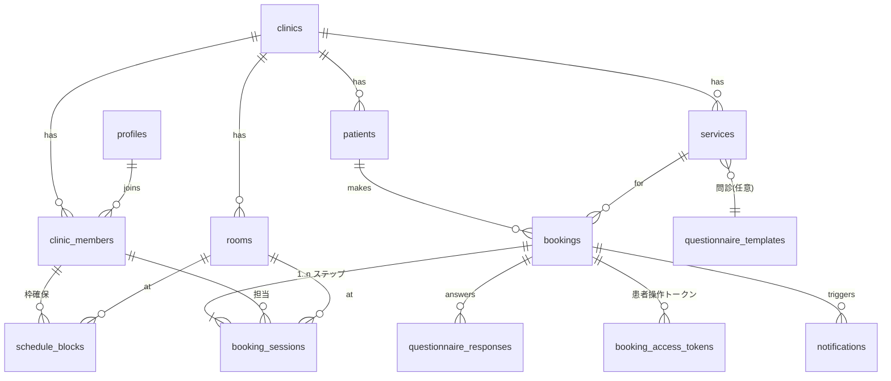

# premake v2 データモデル

> [00_要件定義.md](00_要件定義.md) の実装スキーマ。マイグレーション SQL の設計図。
> 原則: 全業務テーブルに `clinic_id`(テナントキー)。RLS はデフォルト拒否・メンバーのみ。ゲスト・公開アクセスは Server 経由(service role + トークン検証)で anon 直接アクセスは許可しない。

---

## 1. ER 概観



## 2. テーブル定義(19)

### 2.1 テナント・ユーザー系

```sql
-- テナント(クリニック)
create table clinics (
  id                     uuid primary key default gen_random_uuid(),
  slug                   text not null unique,          -- 公開URL: /c/[slug]
  name                   text not null,
  director_name          text,                          -- 院長名(医療広告: 提供主体明示)
  postal_code            text,
  address                text,
  phone                  text,
  email                  text,
  business_hours         jsonb not null default '[]',   -- [{dow:1, open:"10:00", close:"19:00"}]
  public_booking_enabled boolean not null default false, -- 患者向け公開予約のオン/オフ
  booking_approval_mode  text not null default 'manual'
                         check (booking_approval_mode in ('auto','manual')),
  cancel_deadline_hours  integer not null default 24,   -- 患者キャンセル期限
  settings               jsonb not null default '{}',
  created_at             timestamptz not null default now(),
  updated_at             timestamptz not null default now()
);

-- ユーザープロフィール(auth.users と 1:1)
create table profiles (
  id         uuid primary key references auth.users(id) on delete cascade,
  full_name  text not null default '',
  is_ops     boolean not null default false,            -- premake 運営
  created_at timestamptz not null default now(),
  updated_at timestamptz not null default now()
);

-- クリニック所属(1ユーザー複数ロール)
create table clinic_members (
  id              uuid primary key default gen_random_uuid(),
  clinic_id       uuid not null references clinics(id),
  user_id         uuid not null references profiles(id),
  roles           text[] not null default '{staff}',    -- owner / doctor / staff の部分集合
  employment_type text check (employment_type in ('employed','contracted')),
  display_name    text,                                  -- 指名表示用(例: 姓のみ)
  is_bookable     boolean not null default false,        -- 公開ページの指名対象か
  status          text not null default 'active' check (status in ('active','inactive')),
  created_at      timestamptz not null default now(),
  updated_at      timestamptz not null default now(),
  unique (clinic_id, user_id)
);

-- スタッフ招待
create table invitations (
  id              uuid primary key default gen_random_uuid(),
  clinic_id       uuid not null references clinics(id),
  email           text not null,
  roles           text[] not null default '{staff}',
  employment_type text,
  token_hash      text not null unique,                  -- 生トークンはメールのみ
  expires_at      timestamptz not null,
  accepted_at     timestamptz,
  created_by      uuid references profiles(id),
  created_at      timestamptz not null default now()
);
```

### 2.2 患者

```sql
create table patients (
  id                uuid primary key default gen_random_uuid(),
  clinic_id         uuid not null references clinics(id),
  name              text not null,
  kana              text,
  birthdate         date,
  phone             text,
  email             text,
  external_chart_no text,                                -- 既存カルテ番号(橋渡し用)
  notes             text,                                -- 院内メモ(要配慮に準じ閲覧ログ対象)
  tags              text[] not null default '{}',
  created_at        timestamptz not null default now(),
  updated_at        timestamptz not null default now()
);
create index on patients (clinic_id, kana);
create index on patients (clinic_id, phone);
create index on patients (clinic_id, email);
```

### 2.3 メニュー・リソース

```sql
create table service_categories (
  id         uuid primary key default gen_random_uuid(),
  clinic_id  uuid not null references clinics(id),
  name       text not null,
  sort_order integer not null default 0
);

create table services (
  id                        uuid primary key default gen_random_uuid(),
  clinic_id                 uuid not null references clinics(id),
  category_id               uuid references service_categories(id),
  name                      text not null,
  description               text,           -- 施術内容・リスク副作用・注意事項(公開表示)
  kind                      text not null default 'treatment', -- 将来: trial_venue 等(器の拡張点)
  price_yen                 integer,
  show_price                boolean not null default false,    -- 料金表示フラグ(Q3 回答)
  is_public                 boolean not null default false,    -- 公開ページ掲載
  allow_nomination          boolean not null default false,    -- 指名可否
  questionnaire_template_id uuid references questionnaire_templates(id),
  session_template          jsonb not null
    default '[{"kind":"procedure","label":null,"duration_min":60,"buffer_min":0}]',
    -- ステップ列: kind = counseling|procedure|retouch|other
    -- 例(アートメイク眉): [{counseling,30},{procedure,120,buffer:15}]。リタッチは別メニュー or 追加セッション
  sort_order                integer not null default 0,
  status                    text not null default 'active' check (status in ('active','archived')),
  created_at                timestamptz not null default now(),
  updated_at                timestamptz not null default now()
);

create table staff_service_assignments (
  id         uuid primary key default gen_random_uuid(),
  clinic_id  uuid not null references clinics(id),
  member_id  uuid not null references clinic_members(id),
  service_id uuid not null references services(id),
  unique (member_id, service_id)
);

create table rooms (
  id         uuid primary key default gen_random_uuid(),
  clinic_id  uuid not null references clinics(id),
  name       text not null,
  sort_order integer not null default 0,
  status     text not null default 'active' check (status in ('active','archived'))
);

-- 休診・例外日
create table clinic_closures (
  id        uuid primary key default gen_random_uuid(),
  clinic_id uuid not null references clinics(id),
  date      date not null,
  note      text,
  unique (clinic_id, date)
);
```

### 2.4 施術枠(v2-08 = 「看護師の場所予約」)

```sql
create extension if not exists btree_gist;

create table schedule_blocks (
  id         uuid primary key default gen_random_uuid(),
  clinic_id  uuid not null references clinics(id),
  member_id  uuid not null references clinic_members(id), -- 誰の枠か
  room_id    uuid not null references rooms(id),
  time_range tstzrange not null,
  block_type text not null default 'open'
             check (block_type in ('open','blocked')),
             -- open: 患者予約を受け付ける施術枠 / blocked: 占有のみ(休憩・準備)
  note       text,
  created_by uuid references profiles(id),
  created_at timestamptz not null default now(),
  updated_at timestamptz not null default now(),
  -- 同一部屋・同一スタッフの時間重複を DB レベルで排他
  exclude using gist (room_id with =, time_range with &&),
  exclude using gist (member_id with =, time_range with &&)
);
```

> **空き枠の導出**: 公開ページ・院内予約 UI の「空き枠」は `schedule_blocks(open)` から既存 `booking_sessions` を差し引いて算出。メニュー所要時間+バッファで刻む。受付は schedule_block 外への直接予約も警告付きで可能(小規模運用の現実対応 — その場合 block を自動生成)。

### 2.5 予約

```sql
create table bookings (
  id                  uuid primary key default gen_random_uuid(),
  clinic_id           uuid not null references clinics(id),
  booking_no          text not null unique,             -- 表示番号: B-250707-001
  patient_id          uuid references patients(id),     -- 名寄せ後に確定。ゲスト直後は null 可
  service_id          uuid not null references services(id),
  status              text not null default 'requested'
    check (status in ('requested','confirmed','checked_in','done','cancelled','no_show')),
  source              text not null default 'staff'
    check (source in ('web','phone','walk_in','staff')),
  nominated_member_id uuid references clinic_members(id), -- 指名(任意)
  guest_name          text,   -- ゲスト予約の生入力(名寄せ前でも予約は成立)
  guest_kana          text,
  guest_email         text,
  guest_phone         text,
  cancel_reason       text,
  cancelled_at        timestamptz,
  notes               text,                              -- 院内メモ
  created_by          uuid references profiles(id),      -- web ゲストなら null
  created_at          timestamptz not null default now(),
  updated_at          timestamptz not null default now()
);
create index on bookings (clinic_id, status, created_at);

create table booking_sessions (
  id                uuid primary key default gen_random_uuid(),
  clinic_id         uuid not null references clinics(id),
  booking_id        uuid not null references bookings(id) on delete cascade,
  seq               integer not null default 1,
  kind              text not null default 'procedure'
                    check (kind in ('counseling','procedure','retouch','other')),
  label             text,
  member_id         uuid references clinic_members(id),  -- 担当(未定可)
  room_id           uuid references rooms(id),
  time_range        tstzrange,                           -- 後日調整は null
  status            text not null default 'scheduled'
                    check (status in ('scheduled','done','cancelled')),
  schedule_block_id uuid references schedule_blocks(id), -- どの枠から取ったか(任意)
  created_at        timestamptz not null default now(),
  updated_at        timestamptz not null default now(),
  unique (booking_id, seq),
  -- 有効セッションのみ部屋・担当の重複を排他(キャンセル済みは対象外)
  exclude using gist (room_id with =, time_range with &&)
    where (status = 'scheduled' and room_id is not null and time_range is not null),
  exclude using gist (member_id with =, time_range with &&)
    where (status = 'scheduled' and member_id is not null and time_range is not null)
);
create index booking_sessions_time_idx on booking_sessions using gist (clinic_id, time_range);

-- 患者操作トークン(ログインなしの本人性担保)
create table booking_access_tokens (
  id         uuid primary key default gen_random_uuid(),
  booking_id uuid not null references bookings(id) on delete cascade,
  token_hash text not null unique,     -- SHA-256。生値はメールリンクのみ
  purpose    text not null check (purpose in ('confirm','manage','questionnaire')),
  expires_at timestamptz not null,
  used_at    timestamptz,              -- confirm は一回性
  created_at timestamptz not null default now()
);
```

> **患者×時間の重複**(v2-13 の 3 軸目)は DB 制約でなくアプリ層で検知(患者未確定のゲスト予約があるため)。警告表示に留め、強制ブロックしない(家族分の代理予約等の現実対応)。

### 2.6 問診

```sql
create table questionnaire_templates (
  id         uuid primary key default gen_random_uuid(),
  clinic_id  uuid not null references clinics(id),
  name       text not null,
  questions  jsonb not null default '[]',
  -- [{id, type: text|textarea|radio|checkbox|date|consent, label, options?, required}]
  status     text not null default 'active' check (status in ('active','archived')),
  created_at timestamptz not null default now(),
  updated_at timestamptz not null default now()
);

create table questionnaire_responses (
  id           uuid primary key default gen_random_uuid(),
  clinic_id    uuid not null references clinics(id),
  booking_id   uuid not null references bookings(id) on delete cascade,
  template_id  uuid not null references questionnaire_templates(id),
  answers      jsonb not null default '{}',
  submitted_at timestamptz,
  created_at   timestamptz not null default now(),
  updated_at   timestamptz not null default now()
);
```

### 2.7 通知・ジョブ・監査

```sql
create table notifications (
  id              uuid primary key default gen_random_uuid(),
  clinic_id       uuid not null references clinics(id),
  booking_id      uuid references bookings(id) on delete set null,
  recipient_type  text not null check (recipient_type in ('patient','member')),
  recipient_email text not null,
  kind            text not null,  -- booking_confirmed / booking_cancelled / reminder / questionnaire_request / booking_request_received ...
  payload         jsonb not null default '{}',
  status          text not null default 'queued' check (status in ('queued','sent','failed')),
  sent_at         timestamptz,
  error           text,
  created_at      timestamptz not null default now()
);

create table worker_jobs (
  id         uuid primary key default gen_random_uuid(),
  kind       text not null,               -- send_notification / booking_reminder_scan ...
  payload    jsonb not null default '{}',
  run_at     timestamptz not null default now(),
  status     text not null default 'queued'
             check (status in ('queued','running','done','failed','dead')),
  attempts   integer not null default 0,
  last_error text,
  created_at timestamptz not null default now(),
  updated_at timestamptz not null default now()
);
create index on worker_jobs (status, run_at);

create table audit_logs (
  id            bigint generated always as identity primary key,
  clinic_id     uuid,
  actor_user_id uuid,
  actor_type    text not null check (actor_type in ('member','ops','guest','system')),
  action        text not null,            -- booking.create / questionnaire.view / patient.update ...
  target_type   text,
  target_id     uuid,
  diff          jsonb,
  ip            inet,
  user_agent    text,
  created_at    timestamptz not null default now()
);
create index on audit_logs (clinic_id, created_at desc);
```

---

## 3. RLS 方針

```sql
-- ヘルパー(security definer)
is_ops()                          -- profiles.is_ops
is_clinic_member(_clinic_id)      -- active な clinic_members が存在
has_role(_clinic_id, _role)       -- roles 配列に含む
```

| テーブル群 | select | insert/update/delete |
|---|---|---|
| clinics | member or ops | owner or ops |
| clinic_members / invitations | 同クリニック member | owner / ops |
| services / rooms / categories / closures / assignments | member | owner(+staff は閲覧のみ)※MVP は owner/staff とも編集可で開始し、運用で絞る |
| schedule_blocks | member | 本人 or owner(受付=staff も他人分を操作可、MVP は member 全員可) |
| patients / questionnaire_responses | member(閲覧は audit 記録) | member |
| bookings / booking_sessions | member | member |
| notifications / worker_jobs / audit_logs | member(自クリニック)/ ops | システム(service role)のみ |
| profiles | 本人 or 同クリニック member | 本人 |

- **anon(未ログイン)ポリシーは一切作らない**。公開ページ・ゲスト予約・問診記入は Server(Route Handler / Server Action)が service role で実行し、トークン検証・入力検証・レート制限をアプリ層で行う。
- 三層防御(旧設計踏襲): Middleware(セッション)→ Server Action(認可ヘルパ)→ RLS。

## 4. 初期データ(シード)

- ops ユーザー(User 本人)
- デモクリニック 1 件(開発用)+ 実クリニック(導入時に ops が作成)
- サービス例: アートメイク(眉 / アイライン / リップ / リタッチ各種、カウンセリングのみ)+ 他美容メニューのサンプル(Q9 のヒアリングで実メニューに差し替え)
- 問診テンプレ: アートメイク標準問診(既往歴・アレルギー・妊娠授乳・ケロイド体質・金属アレルギー・過去のアートメイク歴 等)

---

バージョン: 1.0 / 作成日: 2026-07-07
